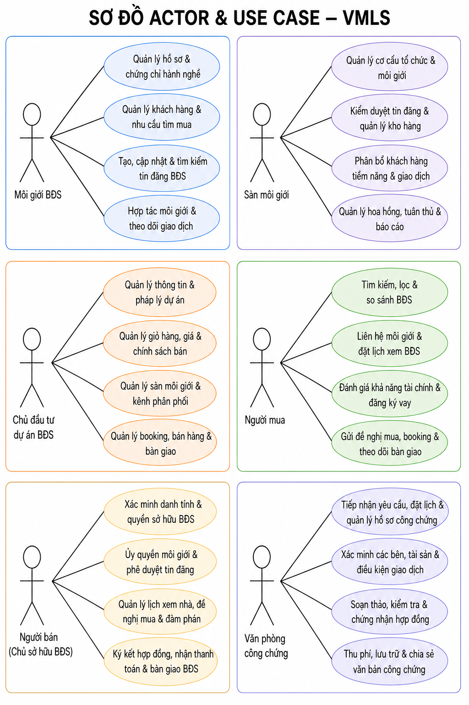

# VMLS Actor and Use Case Conversation Context

> Status: `PROPOSAL`
>
> Migrated on: 2026-08-13
>
> Origin: Product discussion previously conducted in the `VMLS` workspace.
>
> Canonicality: This document preserves conversation context. It does not override `CONTEXT.md`, `MASTER_PLAN.md`, approved specifications, or domain decisions. Any adoption into the product baseline requires explicit review and approval.

## 1. Purpose

This document preserves the product discussion that decomposed a Vietnam MLS concept into actors, use cases, and user stories. The discussion began with six market actors, later added the property owner/seller and notary office, and finally narrowed the actor diagram to six actors.

The latest agreed diagram scope is:

1. Môi giới BĐS.
2. Sàn môi giới.
3. Chủ đầu tư dự án BĐS.
4. Người mua.
5. Người bán (Chủ sở hữu BĐS).
6. Văn phòng công chứng.

`Ngân hàng` and `Cơ quan quản lý` appeared in earlier drafts but were explicitly removed from the latest diagram. Their removal from the diagram does not resolve whether they remain domain Parties or future product actors.

## 2. Evidence classification

- `FACT`: The final requested diagram contains the six actors listed above.
- `FACT`: The final diagram contains four use cases per actor, for 24 use cases total.
- `PROPOSAL`: The use cases and user stories below are proposed product behavior derived from the conversation.
- `PROPOSAL`: VMLS should orchestrate document exchange and status synchronization with a notary office without replacing the statutory authority of a notary.
- `OPEN QUESTION`: Whether every actor receives a direct VMLS account in the MVP.
- `OPEN QUESTION`: Which workflows are implemented directly in VMLS versus delegated to external regulated platforms.
- `OPEN QUESTION`: Whether banks and regulators remain outside the current UI only or outside the intended product scope.

## 3. Terminology alignment

The conversation used Vietnamese product language. When applying it to the repository domain model:

- “BĐS” may refer to a `Property` or `Unit`; it must not be treated as a `Listing` without an explicit mapping.
- “Tin đăng” maps to `Listing` only after it becomes a governed market offering. Editable preparation maps to `Listing Input`.
- “Người bán/Chủ sở hữu” is a `Party` acting in an owner or seller capacity, not automatically a system `User`.
- “Môi giới BĐS” is an industry participant whose authority must be represented through `Membership`, `Representation`, and applicable `Entitlement`; the Vietnamese word “môi giới” must not collapse these concepts.
- “Sàn môi giới” generally maps to a brokerage `Organization`, but its legal and operational boundary remains subject to Vietnam validation.
- “Chủ đầu tư dự án BĐS” is a developer `Organization` or authorized `Party` governing a `Project`, `Unit` inventory, and `Distribution Assignment`.
- “Văn phòng công chứng” is an external regulated organization. Its staff and notaries require scoped roles rather than blanket access.
- A completed transaction outcome must be represented separately from `Property` and `Listing`, using a `Closing Record` or a future approved transaction aggregate.

## 4. Current actor/use-case catalog

### 4.1 Môi giới BĐS

#### UC-BROKER-01 — Quản lý hồ sơ và chứng chỉ hành nghề

Goal: establish the broker's verified professional identity, organizational relationship, and eligibility to participate in governed workflows.

User stories:

- As a broker, I want to register and verify my identity so the platform can associate actions with the correct person.
- As a broker, I want to submit professional certificate information so my eligibility can be assessed.
- As a broker, I want to link my profile to the brokerage where I work so my authority is scoped to a valid Membership.
- As a broker, I want to see verification status and rejection reasons so I can correct incomplete evidence.
- As a broker, I want expiry reminders for time-bounded credentials so I can renew them before losing eligibility.
- As a brokerage administrator, I want ineligible or expired brokers prevented from initiating governed Listing actions.

#### UC-BROKER-02 — Quản lý khách hàng và nhu cầu tìm mua

Goal: record buyer requirements and manage broker-client activity without treating the client relationship as permanent data access.

User stories:

- As a broker, I want to create a buyer profile with budget, location, asset type, and purchase timeline.
- As a broker, I want to record the buyer's Consent before storing or sharing personal requirements.
- As a broker, I want to classify prospects by readiness so I can prioritize follow-up.
- As a broker, I want to record interactions, shortlist activity, viewings, and offers in one timeline.
- As a broker, I want to update or close a requirement when the buyer's needs change.
- As a broker, I want duplicate-client warnings inside my permitted organization scope.

#### UC-BROKER-03 — Tạo, cập nhật và tìm kiếm tin đăng BĐS

Goal: prepare governed Listings and discover appropriate market offerings while preserving Property/Listing separation.

User stories:

- As a broker, I want to search Listings by location, price, area, asset type, legal status, and lifecycle status.
- As a broker, I want to search on a map and save filters for future matching.
- As a listing broker, I want to create a Listing Input linked to a Property or Unit.
- As a listing broker, I want to declare the representation basis, scope, and effective period before submission.
- As a broker, I want to attach photos, documents, and source information to a Listing Input.
- As a broker, I want to submit a Listing for brokerage review.
- As a broker, I want to update price or availability through auditable events rather than overwrite history.
- As a broker, I want expiry and stale-data warnings so unavailable offerings are not presented as current.

#### UC-BROKER-04 — Hợp tác môi giới và theo dõi giao dịch

Goal: support cooperation, buyer introduction, negotiation, and transaction follow-up with auditable attribution.

User stories:

- As a buyer-side broker, I want to view permitted cooperation terms before introducing a client.
- As a listing broker, I want to approve or reject a cooperation request.
- As a broker, I want to record buyer introduction and viewing evidence to protect attribution.
- As a broker, I want to coordinate viewing schedules with the seller and buyer.
- As a broker, I want to prepare and submit an offer without overwriting earlier versions.
- As a broker, I want to track deposit, financing, signing, payment, and handover milestones.
- As a broker, I want overdue milestone notifications.
- As a broker, I want the Listing lifecycle updated when an accepted offer progresses or fails.

### 4.2 Sàn môi giới

#### UC-BROKERAGE-01 — Quản lý cơ cấu tổ chức và môi giới

Goal: govern the brokerage Organization, Memberships, roles, and time-bounded authority.

User stories:

- As a brokerage administrator, I want to manage branches, teams, and reporting relationships.
- As a brokerage administrator, I want to invite, approve, suspend, and remove broker Memberships.
- As a brokerage administrator, I want to assign roles without granting blanket access to business data.
- As a brokerage administrator, I want to monitor credential expiry and eligibility status.
- As a brokerage administrator, I want to transfer open work when a broker leaves.
- As a compliance manager, I want an immutable history of Membership and Entitlement changes.

#### UC-BROKERAGE-02 — Kiểm duyệt tin đăng và quản lý kho hàng

Goal: review submitted Listings and govern the brokerage's market inventory.

User stories:

- As a reviewer, I want a queue of submitted Listings awaiting review.
- As a reviewer, I want to check required data, representation evidence, documents, and media.
- As a reviewer, I want duplicate Property or conflicting Listing warnings.
- As a reviewer, I want to request changes against specific fields or evidence.
- As a reviewer, I want to approve, reject, suspend, or withdraw a Listing with a reason.
- As a brokerage manager, I want to monitor active, stale, expiring, withdrawn, and closed inventory.
- As a brokerage manager, I want distribution channels to consume an authorized Projection rather than the full record.

#### UC-BROKERAGE-03 — Phân bổ khách hàng tiềm năng và giao dịch

Goal: allocate leads and supervise transaction execution inside the brokerage.

User stories:

- As a brokerage manager, I want to assign leads by territory, expertise, workload, or rotation.
- As a brokerage manager, I want response SLAs and reassignment when a broker does not act.
- As a brokerage manager, I want duplicate lead warnings within the allowed scope.
- As a transaction manager, I want to view the brokerage transaction pipeline.
- As a transaction manager, I want transaction checklists appropriate to primary, secondary, and rental workflows.
- As a transaction manager, I want to assign responsible parties and intervene when milestones are overdue.
- As a transaction manager, I want to prevent completion while mandatory evidence is missing.

#### UC-BROKERAGE-04 — Quản lý hoa hồng, tuân thủ và báo cáo

Goal: calculate and reconcile compensation while supporting compliance, audit, and operational reporting.

User stories:

- As a brokerage manager, I want configurable commission-sharing rules for the brokerage, broker, and cooperating parties.
- As an accountant, I want expected and received commission amounts reconciled against a transaction.
- As an accountant, I want invoice and payment status tracked without erasing adjustments.
- As a compliance manager, I want listing, access, approval, and transaction audit trails.
- As a compliance manager, I want alerts for missing documents, stale records, and suspicious changes.
- As a leader, I want performance reports by branch, team, broker, source, and pipeline stage.
- As an authorized reviewer, I want commission or attribution disputes backed by system evidence.

### 4.3 Chủ đầu tư dự án BĐS

#### UC-DEVELOPER-01 — Quản lý thông tin và pháp lý dự án

Goal: maintain a governed Project record and time-bounded legal-document evidence.

User stories:

- As a developer, I want to register and verify the developer Organization.
- As a developer, I want to create a Project with location, phases, buildings, inventory structure, and progress.
- As a developer, I want to attach legal documents to the Project and applicable phases.
- As a developer, I want to distinguish verified evidence from self-declared information.
- As a developer, I want expiry and replacement events recorded without deleting prior documents.
- As a developer, I want to control which Units are eligible for discovery, booking, or contracting.

#### UC-DEVELOPER-02 — Quản lý giỏ hàng, giá và chính sách bán

Goal: manage Unit inventory, availability, pricing, payment schedules, and sales policies as versioned data.

User stories:

- As a developer, I want to bulk import buildings, floors, Units, areas, and product types.
- As a developer, I want real-time Unit availability statuses with conflict prevention.
- As a developer, I want price lists and sales policies with effective dates.
- As a developer, I want discount and payment-schedule rules by release and buyer segment.
- As a developer, I want policy changes versioned so prior bookings retain the applicable terms.
- As a developer, I want temporary holds to expire automatically when conditions are not fulfilled.

#### UC-DEVELOPER-03 — Quản lý sàn môi giới và kênh phân phối

Goal: grant and govern Distribution Assignments to brokerages without confusing them with Listing Agreements.

User stories:

- As a developer, I want to invite and approve brokerages as distribution partners.
- As a developer, I want to grant access to specified Projects, phases, Units, or inventory pools.
- As a developer, I want distribution scope, territory, targets, and effective periods recorded.
- As a developer, I want commission policies defined by partner, release, or product type.
- As a developer, I want to suspend a partner assignment when conditions are breached.
- As a developer, I want channel performance compared using booking and conversion outcomes.

#### UC-DEVELOPER-04 — Quản lý booking, bán hàng và bàn giao

Goal: coordinate booking, contracting, payment milestones, construction progress, and handover.

User stories:

- As a developer, I want to receive a booking request linked to the buyer, brokerage, broker, and Unit.
- As a developer, I want a Unit locked for a defined hold period to prevent double allocation.
- As a developer, I want buyer documents collected through a governed checklist.
- As a developer, I want agreement, deposit, and contract status tracked by version and milestone.
- As a developer, I want bank transactions reconciled to buyer, Unit, and payment schedule.
- As a developer, I want construction and handover milestones communicated to authorized parties.
- As a developer, I want handover defects recorded and resolved.
- As a developer, I want completed sales reflected in availability and reporting.

### 4.4 Người mua

#### UC-BUYER-01 — Tìm kiếm, lọc và so sánh BĐS

Goal: help buyers discover current, appropriately projected Listings and compare evidence.

User stories:

- As a buyer, I want to search by location, price, area, asset type, progress, and handover timing.
- As a buyer, I want to see results on a map and filter to active offerings.
- As a buyer, I want to distinguish verified information from self-declared information.
- As a buyer, I want to save Listings and compare them using the same dimensions.
- As a buyer, I want price and availability change notifications.
- As a buyer, I want to report incorrect, duplicate, stale, or suspicious data.

#### UC-BUYER-02 — Liên hệ môi giới và đặt lịch xem BĐS

Goal: connect buyers with an authorized broker and coordinate viewings.

User stories:

- As a buyer, I want to contact the responsible broker through a privacy-preserving channel.
- As a buyer, I want to know whether a broker represents the seller, buyer, or another party.
- As a buyer, I want to select an available viewing slot.
- As a buyer, I want to reschedule or cancel a viewing.
- As a buyer, I want instructions and a verified contact before the appointment.
- As a buyer, I want to provide feedback and request additional information after the viewing.

#### UC-BUYER-03 — Đánh giá khả năng tài chính và đăng ký vay

Goal: estimate affordability and, with explicit Consent, initiate a financing workflow.

User stories:

- As a buyer, I want to estimate down payment, loan amount, and monthly repayment.
- As a buyer, I want to compare financing options applicable to a selected asset.
- As a buyer, I want to control exactly which data is shared with a lender.
- As a buyer, I want to request preliminary financing assessment.
- As a buyer, I want to see expiry and conditions of preliminary results.
- As a buyer, I want to withdraw Consent where permitted without erasing required audit evidence.

#### UC-BUYER-04 — Gửi đề nghị mua, booking và theo dõi bàn giao

Goal: allow a buyer to submit a purchase proposal and follow the transaction to handover.

User stories:

- As a buyer, I want to submit price, validity period, payment terms, and conditions through my broker or approved channel.
- As a project buyer, I want to request a booking for an available Unit.
- As a buyer, I want an electronic acknowledgement that my offer or booking was received.
- As a buyer, I want to withdraw an offer where its terms allow.
- As a buyer, I want to review and approve the final document version before signing.
- As a buyer, I want to track deposit, financing, signing, payment, transfer, and handover milestones.
- As a buyer, I want to verify payment instructions before transferring funds.
- As a buyer, I want to record and monitor handover defects.

### 4.5 Người bán (Chủ sở hữu BĐS)

#### UC-SELLER-01 — Xác minh danh tính và quyền sở hữu BĐS

Goal: verify the seller or authorized representative and the evidence supporting ownership or disposition rights.

User stories:

- As a seller, I want to verify my identity so VMLS knows who is requesting representation or sale.
- As a seller, I want to declare the Property and provide ownership or usage-right evidence.
- As a seller, I want to identify co-owners and other required consenting Parties.
- As an authorized representative, I want to submit evidence of representation scope and validity.
- As a seller, I want to see whether identity, ownership, or representation is verified, pending, expired, or rejected.
- As a seller, I want precise requests for missing evidence rather than resubmitting the entire file.
- As a seller, I want sensitive ownership documents visible only to authorized recipients and purposes.

#### UC-SELLER-02 — Ủy quyền môi giới và phê duyệt tin đăng

Goal: establish a time-bounded Listing Agreement or Representation and allow the seller to approve material Listing content.

User stories:

- As a seller, I want to choose a verified broker or brokerage.
- As a seller, I want to approve or reject a representation request.
- As a seller, I want to define whether the arrangement is exclusive or non-exclusive.
- As a seller, I want to define the activities the broker may perform and the effective period.
- As a seller, I want to review Listing content, media, price, and sale conditions before submission.
- As a seller, I want to request specific corrections.
- As a seller, I want material price, legal-status, or sale-condition changes to require renewed approval.
- As a seller, I want to renew or terminate representation without deleting prior events.

#### UC-SELLER-03 — Quản lý lịch xem nhà, đề nghị mua và đàm phán

Goal: let the seller control access to the Property and make auditable decisions on offers.

User stories:

- As a seller, I want to define available viewing times and visitor conditions.
- As a seller, I want to accept, reject, or reschedule a viewing request.
- As a seller, I want notifications for new, changed, or cancelled viewings.
- As a seller, I want aggregated viewing feedback.
- As a seller, I want offers presented with price, validity, payment terms, and conditions.
- As a seller, I want permitted evidence of buyer financial readiness.
- As a seller, I want to compare multiple offers across consistent dimensions.
- As a seller, I want to accept, reject, or counter an offer without overwriting history.
- As a seller, I want to pause new viewings or offers while a preferred negotiation is active.

#### UC-SELLER-04 — Ký kết hợp đồng, nhận thanh toán và bàn giao BĐS

Goal: support the seller through contracting, payment confirmation, legal transfer, and handover.

User stories:

- As a seller, I want a transaction checklist showing required tasks and responsible parties.
- As a seller, I want to provide documents required for deposit, contracting, and transfer.
- As a seller, I want to review, comment on, and approve the final contract version.
- As a seller, I want to sign electronically only where the document and workflow permit it.
- As a seller, I want the receiving bank account verified and changes subject to strong controls.
- As a seller, I want each expected payment and due date tracked.
- As a seller, I want to confirm receipt of payments against the correct transaction.
- As a seller, I want to track notarization, tax, registration, and transfer milestones where applicable.
- As a seller, I want a handover record covering keys, fixtures, utilities, and condition.
- As a seller, I want the Listing closed after the transaction outcome is recorded.
- As a seller, I want a downloadable completion dossier.

### 4.6 Văn phòng công chứng

#### UC-NOTARY-01 — Tiếp nhận yêu cầu, đặt lịch và quản lý hồ sơ công chứng

Goal: receive a notarial request from a VMLS transaction, assess completeness, and coordinate processing.

User stories:

- As an intake officer, I want to receive a notarial request without re-entering permitted transaction data.
- As an intake officer, I want a notarial case identifier linked to the VMLS transaction identifier.
- As an intake officer, I want to view only data and documents shared with valid authority and Consent.
- As an intake officer, I want a checklist appropriate to the transaction type.
- As an intake officer, I want to request specific missing, invalid, or expired evidence.
- As a notary office, I want to publish available appointment slots.
- As a notary office, I want to record whether processing is in-person or electronic where legally and operationally available.
- As an office administrator, I want to assign a qualified notary.
- As an intake officer, I want to reschedule or cancel with a reason and notify all relevant Parties.
- As a notary office, I want intake status synchronized back to VMLS.

#### UC-NOTARY-02 — Xác minh các bên, tài sản và điều kiện giao dịch

Goal: support the notary's assessment of participant identity, authority, asset evidence, and transaction conditions.

User stories:

- As a notary, I want to verify the identities of buyers, sellers, and representatives.
- As a notary, I want to assess legal capacity, voluntariness, and informed intent.
- As a notary, I want to verify representation authority and scope.
- As a notary, I want to identify co-owners, spouses, and other Parties whose consent may be required.
- As a notary, I want to compare asset evidence with the VMLS transaction data.
- As a notary, I want to query permitted notarial, land, restriction, and risk information.
- As a notary, I want to request additional verification when evidence conflicts.
- As a notary, I want to record eligible, clarification required, suspended, or refused outcomes with reasons.
- As a notary office, I want to return a minimally necessary status to VMLS without exposing protected legal details.

#### UC-NOTARY-03 — Soạn thảo, kiểm tra và chứng nhận hợp đồng

Goal: prepare or review the instrument, manage versions, obtain informed agreement, and perform the regulated notarial act.

User stories:

- As a notary, I want to create a draft from verified transaction data.
- As a notary, I want to receive and review a draft supplied by the Parties.
- As a notary, I want to check Party, asset, price, payment, and handover information for consistency.
- As a notary, I want every material edit to create a new document version.
- As a notary office, I want to share the draft through a secure channel.
- As a notary, I want to record comments and resolution before locking the final version.
- As a notary, I want to record that rights, obligations, and legal consequences were explained.
- As a notary, I want to record that the Parties freely accepted the final content.
- As a notary, I want to conduct signing in person or through an eligible electronic-notarization workflow.
- As a notary office, I want to record the instrument number, time, notary, and execution method.
- As a notary office, I want to synchronize completed, incomplete, or refused status back to VMLS.

#### UC-NOTARY-04 — Thu phí, lưu trữ và chia sẻ văn bản công chứng

Goal: manage fees and controlled delivery, retention, integrity, and later access to notarial records.

User stories:

- As a notary office employee, I want to calculate fees, service prices, and related costs for the case.
- As a notary office, I want to tell each Party what amount is due and how it can be paid.
- As an accountant, I want to reconcile payment to the correct case and payer.
- As an accountant, I want to issue a valid receipt or financial document.
- As an archivist, I want to retain the instrument, evidence, processing history, and signatures under applicable rules.
- As a notary office, I want to verify digital signature, timestamp, and document integrity.
- As a notary office, I want to deliver electronic or paper results only to authorized recipients.
- As a notary office, I want to share only the minimum result metadata required by VMLS.
- As a notary office, I want to share with a bank or authority only when a valid basis and access scope exist.
- As an archivist, I want to receive and adjudicate requests for copies.
- As a notary office, I want expiring or improper access links revoked.
- As an authorized auditor, I want an immutable history of access, download, copy issuance, and sharing.

## 5. Cross-actor workflow proposal

```mermaid
flowchart LR
    A["Seller verifies identity and authority"] --> B["Seller grants Representation"]
    B --> C["Broker prepares Listing Input"]
    C --> D["Brokerage reviews and activates Listing"]
    D --> E["Buyer searches and requests viewing"]
    E --> F["Buyer submits offer or booking"]
    F --> G["Seller accepts or counters"]
    G --> H["Transaction dossier is prepared"]
    H --> I["Notary office receives the request"]
    I --> J["Notary verifies Parties, asset, and conditions"]
    J --> K["Instrument is signed and notarized"]
    K --> L["Payment, transfer, and handover are completed"]
    L --> M["Closing Record and Audit Events are recorded"]
```

## 6. Data-access proposal

| Data class | Typical recipients | Examples |
|---|---|---|
| Public Field | Buyers and public discovery | Public Listing price, area, media, amenities |
| Industry Field | Authorized brokers and brokerages | Cooperation terms, showing instructions, internal Listing contacts |
| Restricted Field | Purpose- and Consent-bound Parties | Identity documents, owner contacts, buyer financial data |
| Transaction-scoped | Transaction participants | Offers, contracts, payment milestones, handover records |
| Regulated/notarial | Authorized notary staff and recipients | Notarial evidence, instrument, notarial outcome metadata |
| Audit/governance | Authorized operations or authority | Verification decisions, access logs, status history |

## 7. Important business-rule proposals

- `PROPOSAL`: A Listing must link to a Property or Unit, a responsible Party, and effective representation or distribution authority.
- `PROPOSAL`: Identity verification, ownership verification, representation verification, and data-source verification must be distinct outcomes.
- `PROPOSAL`: Material price, status, document, offer, contract, and payment changes must be evented and auditable.
- `PROPOSAL`: Co-owner and required-consent rules must be configurable rather than assumed.
- `PROPOSAL`: Accepting an offer should move the Listing to an appropriate governed state; it must not silently turn the Property itself into “sold.”
- `PROPOSAL`: VMLS should use field-level Projections and not send complete records to every actor.
- `PROPOSAL`: Notarial authority, instrument numbering, signing, certification, and original dossier retention remain with the authorized notary organization and platform.
- `PROPOSAL`: VMLS should receive minimally necessary notarial status and reference metadata, not expose notarial instruments publicly.
- `PROPOSAL`: Payment-account changes require strong verification and immutable audit evidence.
- `PROPOSAL`: A completed outcome should create or update a Closing Record without deleting Property or Listing history.

## 8. Legal references captured during the discussion

These links were used as current primary-source grounding during the conversation. They remain external evidence and do not by themselves approve a product requirement.

- Luật Kinh doanh bất động sản 2023 and broker eligibility context: <https://xaydungchinhsach.chinhphu.vn/tu-1-1-2025-moi-gioi-bat-dong-san-khong-duoc-hanh-nghe-tu-do-119231222132743287.htm>
- Payment through accounts at lawful credit institutions: <https://xaydungchinhsach.chinhphu.vn/thanh-toan-trong-kinh-doanh-bat-dong-san-phai-chuyen-khoan-119231222124001652.htm>
- Luật Đất đai số 31/2024/QH15: <https://vanban.chinhphu.vn/?classid=1&docid=211189&pageid=27160&typegroupid=3>
- Luật Công chứng số 46/2024/QH15: <https://vanban.chinhphu.vn/?docid=212474&pageid=27160>
- Bộ Tư pháp material on electronic notarization: <https://vbpl.moj.gov.vn/botuphap/Pages/vbpq-toanvan.aspx?ItemID=178104>

## 9. Diagram history

All image artifacts from the conversation are stored under `HN-VMLS-ActorContext/actor-use-cases/assets/`.

| File | Conversation state |
|---|---|
| `reference-uml-actor-diagram.png` | User-supplied visual reference for stick figures, ovals, and association lines |
| `vmls-actor-use-case-diagram.png` | First project-local draft |
| `vmls-actor-use-case-diagram-v2.png` | Six-actor layout with short use-case names |
| `vmls-actor-use-case-diagram-v3.png` | Six actors with explicit action-oriented names |
| `vmls-actor-use-case-diagram-v4.png` | Added property owner/seller |
| `vmls-actor-use-case-diagram-v5.png` | Added notary office; eight actors total |
| `vmls-actor-use-case-diagram-v6.png` | Latest agreed diagram; six actors and 24 use cases |

Latest diagram:

## 10. Historical actor scope removed from the latest diagram

The initial product breakdown also analyzed `Ngân hàng` and `Cơ quan quản lý`. They appeared in diagram versions through v5 and were explicitly removed from v6 at the user's request. The material below is retained as historical `PROPOSAL`, not as part of the current six-actor diagram.

### 10.1 Ngân hàng

Historical use-case groups:

1. Manage mortgage products and Project/Property eligibility.
2. Estimate affordability and provide preliminary financing assessment with explicit Consent.
3. Receive, validate, appraise, and approve credit applications.
4. Disburse, reconcile, and manage fraud or collateral risk.

Representative historical user stories:

- As a bank, I want to publish loan products with interest, term, loan-to-value, and eligibility conditions.
- As a buyer, I want to estimate repayment and request preliminary assessment before submitting an offer.
- As a bank officer, I want buyer data received only after explicit, purpose-bound Consent.
- As an appraiser, I want structured Property, Listing, and transaction evidence without treating asking price as verified value.
- As a credit officer, I want to record conditional approval, approval, or refusal without exposing sensitive credit data to brokers.
- As a bank, I want disbursement status linked to a transaction milestone and authorized payee.
- As a risk team, I want alerts for duplicate collateral, suspicious price differences, forged documents, or changed payment instructions.
- As an auditor, I want every access and decision recorded as an immutable Audit Event.

### 10.2 Cơ quan quản lý

Historical use-case groups:

1. Verify organizations, brokers, professional credentials, Projects, and legal evidence through authorized sources.
2. Receive standardized market and compliance reporting.
3. Monitor market signals, data quality, and regulated behavior within jurisdiction.
4. Conduct inspection, handle complaints, publish permitted aggregates, and issue warnings.

Representative historical user stories:

- As an authority officer, I want access limited by agency, jurisdiction, Purpose, and assigned case.
- As an authority, I want to supply or validate official organization and credential status.
- As an authority, I want standardized reports that avoid duplicate data entry across systems.
- As a market supervisor, I want aggregate supply, asking-price, transaction, inventory, and liquidity signals.
- As an inspector, I want evidence-preserving requests for explanation, correction, temporary restriction, or documents.
- As a complaint officer, I want relevant Listing, status, price, communication, and Audit Event history.
- As an authority, I want to publish permitted market indicators without disclosing personal or confidential business data.
- As a policy administrator, I want taxonomies and reporting requirements versioned by effective date.

### 10.3 Earlier owner and notary decisions

- `PROPOSAL`: The seller/owner was initially treated as a domain Party that might not require a direct MVP account; later diagrams promoted the seller to a visible actor.
- `PROPOSAL`: The notary office was added after the owner and was modeled as a regulated external participant, not a replacement for statutory notarial systems.
- `FACT`: The latest diagram keeps both seller and notary while removing bank and regulator.

## 11. Migration record

- Source workspace: `/Users/phatnt2702/Documents/ChatGPT/VMLS`
- Destination repository: `/Users/phatnt2702/Documents/ChatGPT/HN-VMLS`
- Context document: `HN-VMLS-ActorContext/actor-use-cases/conversation-context.md`
- Diagram artifacts: `HN-VMLS-ActorContext/actor-use-cases/assets/`
- Migration scope: only artifacts and context created or used in this conversation; unrelated source code, Git metadata, dependencies, screenshots, and outputs in the old workspace were intentionally left untouched.
- File handling: image artifacts v1, v2, v4, v5, and v6 were moved from the old workspace. The v3 artifact also appears under `HN-VMLS-ActorContext/system-adaptation/assets/`; the duplicate is retained to preserve both conversation artifact sets.

## 12. Open questions before baseline adoption

1. Which six actors are only diagram personas and which are authenticated product actors?
2. Does the existing canonical six-actor prototype remain authoritative, or does this proposed set replace bank and regulator perspectives?
3. Is the seller a direct User in MVP or a Party represented through broker-assisted workflows?
4. Which seller approvals require one owner, all co-owners, or a configurable approval threshold?
5. What official data sources can support ownership, restriction, representation, and notarial verification?
6. Which notary integrations are available in the intended pilot locality?
7. What minimum notarial outcome may be persisted in VMLS, for what Purpose and retention period?
8. Which transaction aggregate should be canonical before closing: a new `Transaction` model or a workflow projection ending in `Closing Record`?
9. Which payment states are observed by VMLS and which are authoritative only in banking or accounting systems?
10. Which use cases belong to MVP, later phases, or external integrations?
