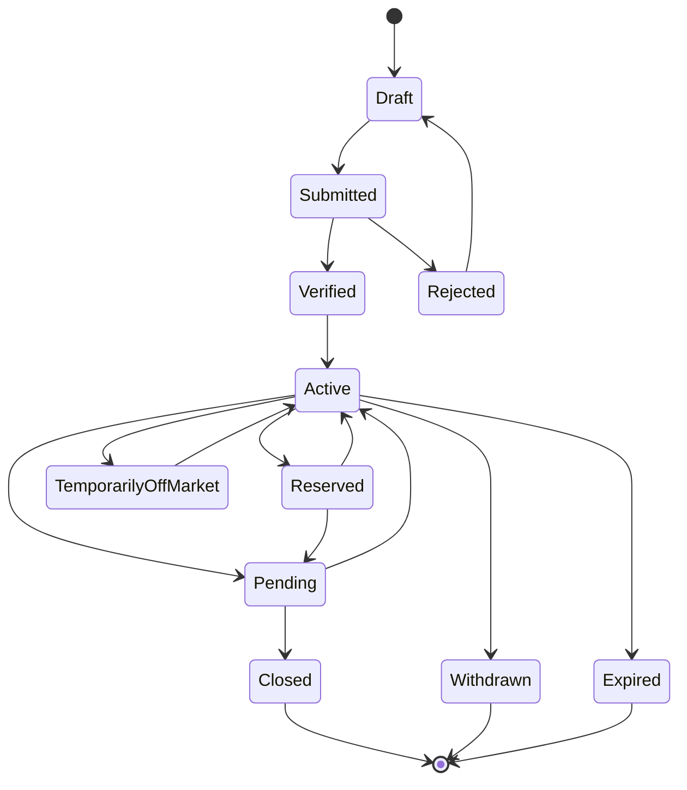

# Housenow MLS — Master Plan

> Phiên bản: 0.1  
> Trạng thái: Phase 6 core vertical slice operational  
> Phạm vi: Phase 0 đến Phase 6  
> Sản phẩm tham chiếu: MLS Matrix tại Mỹ  
> Mục tiêu: Xây dựng nền tảng dữ liệu và vận hành thị trường bất động sản đa bên phù hợp với Việt Nam.

## Progress snapshot - 2026-08-13

| Phase | Status | Evidence / deliverables |
|---|---|---|
| Phase 0 - Product alignment | Documentation baseline complete; stakeholder approval pending | [`docs/product/product-alignment.md`](./docs/product/product-alignment.md), assumption/open-question/decision logs |
| Phase 1 - Repo and domain discovery | Complete for supplied research snapshot; no implementation repo was present | [`docs/research/phase-1-discovery.md`](./docs/research/phase-1-discovery.md), [`docs/research/reference-discovery.md`](./docs/research/reference-discovery.md) |
| Phase 2 - Product and business specification | Draft baseline complete; product/legal/domain approval pending | Product requirements, permissions, data dictionary, business rules, acceptance criteria, traceability |
| Phase 3 - UX concept and clickable prototype | Core workflow implemented; extended screens remain | React application under `src/` |
| Phase 4 - Scope lock | Vertical-slice working baseline frozen; human sign-off pending | [`docs/product/phase-4-scope-lock.md`](./docs/product/phase-4-scope-lock.md) |
| Phase 5 - Technical foundation | Operational for the local vertical slice | Node HTTP API, SQLite, role scope and audit trail under `server/` |
| Phase 6 - MVP execution | Core vertical slice operational; broader epics and production hardening remain | End-to-end create, validate, review, activate, pend, close and audit workflow |

The supplied `TheNowProject/mls` ZIP is a research and domain-discovery repository, not an implementation repository. Texas-specific observations remain evidence inputs and are not promoted to Vietnam requirements without an explicit decision.

## 1. Product vision

Housenow MLS là nền tảng dữ liệu bất động sản tập trung, cho phép các bên tham gia thị trường tạo, xác minh, phân phối, khai thác và giám sát thông tin bất động sản theo quyền hạn rõ ràng.

Nền tảng phải giúp người sử dụng trả lời được:

- Bất động sản này có tồn tại và được định danh nhất quán không?
- Ai có quyền đăng bán, cho thuê hoặc phân phối?
- Dữ liệu đến từ nguồn nào và đã được xác minh ở mức nào?
- Listing đang ở trạng thái nào và lịch sử thay đổi ra sao?
- Ai chịu trách nhiệm đối với từng thay đổi?
- Ai được xem và thay đổi từng nhóm dữ liệu?
- Dữ liệu có đủ tin cậy để phục vụ tìm kiếm, giao dịch, cấp tín dụng và quản lý không?

### 1.1 Giá trị cốt lõi

- Chuẩn hóa dữ liệu bất động sản.
- Xác minh nguồn dữ liệu và quyền phân phối.
- Hạn chế tin giả, tin trùng và tin hết hiệu lực.
- Theo dõi lịch sử thay đổi và trách nhiệm cập nhật.
- Phân quyền rõ giữa các bên tham gia.
- Cung cấp một nguồn dữ liệu đáng tin cậy cho thị trường.
- Hỗ trợ cơ quan quản lý bằng dữ liệu tổng hợp và audit trail.

### 1.2 Nguyên tắc sản phẩm

1. Trust before growth: chất lượng và khả năng truy nguyên dữ liệu quan trọng hơn số lượng listing.
2. Permission by design: quyền xem và sửa dữ liệu phải được thiết kế từ đầu.
3. History is immutable: không ghi đè hoặc làm mất lịch sử quan trọng.
4. One canonical identity: một tài sản cần có một định danh chuẩn, dù có nhiều listing theo thời gian.
5. Explicit provenance: mọi dữ liệu quan trọng phải có nguồn và mức độ xác minh.
6. Workflow before features: build theo luồng nghiệp vụ hoàn chỉnh, không theo danh sách tính năng rời rạc.
7. Prototype before production: xác nhận nghiệp vụ bằng prototype trước khi khóa kiến trúc MVP.

## 2. Actors

### 2.1 Actors chính

1. Môi giới.
2. Sàn môi giới.
3. Chủ đầu tư.
4. Ngân hàng.
5. Cơ quan quản lý.
6. Người mua.

### 2.2 Actors vận hành cần bổ sung

#### Housenow Admin / Data Steward

- Xác minh tổ chức và người dùng.
- Xử lý listing hoặc property trùng.
- Xử lý tranh chấp và báo cáo dữ liệu sai.
- Quản lý taxonomy, data dictionary và validation rules.
- Theo dõi chất lượng dữ liệu, SLA và lỗi đồng bộ.

#### Chủ sở hữu / Người bán

Chưa nhất thiết phải có tài khoản trong MVP, nhưng phải tồn tại trong domain model để biểu diễn:

- Quyền sở hữu hoặc quyền định đoạt.
- Sự đồng ý cho đăng listing.
- Quyền đại diện của môi giới hoặc sàn.
- Phạm vi công khai và phân phối dữ liệu.
- Việc gia hạn hoặc chấm dứt quyền đại diện.

## 3. Core domain model

### 3.1 Đối tượng cốt lõi

| Đối tượng | Ý nghĩa |
|---|---|
| Property | Tài sản vật lý/pháp lý: đất, nhà, căn hộ hoặc công trình |
| Project | Dự án bất động sản của chủ đầu tư |
| Unit | Sản phẩm cụ thể thuộc dự án: căn, nền, shophouse hoặc đơn vị tương đương |
| Listing | Đề nghị bán/cho thuê một property hoặc unit trong một khoảng thời gian |
| Party | Cá nhân hoặc tổ chức tham gia |
| Representation | Quan hệ đại diện hoặc quyền phân phối |
| Transaction | Quá trình giao dịch phát sinh từ listing |
| Verification | Kết quả xác minh danh tính, quyền hoặc dữ liệu |
| Data Source | Nguồn của một trường hoặc một bản ghi |
| Audit Event | Sự kiện thay đổi dữ liệu, trạng thái hoặc quyền |

### 3.2 Quan hệ quan trọng

- Một `Property` có thể có nhiều `Listing` theo thời gian.
- Một `Project` có nhiều `Unit`.
- Một `Unit` có thể liên kết với một `Property` khi đủ dữ liệu định danh.
- Một `Listing` phải có party chịu trách nhiệm và căn cứ về quyền đăng/phân phối.
- Một `Listing` có thể phát sinh nhiều lead, lịch xem hoặc offer, nhưng chỉ đóng thành transaction theo quy tắc nghiệp vụ.
- Mọi thay đổi quan trọng phải tạo `Audit Event`.
- Trường dữ liệu quan trọng phải liên kết được với `Data Source` và `Verification`.

### 3.3 Listing lifecycle giả định



Lifecycle trên là giả thuyết ban đầu. Repo, tech lead, product owner và chuyên gia pháp lý phải xác nhận actor, điều kiện, thời hạn và audit event của từng transition.

## 4. Use cases theo actor

### 4.1 Môi giới

#### P0 — Prototype

- Tìm kiếm listing theo nhiều tiêu chí.
- Xem listing detail và dữ liệu dành riêng cho môi giới.
- Lưu listing và so sánh.
- Tạo/chỉnh sửa listing.
- Khai báo quyền đại diện hoặc phân phối.
- Gửi listing để sàn kiểm duyệt.
- Cập nhật trạng thái listing.
- Chia sẻ shortlist với người mua.
- Đặt lịch xem nhà.
- Xem lịch sử listing và provenance.

#### P1 — MVP

- Đăng ký, xác minh danh tính và chứng chỉ.
- Tham gia một sàn môi giới.
- Saved search và notification.
- Quản lý khách hàng và lead ở mức cơ bản.
- Nhận cảnh báo listing sai hoặc sắp hết hạn.
- Tạo CMA cơ bản.
- Báo cáo dữ liệu sai hoặc đáng ngờ.

#### P2 — Sau MVP

- Offer và transaction workflow.
- Hợp đồng/chữ ký số.
- Theo dõi hoa hồng.
- CMA nâng cao và trợ lý AI.
- Phân tích hiệu suất cá nhân.

### 4.2 Sàn môi giới

#### P0 — Prototype

- Xem inventory của sàn.
- Duyệt hoặc từ chối listing.
- Giao listing hoặc lead cho môi giới.
- Xem listing trùng hoặc có lỗi.
- Xem audit timeline.
- Xem dashboard nguồn hàng cơ bản.

#### P1 — MVP

- Xác minh hồ sơ sàn.
- Mời, duyệt, khóa hoặc loại môi giới.
- Quản lý role và permission nội bộ.
- Thiết lập workflow kiểm duyệt.
- Theo dõi listing chậm cập nhật hoặc sắp hết hạn.
- Quản lý quality queue và báo cáo vận hành.

#### P2 — Sau MVP

- Quản lý hợp đồng và hoa hồng.
- Tích hợp CRM/ERP.
- Website/IDX riêng.
- Benchmark hiệu suất theo khu vực.

### 4.3 Chủ đầu tư

#### P0 — Prototype

- Khai báo dự án.
- Quản lý block, tầng, loại sản phẩm và unit.
- Import quỹ căn mô phỏng.
- Xem inventory grid.
- Cập nhật giá và trạng thái unit.
- Chỉ định đơn vị được phân phối.
- Xem tài liệu và trạng thái pháp lý mô phỏng.

#### P1 — MVP

- Xác minh doanh nghiệp và dự án.
- Bulk import quỹ căn.
- Quản lý bảng giá và chính sách bán hàng.
- Công bố, tạm khóa hoặc thu hồi sản phẩm.
- Theo dõi lead theo dự án và đơn vị phân phối.
- Phát hiện dữ liệu chào bán mâu thuẫn.
- Xem tồn kho và hiệu quả phân phối.

#### P2 — Sau MVP

- Booking/giữ chỗ.
- Chính sách chiết khấu nhiều tầng.
- Đối soát và hoa hồng.
- Tích hợp ERP.
- Data room cho ngân hàng và cơ quan quản lý.

### 4.4 Ngân hàng

#### P0 — Prototype

- Tra cứu project, property hoặc listing được phép.
- Xem nguồn và mức xác minh của dữ liệu.
- Xem giá và lịch sử giá.
- Hiển thị sản phẩm vay phù hợp.
- Cung cấp công cụ ước tính khoản vay.

#### P1 — MVP

- Xác minh tài khoản tổ chức.
- Gắn sản phẩm vay với dự án hoặc loại tài sản.
- Nhận lead tư vấn có consent.
- Theo dõi trạng thái tư vấn hoặc sơ tuyển.
- Cung cấp trạng thái đủ điều kiện ở phạm vi được phép.

#### P2 — Sau MVP

- Pre-approval tích hợp.
- Định giá tài sản bảo đảm.
- Fraud/anomaly detection.
- Theo dõi tài sản thế chấp.
- API kiểm tra điều kiện tín dụng.

Nguyên tắc: ngân hàng không mặc định được xem dữ liệu cá nhân hoặc dữ liệu giao dịch. Quyền truy cập phải dựa trên mục đích, consent và chính sách lưu trữ.

### 4.5 Cơ quan quản lý

#### P0 — Prototype

- Xem dashboard chất lượng dữ liệu.
- Xem dữ liệu tổng hợp theo địa bàn và trạng thái.
- Xem audit trail và listing bất thường.
- Xem queue báo cáo vi phạm.

#### P1 — MVP

- Quản lý chuẩn dữ liệu dùng chung.
- Kiểm tra/xác minh giấy phép theo phạm vi tích hợp.
- Theo dõi provenance và chất lượng dữ liệu.
- Yêu cầu tổ chức sửa dữ liệu.
- Xuất báo cáo theo thẩm quyền.
- Quản lý phạm vi truy cập và retention.

#### P2 — Sau MVP

- Phát hiện giá hoặc hành vi bất thường.
- Tích hợp đất đai, quy hoạch và thuế.
- Cổng dữ liệu mở ở mức tổng hợp.
- Cảnh báo sớm rủi ro thị trường.

Không gom toàn bộ cơ quan quản lý vào một role. Cần tách cơ quan định chuẩn, cấp phép, giám sát và sở hữu dữ liệu nguồn.

### 4.6 Người mua

#### P0 — Prototype

- Tìm kiếm theo vị trí, giá và nhu cầu.
- Xem danh sách và bản đồ.
- Xem listing detail và mức xác minh.
- So sánh, lưu và chia sẻ listing.
- Liên hệ môi giới đã xác minh.
- Đặt lịch xem.
- Ước tính khoản vay.
- Báo cáo tin sai.

#### P1 — MVP

- Tạo tài khoản và hồ sơ nhu cầu.
- Saved search và notification.
- Quản lý shortlist.
- Theo dõi lịch hẹn.
- Consent chia sẻ dữ liệu cho môi giới/ngân hàng.

#### P2 — Sau MVP

- Pre-approval.
- Gửi đề nghị mua.
- Theo dõi tiến trình giao dịch.
- Data room cá nhân.
- Đánh giá môi giới sau giao dịch.

## 5. Permission baseline

| Hành động | Môi giới | Sàn | CĐT | Ngân hàng | Cơ quan quản lý | Người mua |
|---|---:|---:|---:|---:|---:|---:|
| Tạo listing | Có | Có | Theo loại | Không | Không | Không |
| Duyệt listing | Không | Trong sàn | Quỹ căn mình | Không | Giám sát | Không |
| Xem dữ liệu hạn chế | Theo quyền | Theo sàn | Dự án mình | Theo consent | Theo thẩm quyền | Không |
| Sửa trạng thái | Listing mình | Trong sàn | Inventory mình | Không | Override có audit | Không |
| Xem audit | Của mình | Trong sàn | Dự án mình | Giới hạn | Theo thẩm quyền | Không |
| Báo cáo sai phạm | Có | Có | Có | Có | Tiếp nhận/xử lý | Có |

Bảng trên là permission baseline. Trước MVP phải chi tiết đến role, resource, action, scope và field-level visibility.

## 6. Scope prioritization

### P0 — Prototype phải thể hiện

- Role switch mô phỏng.
- Search và listing results.
- Listing detail.
- Create/edit/submit listing.
- Listing lifecycle.
- Sàn duyệt listing.
- Project và unit inventory.
- Verification badge.
- Data provenance.
- Audit timeline.
- Dashboard cơ bản cho ngân hàng/cơ quan quản lý.
- Buyer experience.
- Admin quality queue.

### P1 — MVP phải vận hành thật

- Authentication.
- Organization và membership.
- RBAC và field-level authorization.
- Property/project/unit/listing data model.
- Listing approval workflow.
- Duplicate detection cơ bản.
- Saved search và notification.
- Bulk import inventory.
- Data validation và provenance.
- Report listing/data issue.
- Audit log.
- Admin console.
- Dashboard cơ bản.
- Import/API pipeline tối thiểu.

### P2 — Không thuộc MVP đầu tiên

- Booking và transaction đầy đủ.
- Offer, hợp đồng và chữ ký số.
- Commission.
- Mortgage pre-approval sâu.
- IDX/data distribution mở rộng.
- Regulatory analytics nâng cao.
- AI search và anomaly detection nâng cao.

## 7. Phase plan

## Phase 0 — Product alignment

### Mục tiêu

Thống nhất Housenow đang xây gì, cho ai và chưa xây gì.

### Checklist

- [ ] Viết product vision một trang.
- [ ] Chốt actors chính và actors vận hành.
- [ ] Chọn buyer đầu tiên của sản phẩm.
- [ ] Chọn nhóm người dùng pilot đầu tiên.
- [ ] Chọn phân khúc: sơ cấp, thứ cấp hoặc thứ tự triển khai cả hai.
- [ ] Chọn khu vực triển khai đầu tiên.
- [ ] Chốt vấn đề ưu tiên số một.
- [ ] Viết non-goals/out-of-scope.
- [ ] Xác định product owner và decision owners.
- [ ] Thống nhất cách tech lead, product và business phê duyệt quyết định.
- [ ] Tạo assumption log.
- [ ] Tạo open-question backlog.
- [ ] Tạo glossary thuật ngữ Việt/Anh.

### Deliverables

- Product vision.
- Product principles.
- Scope/non-scope.
- Actor definitions.
- Assumption log.
- Decision log.

### Exit criteria

- Team thống nhất một câu mô tả sản phẩm.
- Có phân khúc và phạm vi đầu tiên cụ thể.
- Prototype có một mục tiêu kiểm chứng rõ ràng.

## Phase 1 — Repo và domain discovery

### Trigger

Bắt đầu khi repo của tech lead được cung cấp và quyền truy cập/reuse được xác nhận.

### Mục tiêu

Hiểu repo hiện tại, tách implementation khỏi requirement và xác định phần reuse/reference/replace.

### Checklist

- [ ] Xác nhận repo dùng để tham khảo, fork hay reuse code.
- [ ] Kiểm tra license và quyền sở hữu.
- [ ] Clone repo vào `reference/` hoặc workspace riêng.
- [ ] Không chỉnh sửa trực tiếp reference repo khi chưa được thống nhất.
- [ ] Inventory file, module, service và dependency.
- [ ] Chạy Understand Anything trên repo.
- [ ] Sinh structural graph và domain graph.
- [ ] Xác định entry points và critical flows.
- [ ] Xác định database schema và migration.
- [ ] Xác định authentication/authorization.
- [ ] Xác định external services và integrations.
- [ ] Xác định module hoàn chỉnh, mock, legacy và dead code.
- [ ] Kiểm tra secrets và dữ liệu nhạy cảm.
- [ ] Map code hiện tại sang actors/use cases.
- [ ] Map code hiện tại sang domain entities.
- [ ] Lập reuse/replace/reference matrix.
- [ ] Lập danh sách câu hỏi cho tech lead.
- [ ] Tech lead walkthrough các flow quan trọng.

### Câu hỏi cần dùng với Understand Anything

- What are the main user roles and permissions?
- Explain the listing lifecycle from draft to closed.
- How are property, project, unit, listing, agent and brokerage modeled?
- Which modules contain core business rules?
- Which modules are reusable independently?
- Identify mocks, incomplete flows, hard-coded assumptions and legacy areas.
- What external services and databases are required?
- Which rules are specific to the US market?
- What would need to change for the Vietnamese market?

### Deliverables

- Architecture map.
- Domain map hiện tại.
- Actor-capability matrix hiện tại.
- Data model hiện tại.
- Integration inventory.
- Reuse/replace/reference matrix.
- Security and technical risk register.
- Tech lead question list.

### Exit criteria

- Team giải thích được listing lifecycle trong repo.
- Biết phần nào có thể reuse và phần nào phải viết mới.
- Tech lead xác nhận các phát hiện quan trọng.

## Phase 2 — Product và business specification

### Mục tiêu

Chuyển hiểu biết từ repo và stakeholder thành đặc tả đủ rõ để thiết kế prototype và build MVP.

### Checklist

- [ ] Hoàn thiện actor definitions.
- [ ] Hoàn thiện role hierarchy.
- [ ] Lập actor–use case matrix.
- [ ] Lập resource–action–scope permission matrix.
- [ ] Lập field-level visibility matrix.
- [ ] Chốt Property/Project/Unit/Listing/Transaction definitions.
- [ ] Chốt listing lifecycle.
- [ ] Chốt project/unit inventory lifecycle.
- [ ] Chốt representation/distribution workflow.
- [ ] Chốt verification workflow.
- [ ] Chốt provenance model.
- [ ] Chốt duplicate detection và merge workflow.
- [ ] Chốt audit requirements.
- [ ] Chốt notification events.
- [ ] Chốt search/filter taxonomy.
- [ ] Tạo data dictionary.
- [ ] Tạo business rules catalog.
- [ ] Viết happy path và exception flows.
- [ ] Tạo legal/compliance backlog.
- [ ] Viết MVP acceptance criteria.

### Mỗi state transition phải có

- Actor được phép thực hiện.
- Điều kiện trước khi thực hiện.
- Dữ liệu bắt buộc.
- Validation rules.
- Notification phát sinh.
- Audit event.
- Cách rollback/correction.
- SLA cập nhật nếu có.

### Deliverables

- Product requirements baseline.
- Actor–use case matrix.
- Permission matrices.
- Domain model.
- State machines.
- Data dictionary.
- Business rules catalog.
- MVP acceptance criteria.

### Exit criteria

- Mọi màn hình dự kiến đều truy được về một use case.
- Mọi field quan trọng có owner, source và visibility.
- Mọi transition quan trọng có permission và audit requirement.

## Phase 3 — UX concept và clickable prototype

### Mục tiêu

Tạo một prototype đủ thật để sáu actor nhìn thấy sản phẩm, thực hiện tác vụ và phản hồi nghiệp vụ.

### 3.1 Concept

- [ ] Product promise.
- [ ] Design principles.
- [ ] Information architecture.
- [ ] Navigation theo actor.
- [ ] Trust model trên UI.
- [ ] Data density principles.

### 3.2 Moodboard

- [ ] Hướng professional data system.
- [ ] Tránh cảm giác website rao vặt thông thường.
- [ ] Xác định visual hierarchy.
- [ ] Xác định màu trạng thái và verification.
- [ ] Xác định accessibility baseline.

### 3.3 Key elements

- [ ] Listing status.
- [ ] Verification level.
- [ ] Data source/provenance.
- [ ] Agent/brokerage identity.
- [ ] Project/unit identity.
- [ ] Audit history.
- [ ] Permission/visibility state.
- [ ] Financial eligibility.

### 3.4 UI components

- [ ] Search filter.
- [ ] Listing table/grid.
- [ ] Property card.
- [ ] Map marker.
- [ ] Status badge.
- [ ] Verification badge.
- [ ] Provenance label.
- [ ] Activity timeline.
- [ ] Organization/user selector.
- [ ] Approval panel.
- [ ] Project inventory grid.
- [ ] Document status.
- [ ] Loading/empty/error/permission-denied states.

### 3.5 Full screens

- [ ] Login/role switch mô phỏng.
- [ ] Môi giới — search và results.
- [ ] Môi giới — listing detail.
- [ ] Môi giới — create/edit/submit listing.
- [ ] Sàn — review/approve/reject listing.
- [ ] Chủ đầu tư — project inventory.
- [ ] Ngân hàng — finance eligibility.
- [ ] Cơ quan quản lý — data-quality dashboard.
- [ ] Người mua — verified listing experience.
- [ ] Housenow Admin — verification/data issue queue.

### Nguyên tắc prototype

- Dùng một dataset mẫu xuyên suốt.
- Các actor xem cùng một property/listing nhưng thấy dữ liệu khác nhau theo quyền.
- Dữ liệu giả phải có cấu trúc gần với domain model.
- Chưa cần backend, authentication, transaction hoặc tích hợp thật.
- Ưu tiên luồng hoàn chỉnh hơn số lượng màn hình.

### Deliverables

- Concept direction.
- Moodboard.
- UI foundations.
- Component set.
- Clickable prototype.
- Prototype test script.

### Exit criteria

- Sáu actor hoàn thành được tác vụ P0 chính.
- Stakeholder hiểu sản phẩm mà không cần giải thích dài.
- Feedback tập trung vào nghiệp vụ và dữ liệu thay vì câu hỏi “sản phẩm này là gì”.

## Phase 4 — Feedback, validation và scope lock

### Mục tiêu

Kiểm chứng giả thuyết, sửa các lỗi nghiệp vụ và khóa phạm vi MVP.

### Checklist

- [ ] Chuẩn bị test scenario riêng cho từng actor.
- [ ] Mỗi session có nhiệm vụ cụ thể.
- [ ] Quan sát hành vi trước khi hỏi ý kiến.
- [ ] Ghi lại failure point và misunderstanding.
- [ ] Phân loại feedback: business, data, permission, UX, visual, technical, future.
- [ ] Gắn actor và use case bị ảnh hưởng.
- [ ] Gắn severity và frequency.
- [ ] Xác định feedback làm thay đổi schema.
- [ ] Xác định feedback làm thay đổi permission.
- [ ] Xác định feedback cần legal review.
- [ ] Cập nhật assumption và decision log.
- [ ] Ưu tiên P0/P1/P2.
- [ ] Freeze prototype MVP.
- [ ] Product/business sign-off.
- [ ] Tech lead sign-off.

### Câu hỏi feedback chuẩn

1. Luồng này có đúng cách công việc thực tế diễn ra không?
2. Thiếu dữ liệu, trạng thái hoặc actor nào?
3. Chỗ nào gây hiểu nhầm hoặc thiếu tin cậy?
4. Nếu chỉ sửa một thứ trước MVP, đó là gì?

### Deliverables

- Research/feedback report.
- Updated domain and permission models.
- Prioritized MVP backlog.
- Frozen prototype baseline.
- Sign-off record.

### Exit criteria

- Không còn thay đổi lớn về actors, core entities hoặc lifecycle.
- Có backlog MVP và acceptance criteria.
- Các decision owners đã sign off.

## Phase 5 — Technical foundation

### Mục tiêu

Chốt kiến trúc và xây nền tảng kỹ thuật an toàn cho MVP.

### Checklist kiến trúc

- [ ] Chốt build mới hay reuse từng phần repo.
- [ ] Tạo Architecture Decision Records.
- [ ] Chốt system boundaries.
- [ ] Chốt database schema.
- [ ] Chốt API contracts.
- [ ] Chốt search architecture.
- [ ] Chốt import/sync architecture.
- [ ] Chốt document/file storage.
- [ ] Chốt notification architecture.
- [ ] Chốt audit architecture.

### Checklist identity và security

- [ ] Authentication.
- [ ] Organization membership.
- [ ] RBAC.
- [ ] Resource-level authorization.
- [ ] Field-level authorization.
- [ ] Consent model.
- [ ] PII classification.
- [ ] Secret management.
- [ ] Security logging.
- [ ] Threat model.
- [ ] Abuse/report workflow.

### Checklist data

- [ ] Canonical IDs.
- [ ] Provenance at record/field level theo mức cần thiết.
- [ ] Verification levels.
- [ ] Immutable audit trail.
- [ ] Validation rules.
- [ ] Deduplication rules.
- [ ] Merge/correction workflow.
- [ ] Import idempotency.
- [ ] Data retention.
- [ ] Backup/recovery.
- [ ] Seed/demo data.

### Checklist engineering

- [ ] Repository structure.
- [ ] Local development setup.
- [ ] Environment strategy.
- [ ] CI/CD.
- [ ] Test strategy.
- [ ] Observability.
- [ ] Error handling.
- [ ] Feature flags.
- [ ] Analytics event schema.
- [ ] Documentation baseline.

### Non-negotiables

- Authorization phải được kiểm tra ở backend.
- Mọi thay đổi dữ liệu quan trọng phải có audit event.
- Không ghi đè hoặc làm mất lịch sử listing.
- Tách dữ liệu public, industry-only và restricted.
- Mọi record quan trọng phải truy nguyên được nguồn.
- Import phải idempotent và có cơ chế xử lý trùng.
- Không sử dụng dữ liệu cá nhân thật trong prototype/dev.
- Override của admin/regulator phải có lý do và audit.

### Deliverables

- Target architecture.
- ADR set.
- Database schema.
- API specification.
- Security and permission design.
- Data import design.
- Test strategy.
- Delivery plan.

### Exit criteria

- Kiến trúc hỗ trợ đầy đủ P1 scope.
- Security review không còn blocker nghiêm trọng.
- Có skeleton chạy được trên môi trường development.
- Có seed data và pipeline kiểm thử cơ bản.

## Phase 6 — MVP build

### Mục tiêu

Build một vertical-slice MVP có thể vận hành bằng dữ liệu và quyền thật trong phạm vi đã khóa.

### Thứ tự implementation

#### Epic 1 — Identity và organization

- [ ] User authentication.
- [ ] Organization profiles.
- [ ] Membership/invitation.
- [ ] Roles và permissions.
- [ ] Actor-specific navigation.

#### Epic 2 — Core property data

- [ ] Property model.
- [ ] Project và unit model.
- [ ] Canonical identifiers.
- [ ] Documents và media.
- [ ] Provenance và verification.

#### Epic 3 — Listing lifecycle

- [ ] Create draft.
- [ ] Edit và validate.
- [ ] Submit.
- [ ] Review/approve/reject.
- [ ] Activate.
- [ ] Status transitions.
- [ ] Expiry/withdrawal/correction.
- [ ] Audit timeline.

#### Epic 4 — Discovery

- [ ] Search index.
- [ ] Filters.
- [ ] Results list/grid.
- [ ] Map nếu thuộc locked scope.
- [ ] Listing detail theo quyền.
- [ ] Saved listing/search.

#### Epic 5 — Chủ đầu tư inventory

- [ ] Project management.
- [ ] Unit inventory grid.
- [ ] Bulk import.
- [ ] Import validation/error report.
- [ ] Price/status update.
- [ ] Distribution assignment.

#### Epic 6 — Collaboration

- [ ] Buyer shortlist.
- [ ] Contact/lead capture.
- [ ] Schedule viewing.
- [ ] Notifications.
- [ ] Report data issue.

#### Epic 7 — Oversight và operations

- [ ] Brokerage approval queue.
- [ ] Housenow Admin quality queue.
- [ ] Duplicate review.
- [ ] Verification workflow.
- [ ] Regulatory aggregate dashboard.
- [ ] Audit search/export theo quyền.

#### Epic 8 — Finance light integration

- [ ] Mortgage product catalog.
- [ ] Affordability/loan calculator.
- [ ] Consent-based bank lead.
- [ ] Basic lead status.

### Definition of Done cho mọi feature

- [ ] Có use case và acceptance criteria.
- [ ] Có design và responsive behavior.
- [ ] Có frontend permission state.
- [ ] Có backend authorization.
- [ ] Có validation.
- [ ] Có audit event nếu thay đổi dữ liệu quan trọng.
- [ ] Có loading, empty, error và permission-denied states.
- [ ] Có automated test phù hợp.
- [ ] Có analytics event nếu cần đo lường.
- [ ] Có documentation.
- [ ] Được review bởi actor hoặc domain owner liên quan.
- [ ] Không tạo regression cho critical flows.

### MVP quality gates

- [ ] Không có critical authorization vulnerability.
- [ ] Không mất audit history.
- [ ] Listing lifecycle vượt qua end-to-end tests.
- [ ] Bulk import không tạo bản ghi trùng khi chạy lại.
- [ ] Data visibility đúng theo actor và scope.
- [ ] Các critical flows có monitoring.
- [ ] Backup và restore được kiểm thử.
- [ ] Seed/demo environment sẵn sàng cho review.
- [ ] Known limitations được ghi lại.

### Deliverables

- MVP application.
- Admin/data-steward console.
- Seed/demo environment.
- Automated test suite.
- Technical documentation.
- User-flow documentation.
- Known limitations và post-MVP backlog.

### Exit criteria

- P1 scope chạy end-to-end.
- Sáu actor có trải nghiệm phù hợp với quyền của mình.
- Data provenance, verification và audit hoạt động thật.
- MVP sẵn sàng cho bước chuẩn bị pilot ở một phase tiếp theo, nằm ngoài phạm vi tài liệu này.

## 8. Cross-phase governance

### 8.1 Decision log

Mỗi quyết định lớn cần ghi:

- Vấn đề.
- Các lựa chọn.
- Quyết định.
- Người quyết định.
- Ngày quyết định.
- Lý do.
- Hệ quả.
- Điều kiện cần xem xét lại.

### 8.2 Assumption log

Mỗi giả định cần có:

- Mô tả.
- Actor/use case bị ảnh hưởng.
- Mức rủi ro.
- Cách kiểm chứng.
- Deadline kiểm chứng.
- Trạng thái.

### 8.3 Requirement traceability

Mỗi feature cần truy ngược được theo chuỗi:

`Actor → Use case → Business rule → Screen/API → Acceptance criteria → Test`

### 8.4 Change control

- Thay đổi actor, core entity, lifecycle hoặc permission sau Phase 4 phải được đánh giá tác động.
- Ý tưởng mới không tự động vào MVP; phải được phân loại P1/P2.
- Feedback visual không được làm thay đổi business rule nếu chưa có domain review.
- Repo tham chiếu không tự động trở thành specification.

## 9. Open decisions cần chốt sớm

- [ ] Phân khúc đầu tiên: sơ cấp hay thứ cấp?
- [ ] Khu vực đầu tiên?
- [ ] Buyer đầu tiên của sản phẩm là ai?
- [ ] Ai là source of truth cho từng nhóm dữ liệu?
- [ ] Ai có quyền xác minh property và listing?
- [ ] Listing có bắt buộc độc quyền không?
- [ ] Người bán có tài khoản trực tiếp trong MVP không?
- [ ] Cơ quan quản lý chỉ giám sát hay tham gia phê duyệt?
- [ ] Dữ liệu nào public, industry-only và restricted?
- [ ] Booking/transaction có thuộc MVP không?
- [ ] Ngân hàng tham gia ở mức catalog, lead hay pre-approval?
- [ ] Repo của tech lead được phép reference, fork hay reuse?

## 10. Project structure dự kiến

```text
housenow-mls/
├── MASTER_PLAN.md
├── reference/            # Repo/tài liệu tham chiếu; không chỉnh trực tiếp
├── docs/
│   ├── product/
│   ├── domain/
│   ├── decisions/
│   ├── research/
│   └── architecture/
├── prototype/            # Clickable web prototype
└── app/                  # MVP codebase sau khi scope lock
```

Chỉ `MASTER_PLAN.md` được khởi tạo ở thời điểm hiện tại. Các thư mục và artifact còn lại sẽ được tạo khi repo được cung cấp và Phase 1 bắt đầu.

## 11. Immediate next step

Khi repo được cung cấp:

1. Đặt repo vào vai trò reference, không sửa trực tiếp.
2. Xác nhận quyền fork/reuse với tech lead.
3. Thực hiện Phase 1 discovery.
4. Đối chiếu domain và use cases trong repo với tài liệu này.
5. Cập nhật master plan bằng các phát hiện đã được xác nhận.
6. Chỉ bắt đầu prototype sau khi có actor–use case map và open-question list đủ rõ.
