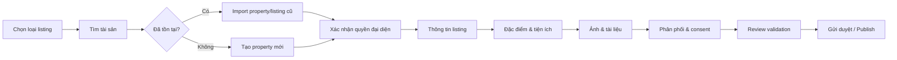
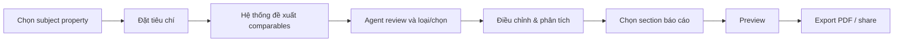

# Housenow MLS — UI Flow Research

> Phiên bản: 0.1  
> Trạng thái: Baseline để bắt đầu prototype  
> Nguồn chính: video walkthrough NTREIS/Matrix và phụ đề do Housenow cung cấp  
> Tài liệu liên quan: [MASTER_PLAN.md](./MASTER_PLAN.md)

## 1. Mục tiêu tài liệu

Tài liệu này chuyển nội dung được trình diễn trong video thành:

- Sơ đồ kiến trúc trải nghiệm.
- Danh mục màn hình cần thiết kế và build.
- Flow nghiệp vụ xuyên màn hình.
- Thành phần UI dùng chung.
- Phạm vi prototype để stakeholder có thể “nhìn được”, thao tác và feedback.
- Checklist nghiệm thu cho từng phần.

Mục tiêu của prototype không phải sao chép nguyên giao diện cũ của Matrix. Housenow cần giữ lại **mô hình nghiệp vụ, mật độ thông tin và khả năng truy vết** giống video, nhưng trình bày bằng UI hiện đại, dễ học và phù hợp thị trường Việt Nam.

## 2. Kết luận quan trọng từ video

### 2.1 Ba lớp sản phẩm khác nhau

```text
Clareity Dashboard  →  Matrix MLS  →  Ứng dụng chuyên biệt / kênh phân phối
     App Hub             Core             CMA, showing, lockbox, forms,
     + SSO            data/workflow        mortgage, portals, reports...
```

Đối chiếu sang Housenow:

| Lớp | Vai trò | Housenow cần làm gì |
|---|---|---|
| Identity & App Hub | Một tài khoản, quyền truy cập theo membership/tổ chức | Làm shell, role switcher và app launcher cơ bản |
| MLS Core | Nguồn dữ liệu listing, tìm kiếm, trạng thái, lịch sử, compliance | Đây là sản phẩm P0 cần build thật |
| Apps & Integrations | Giải quyết tác vụ chuyên sâu | Dựng card/entry point; chỉ build native những công cụ P0 |
| Distribution | Đẩy dữ liệu ra portal/website/đối tác | Prototype màn hình consent, channel và trạng thái đồng bộ |

### 2.2 Matrix không phải toàn bộ MLS

- MLS là hệ sinh thái gồm tổ chức, thành viên, quy tắc, dữ liệu, quyền truy cập và quy trình kiểm soát.
- Matrix là phần mềm lõi mà môi giới sử dụng để nhập, tìm kiếm và cập nhật listing.
- Những app như Cloud CMA, ShowingTime, Supra hoặc TransactionDesk sử dụng dữ liệu MLS cho tác vụ chuyên biệt.
- Vì vậy Housenow không nên gom mọi khả năng vào một màn hình hoặc một module khổng lồ.

### 2.3 Các nguyên tắc UX phải giữ

1. Một tài sản có thể có nhiều listing theo thời gian; `Property ID` và `Listing ID` không phải một.
2. Lịch sử không bị ghi đè; mỗi lần đăng bán/cho thuê tạo record và timeline rõ ràng.
3. Public data, member-only data và private remarks phải được phân lớp.
4. Người dùng phải nhìn thấy ai là listing agent, thuộc sàn nào và ai chịu trách nhiệm giám sát.
5. Mọi thay đổi trạng thái quan trọng cần timestamp, người thực hiện và audit trail.
6. Khi tạo listing, hệ thống phải ưu tiên tái sử dụng dữ liệu property có sẵn.
7. Listing chỉ được phân phối ra kênh ngoài khi có quyền/consent phù hợp.
8. Search, property detail, listing workflow và CMA phải liên kết trực tiếp; tránh bắt người dùng nhập lại dữ liệu.

## 3. Video walkthrough → phạm vi sản phẩm

Mốc thời gian dưới đây dựa trên phụ đề; có thể sai lệch vài giây so với video gốc.

| Khoảng thời gian | Nội dung được trình diễn | Module Housenow tương ứng | Ưu tiên |
|---|---|---|---|
| 00:02–00:07 | Dashboard app, một login cho nhiều công cụ | SSO shell + App Hub | P1 |
| 00:07–00:09 | Vào Matrix; tìm trực tiếp bằng địa chỉ/MLS number | Global Search | P0 |
| 00:09–00:14 | Listing detail, private remarks, tax, ảnh, lịch sử, mortgage/public record | Property 360 + Listing Detail | P0 |
| 00:14–00:20 | Nhiều listing theo lịch sử, quyền phân phối độc quyền, chống đăng trùng, hợp đồng đại diện | Identity resolution + Representation | P0 |
| 00:20–00:24 | My Listings, sửa dữ liệu, chuyển trạng thái, upload ảnh/tài liệu | Listing Workspace | P0 |
| 00:24–00:27 | Tạo listing từ tax/public record hoặc listing cũ; tự điền 60–70% dữ liệu | Create Listing Wizard | P0 |
| 00:27–00:30 | Đồng bộ listing ra portal; seller consent; bán và cho thuê cùng tài sản | Distribution & Consent | P0 demo / P1 thật |
| 00:30–00:36 | Quick Search, Stats, Tax, quyền truy cập theo association | Search + Market Analytics | P0/P1 |
| 00:36–00:42 | Cấu trúc regulator/association/broker/agent; broker giám sát và chịu trách nhiệm | Organization, Roster, Permissions | P0 |
| 00:43–00:46 | Đóng giao dịch, giá chốt, ngày hợp đồng, financing, title company | Close Listing flow | P0 |
| 00:46–00:57 | Cloud CMA: chọn subject property, chọn comparable, tạo PDF report | CMA Builder | P0 |
| 00:58–01:01 | MLS theo vùng, field tương đồng, rule/form khác nhau | Data dictionary + policy configuration | P1 |
| 01:02–01:08 | Chuẩn hóa dữ liệu, nhắc lỗi, phạt sai, licensing và cộng đồng tự kiểm soát | Data Quality + Compliance Queue | P0/P1 |

## 4. Information architecture đề xuất

### 4.1 Navigation dành cho môi giới/sàn

```text
Housenow MLS
├── Tổng quan
│   ├── Market Watch
│   ├── Hot Sheets
│   ├── Việc cần xử lý
│   └── Tìm kiếm gần đây
├── Tìm kiếm
│   ├── Quick Search
│   ├── Advanced Search
│   ├── Map Search
│   └── Saved Searches
├── Listing
│   ├── Tất cả listing
│   ├── Listing của tôi
│   ├── Tạo listing
│   ├── Draft / chờ duyệt
│   └── Quality issues
├── Khách hàng
│   ├── Contacts
│   ├── Shortlists
│   ├── Lịch xem
│   └── Alerts
├── Phân tích
│   ├── CMA
│   ├── Thống kê thị trường
│   └── Báo cáo đã tạo
├── Danh bạ
│   ├── Môi giới
│   ├── Sàn
│   ├── Chủ đầu tư
│   └── Đối tác
├── Ứng dụng
│   └── App Hub / integrations
└── Quản trị (theo quyền)
    ├── Thành viên và vai trò
    ├── Kiểm duyệt listing
    ├── Data quality
    ├── Audit log
    ├── Data dictionary
    └── Distribution channels
```

### 4.2 Global shell

Mọi màn hình nghiệp vụ dùng chung:

- Logo + tên vùng dữ liệu/tổ chức hiện hành.
- Global search: địa chỉ, Listing ID, Property ID, dự án, môi giới.
- Role/organization switcher.
- Notification center.
- Quick create: Listing, Contact, CMA, Showing.
- Help/contextual guide.
- User menu, membership và phiên đăng nhập.

## 5. Danh sách màn hình cần build

## A. Authentication & App Hub

### A1. Sign in

**Mục tiêu:** một tài khoản đi vào đúng tổ chức, vai trò và bộ dữ liệu.

Thành phần:

- Email/phone, password hoặc SSO.
- Organization selector nếu một người thuộc nhiều tổ chức.
- Trạng thái membership/license.
- Thông báo account bị giới hạn và hướng dẫn xử lý.

### A2. App Hub

Giao diện tham chiếu từ màn hình Clareity đầu video.

Nhóm card:

- MLS Core.
- CMA & reports.
- Showing & access.
- Transaction & forms.
- Finance/mortgage.
- Media/floor plan.
- Distribution/IDX.
- Partner tools.

Mỗi card hiển thị tên, mô tả một dòng, trạng thái `Đã kích hoạt / Cần kích hoạt / Sắp có`, quyền truy cập và CTA.

**Không cần build thật trong prototype:** khóa cửa điện tử, chữ ký số, background check. Dùng integration placeholder có mô tả rõ.

## B. Dashboard — “My Matrix” tương đương

### B1. Agent dashboard

Widgets P0:

- Global quick search.
- My Listings theo trạng thái.
- Hot Sheets: new listing, back on market, price increase/decrease, pending, closed.
- Market Watch theo khu vực đã chọn.
- Tasks: listing thiếu dữ liệu, sắp hết hạn, cần đổi trạng thái, lịch xem hôm nay.
- Favorite/Saved Searches.
- Recent Contacts và shortlist gần đây.
- External apps / quick actions.

### B2. Brokerage dashboard

- Tổng inventory của sàn.
- Listing chờ duyệt.
- Listing có lỗi hoặc trùng.
- SLA cập nhật trạng thái.
- Hoạt động của agent.
- Audit events mới nhất.

### B3. Developer dashboard

- Dự án và quỹ căn.
- Inventory theo block/tầng/loại căn/trạng thái.
- Thay đổi giá gần nhất.
- Đơn vị phân phối.
- Lead và lịch xem theo dự án.

## C. Search

### C1. Global quick search

Cho phép nhập:

- Listing ID.
- Địa chỉ.
- Property ID/thửa đất.
- Tên dự án hoặc mã căn.
- Tên môi giới/sàn.

Kết quả autocomplete phải phân nhóm theo loại record, tránh nhập một mã nhưng không biết đang mở property hay listing.

### C2. Advanced listing search

Nhóm filter:

- Loại giao dịch: bán/cho thuê.
- Trạng thái listing.
- Loại bất động sản.
- Vị trí, polygon hoặc bán kính.
- Khoảng giá.
- Phòng ngủ/phòng tắm.
- Diện tích đất/sàn.
- Dự án/chủ đầu tư.
- Pháp lý và mức xác minh.
- Ngày đăng, ngày thay đổi, days on market.
- Agent/sàn phụ trách.
- Tiện ích và đặc điểm chi tiết.

Actions:

- Search.
- Clear.
- Save search.
- Tạo alert.
- Lưu làm template.

### C3. Search results — List

- Dense table cho nghiệp vụ chuyên sâu.
- Card view cho người dùng ít kinh nghiệm.
- Column chooser và saved view.
- Sort, pagination, bulk select.
- Status badge, verification badge, DOM, price changes.
- Quick actions: xem, lưu, so sánh, thêm vào CMA, chia sẻ, đặt lịch.

### C4. Search results — Map

- Map + result panel đồng bộ.
- Cluster marker.
- Draw area / radius.
- Price/status marker.
- Hover/click preview.
- Toggle list/map/split view.

### C5. Saved searches & alerts

- Danh sách bộ lọc đã lưu.
- Đối tượng khách hàng nhận kết quả.
- Tần suất thông báo.
- Lần chạy gần nhất và số kết quả mới.
- Pause/edit/delete.

## D. Property 360 & Listing Detail

Video cho thấy đây là màn hình quan trọng nhất. UI phải phân biệt rõ:

```text
Property = tài sản ổn định theo thời gian
Listing  = một lần chào bán/cho thuê cụ thể
```

### D1. Property header

- Địa chỉ chuẩn hóa.
- Property ID/thửa đất/dự án-unit.
- Loại tài sản.
- Verification level.
- Cảnh báo duplicate/dispute.
- Listing đang active và các CTA chính.

### D2. Listing summary

- Listing ID.
- Status và lifecycle.
- Giá hiện tại + lịch sử giá.
- Ngày đăng, ngày hết hạn, days on market.
- Listing agent, brokerage, supervisor.
- Transaction type và representation type.
- Distribution status.

### D3. Tabs

| Tab | Nội dung |
|---|---|
| Overview | Thông tin cốt lõi, giá, mô tả, đặc điểm |
| Media | Ảnh, video, floor plan, virtual tour |
| Location | Bản đồ, địa giới, tiện ích xung quanh |
| Public/Legal | Thửa đất, quy hoạch, thuế/phí, nguồn công khai được phép |
| Listing History | Mọi lần đăng, status, giá, DOM |
| Transaction History | Giao dịch/transfer được phép hiển thị |
| Documents | Tài liệu pháp lý, disclosure, representation |
| Agent-only | Private remarks, showing instructions, internal contacts |
| Audit | Ai thay đổi gì, lúc nào, nguồn nào |

### D4. Action bar

- Edit listing nếu có quyền.
- Change status.
- Add to shortlist.
- Add to CMA.
- Schedule showing.
- Share/export.
- Report incorrect data.

## E. Listing Workspace

### E1. My Listings

Tabs/status:

- Draft.
- Submitted.
- Needs changes.
- Active.
- Reserved/option.
- Pending.
- Temporarily off market.
- Closed.
- Withdrawn/expired.

Mỗi row hiển thị health score, last updated, expiration, distribution state và issue count.

### E2. Create Listing Wizard

Luồng đề xuất:



Các bước UI:

1. **Listing type:** bán/cho thuê; residential/commercial/project unit.
2. **Resolve property:** địa chỉ, thửa đất, dự án-unit; hiển thị candidate match.
3. **Reuse data:** chọn import từ nguồn công khai hoặc listing lịch sử; đánh dấu field nào được prefill.
4. **Representation:** chủ sở hữu, môi giới/sàn, loại quyền, ngày hiệu lực/hết hạn, tài liệu chứng minh.
5. **Pricing:** giá, phí, điều khoản cơ bản.
6. **Property facts:** phòng, diện tích, đặc điểm, tiện ích.
7. **Public description & private remarks:** tách field và quyền hiển thị.
8. **Media/documents:** upload, reorder, loại tài liệu, visibility.
9. **Distribution consent:** kênh được phép, phạm vi dữ liệu, thời điểm publish.
10. **Review:** completeness score, lỗi blocking, warning, preview public/member view.

### E3. Duplicate/exclusivity guard

Khi resolve property:

- Hiển thị active listing hiện có.
- Hiển thị representation đang hiệu lực.
- Chặn publish nếu xung đột.
- Cho phép gửi dispute hoặc request review.
- Không để người dùng “bỏ qua” bằng cách sửa nhẹ địa chỉ.

### E4. Listing review/approval

Dành cho sàn hoặc data steward:

- Side-by-side field diff.
- Source/provenance của từng field quan trọng.
- Document viewer.
- Validation issues.
- Approve, request changes, reject.
- Comment có vị trí cụ thể.
- Audit reason bắt buộc khi override.

## F. Listing Lifecycle

### F1. Change status

Status dialog phải hiển thị:

- Current state → allowed next states.
- Effective date/time.
- Reason.
- Trường bắt buộc phát sinh theo transition.
- Deadline/SLA và cảnh báo trễ.
- Tác động tới distribution channels.

### F2. Close listing

Theo video, flow đóng listing cần thu thập tối thiểu:

- Contract date.
- Pending/option dates nếu áp dụng.
- Close date.
- Close price.
- Buyer-side agent và organization.
- Financing method hoặc cash.
- Settlement/title/notary party phù hợp bối cảnh Việt Nam.
- Seller concessions/discount nếu chính sách cho phép.
- Price per m² được hệ thống tính tự động.

### F3. Terminate/withdraw

- Không cho agent tự ý xóa record.
- Chọn lý do và ngày hiệu lực.
- Đính kèm căn cứ/chấp thuận cần thiết.
- Broker/admin phê duyệt theo policy.
- Listing chuyển trạng thái nhưng lịch sử còn nguyên.

## G. Distribution & Consent

### G1. Distribution settings

Mỗi listing có:

- Public visibility on/off.
- Danh sách kênh: Housenow Portal, website sàn, đối tác/IDX/API.
- Field-level visibility policy.
- Seller consent record.
- Last sync, next retry và error state.

### G2. Channel monitor

- Channel.
- Trạng thái queued/published/failed/removed.
- External URL hoặc external ID.
- Field mapping issue.
- Retry và audit log.

Prototype chỉ cần mô phỏng việc syndication; chưa cần kết nối thật với portal bên ngoài.

## H. Showing & Access

Video dùng ShowingTime và Supra như hai công cụ gắn với nhau: đặt lịch và kiểm soát người vào xem nhà.

### H1. Schedule showing

- Chọn listing.
- Chọn ngày/khung giờ.
- Người mua/agent tham dự.
- Hướng dẫn tiếp cận.
- Gửi request tới listing agent/seller.
- Confirm/reschedule/cancel.

### H2. Showing log

- Ai đặt lịch, ai dẫn khách, thời điểm vào/xem.
- Trạng thái lịch hẹn.
- Feedback sau buổi xem.
- Timeline cung cấp cho listing agent/seller.

### H3. Lockbox/access placeholder

Không build hệ thống khóa ở P0. Chỉ cần card `Access provider`, trạng thái kết nối và mock access event.

## I. Contacts, Shortlist & Collaboration

### I1. Contact detail

- Thông tin khách hàng.
- Nhu cầu tìm kiếm.
- Consent.
- Assigned agent.
- Saved searches.
- Shortlists.
- Showing history.
- Notes/activity timeline.

### I2. Buyer shortlist

- Thêm listing từ search/detail.
- So sánh dạng bảng.
- Agent ghi chú.
- Buyer like/dislike/comment.
- Chia sẻ link theo quyền.
- Đặt lịch xem từ shortlist.

## J. CMA Builder

Đây là flow nổi bật nhất ở nửa sau video và nên có trong prototype.



### J1. CMA setup

- Subject property.
- Recipient/client.
- Transaction context: tư vấn giá bán hoặc giá mua.
- Khoảng thời gian giao dịch.
- Bán kính/khu vực.
- Số comparable mong muốn.

### J2. Comparable suggestions

Table + map, gồm:

- Status.
- Distance.
- Close/list price.
- Price per m².
- Bedrooms/bathrooms.
- Area.
- Year built.
- Floors/property type.
- Close date.
- Days on market.
- Similarity score và lý do gợi ý.

Agent phải có quyền chọn/bỏ candidate. Hệ thống không tự biến suggestion thành kết luận định giá.

### J3. Analysis

- Summary range.
- Average/median close price.
- Average/median price per m².
- Active competition tách khỏi sold comparables.
- DOM và market velocity.
- Adjustment notes.
- Agent recommended range + rationale.

### J4. Report composer

Cho phép bật/tắt và sắp xếp:

- Cover.
- Agent profile.
- What is CMA.
- Subject property.
- Map.
- Comparable summary.
- Comparable detail/photos.
- Price analysis.
- Market statistics.
- Recommendation/disclaimer.

Output: preview web, PDF và share link có expiry.

## K. Market Analytics

### K1. Hot Sheets

- New listing.
- Back on market.
- Price increase/decrease.
- Status change.
- Pending/closed.
- Filter theo loại tài sản và địa bàn.

### K2. Market statistics

- New/active/pending/closed inventory.
- Median price và price per m².
- Days on market.
- Absorption/supply.
- Price trend.
- Sale-to-list ratio.
- Breakdown theo khu vực, loại hình, khoảng thời gian.

### K3. Reports

- Save report configuration.
- Export CSV/PDF theo quyền.
- Chú thích nguồn, thời điểm cập nhật và methodology.

## L. Roster & Organization

### L1. Agent profile

- License/verification.
- Brokerage và supervisor.
- Khu vực hoạt động.
- Active/closed listings.
- Contact fields theo quyền.
- Membership status.

### L2. Brokerage profile

- Legal identity.
- Broker of record.
- Agents.
- Listing inventory.
- Permission policies.
- Compliance/quality summary.

### L3. Membership management

- Invite/approve/suspend agent.
- Assign supervisor.
- Role and scope.
- Membership/license expiry.
- Access to datasets/apps.

## M. Data Quality, Compliance & Audit

### M1. Quality queue

Issue types:

- Duplicate property/listing.
- Invalid address format.
- Missing required field.
- Conflicting source data.
- Status overdue.
- Expired representation.
- Price/status mismatch with downstream channel.
- User-reported incorrect data.

### M2. Issue detail

- Record snapshot.
- Violation/rule.
- Evidence and sources.
- Responsible party.
- Due date/reminder count.
- Comments and resolution.
- Escalate, waive with reason, resolve.

### M3. Audit log

- Actor.
- Organization/role.
- Resource.
- Action.
- Before/after diff.
- Timestamp.
- Source/system.
- Reason and related document.

Không dùng nút xóa vật lý cho listing hoặc giao dịch nghiệp vụ trong UI thông thường.

## 6. Các flow end-to-end bắt buộc cho prototype

### Flow 1 — Buyer agent tìm một căn cụ thể

```text
Dashboard → nhập địa chỉ/Listing ID → chọn Property
→ xem active listing + listing history → xem agent-only data
→ lưu vào shortlist → đặt lịch xem → ghi nhận feedback
```

### Flow 2 — Buyer chưa có căn cụ thể

```text
Contact → tạo nhu cầu → Advanced Search → List/Map results
→ lưu search + alert → chọn listing → shortlist/compare → schedule showing
```

### Flow 3 — Listing agent đăng tài sản đã tồn tại

```text
Create Listing → resolve property → import dữ liệu cũ
→ kiểm tra active listing/representation conflict
→ khai báo quyền đại diện → hoàn thiện field/media
→ consent & channels → validation → gửi sàn duyệt → active
```

### Flow 4 — Sàn duyệt và giám sát listing

```text
Broker Dashboard → Approval Queue → xem diff + tài liệu
→ request changes/approve → theo dõi SLA/status
→ xử lý quality issue hoặc termination
```

### Flow 5 — Cập nhật đến khi đóng listing

```text
Active → Reserved/Option → Pending → Closed
→ nhập giá/ngày/đối tác/financing → tạo transaction snapshot
→ cập nhật analytics và distribution → giữ nguyên audit history
```

### Flow 6 — Tạo CMA cho khách

```text
Property Detail → Create CMA → criteria → suggested comparables
→ agent chọn/lọc → analysis → compose report → preview → share/PDF
```

## 7. Component inventory

### Navigation & layout

- App shell.
- Sidebar/top navigation.
- Global command/search bar.
- Role/organization switcher.
- Notification drawer.
- Breadcrumb.
- Page header + contextual actions.

### Data display

- Dense data table.
- Saved views/column chooser.
- Listing card.
- Property summary card.
- Map marker + preview card.
- Status and verification badge.
- Metric/KPI card.
- Timeline/audit event.
- Field provenance indicator.
- Before/after diff.

### Input & workflow

- Multi-step wizard.
- Address/property resolver.
- Duplicate candidate matcher.
- Date/range picker.
- Advanced filter builder.
- File uploader and document visibility selector.
- Status transition dialog.
- Approval panel.
- Consent/channel selector.
- Validation summary.
- Autosave/draft indicator.

### Collaboration & reporting

- Shortlist compare table.
- Comment/activity composer.
- Schedule calendar.
- CMA comparable selector.
- Report section composer.
- Web/PDF preview.

## 8. Permission-driven UI

UI không chỉ ẩn menu theo role; mọi action phải kiểm tra `role + organization + resource + scope + state`.

| Khả năng | Agent | Broker/Sàn | CĐT | Data Steward | Người mua |
|---|---:|---:|---:|---:|---:|
| Xem public listing | Có | Có | Có | Có | Có |
| Xem agent-only fields | Theo membership | Có | Theo phạm vi | Có | Không |
| Tạo listing | Có | Có | Unit/dự án mình | Hỗ trợ | Không |
| Publish/approve | Theo policy | Trong sàn | Inventory mình | Override có audit | Không |
| Change status | Listing phụ trách | Trong sàn | Unit mình | Override | Không |
| Xem full audit | Listing mình | Trong sàn | Dự án mình | Có | Không |
| Tạo CMA | Có | Có | Theo phạm vi | Có | Không |
| Xử lý quality issue | Issue được giao | Có | Issue liên quan | Có | Chỉ report |

Prototype phải có tối thiểu ba persona switchable: `Agent`, `Broker`, `Data Steward`. Người mua có thể dùng share link hoặc buyer portal đơn giản.

### 8.1 Field visibility: Consumer vs MLS Member vs Restricted

Một listing dùng chung canonical record nhưng được render thành các view khác nhau theo audience và policy. Zillow/portal tiêu dùng chỉ nhận tập field được phép phân phối; không được coi portal là bản sao đầy đủ của MLS.

| Nhóm dữ liệu | Consumer/portal | MLS member | Restricted theo role/case |
|---|---:|---:|---:|
| Địa chỉ, ảnh, giá chào, trạng thái public | Có | Có | — |
| Loại tài sản, phòng, diện tích, tiện ích, mô tả public | Có | Có | — |
| Parcel/public record, thuế, lịch sử giao dịch công khai | Tùy nguồn và địa phương | Có nếu MLS đã tích hợp | Một số field nhạy cảm |
| Listing agent/broker attribution | Có ở mức công khai | Chi tiết hơn | License/internal hierarchy |
| Days on market | Có thể là metric của portal | MLS DOM/CDOM | — |
| Listing history đầy đủ, expired/withdrawn và price events | Một phần/tùy portal | Có | — |
| Private remarks | Không | Có theo membership | Có thể giới hạn thêm |
| Showing instructions/service | Không | Có theo quyền | Có |
| Keybox number/type/access event | Không | Không mặc định cho mọi member | Chỉ bên được phép |
| Owner/seller identity và contact | Không | Không mặc định | Chỉ role/case được phép |
| Lender, balance/payment và financial detail | Không | Tùy nguồn/policy | Thường restricted |
| Broker supervisor, internal office contact | Không | Tùy MLS | Internal/broker/admin |
| Representation agreement, consent, supporting documents | Không | Chỉ bên liên quan | Broker/admin/compliance |
| Full audit log và before/after diff | Không | Trong phạm vi phụ trách | Broker/data steward/regulator |

UI phải hỗ trợ ít nhất ba chế độ preview ngay trên Listing Workspace:

1. `Public view`: dữ liệu có thể phát ra Housenow Portal/IDX.
2. `Member view`: dữ liệu nghiệp vụ cho thành viên MLS đã xác thực.
3. `Restricted view`: field chỉ mở khi đúng role, organization, assignment hoặc transaction.

Không hard-code visibility chỉ theo tên field. Policy cần xét cả nguồn dữ liệu, consent, địa phương, trạng thái listing và mục đích truy cập.

## 9. Data states cần thiết kế

Mỗi màn hình quan trọng phải có đủ:

- Loading/skeleton.
- Empty state có next action.
- No results.
- Permission denied.
- Read-only record.
- Validation error.
- Conflict/duplicate.
- Stale data/source unavailable.
- Sync pending/failed.
- Success confirmation.
- Unsaved changes/autosave.

## 10. Responsive strategy

- **Desktop-first:** nghiệp vụ Matrix có bảng dữ liệu dày, filter phức tạp và so sánh nhiều cột.
- **Tablet:** hỗ trợ dashboard, search, detail, showing và status update; video cũng trình diễn trên iPad.
- **Mobile:** ưu tiên search nhanh, listing detail, notification, lịch xem và tác vụ hiện trường; không ép toàn bộ admin/CMA composer vào màn hình nhỏ ở P0.
- Table trên tablet/mobile chuyển thành card hoặc horizontal scroll có cột được ghim.
- Action quan trọng phải ở sticky action bar; không phụ thuộc hover.

## 11. P0 clickable prototype — danh sách màn hình chốt

Để stakeholder “nhìn được” và feedback như video, vòng prototype đầu tiên nên có khoảng 18 màn hình/state chính:

1. Sign in / role selection.
2. App Hub.
3. Agent Dashboard.
4. Broker Dashboard.
5. Quick/Advanced Search.
6. Search Results — list.
7. Search Results — map split view.
8. Property 360 — Overview.
9. Property 360 — History/Public data.
10. Property 360 — Agent-only/Audit.
11. My Listings.
12. Create Listing — Resolve & Import.
13. Create Listing — Representation & Details.
14. Create Listing — Distribution, Review & Validation.
15. Listing Approval.
16. Change Status / Close Listing.
17. CMA — Select Comparables.
18. CMA — Analysis & Report Preview.

Secondary states cần làm trong cùng prototype:

- Duplicate conflict.
- Quality issue warning.
- Schedule showing modal.
- Shortlist compare drawer/page.
- Notification center.

## 12. Build order cho UI prototype

### Phase UI-1 — Foundation

- [ ] Design tokens: color, type, spacing, radius, elevation.
- [ ] App shell và responsive grid.
- [ ] Role/organization switcher.
- [ ] Status, verification và visibility system.
- [ ] Mock data schema thống nhất.

### Phase UI-2 — Read experience

- [ ] Agent Dashboard.
- [ ] Search form.
- [ ] Result table/card/map.
- [ ] Property 360.
- [ ] Listing history và audit timeline.
- [ ] Empty/error/permission states.

### Phase UI-3 — Listing workflow

- [ ] My Listings.
- [ ] Create Listing Wizard.
- [ ] Property resolution/import.
- [ ] Representation and duplicate guard.
- [ ] Approval flow.
- [ ] Status transitions và Close Listing.
- [ ] Distribution/consent simulation.

### Phase UI-4 — Agent productivity

- [ ] Contacts và saved searches.
- [ ] Shortlist/compare.
- [ ] Schedule showing.
- [ ] Notification/task center.

### Phase UI-5 — CMA & analytics

- [ ] CMA setup.
- [ ] Comparable map/table.
- [ ] Analysis summary.
- [ ] Report composer/preview.
- [ ] Hot Sheets và market metrics.

### Phase UI-6 — Governance & feedback-ready

- [ ] Broker Dashboard.
- [ ] Data Quality Queue.
- [ ] Issue detail và audit diff.
- [ ] App Hub placeholders.
- [ ] Tablet pass.
- [ ] Seeded demo flows.
- [ ] Instrument feedback per screen/task.

## 13. Prototype acceptance checklist

### Search & detail

- [ ] Tìm được cùng một tài sản bằng địa chỉ, Property ID hoặc Listing ID.
- [ ] Người xem phân biệt được property và từng lần listing.
- [ ] Chuyển list ↔ map không mất filter/selection.
- [ ] Public, member-only và private data có dấu hiệu rõ ràng.
- [ ] Listing history, price history và audit không bị trộn lẫn.

### Listing workflow

- [ ] Import được mock data từ property/listing cũ.
- [ ] Phát hiện và chặn active duplicate.
- [ ] Representation có loại quyền, hiệu lực và tài liệu.
- [ ] Draft được autosave.
- [ ] Validation phân biệt error blocking và warning.
- [ ] Preview được public view và member view.
- [ ] Mọi status transition có field/reason cần thiết.
- [ ] Không có hành động xóa làm mất lịch sử.

### Distribution

- [ ] Người dùng thấy và xác nhận consent.
- [ ] Chọn được kênh phân phối.
- [ ] Thấy trạng thái sync và lỗi giả lập.
- [ ] Thay đổi giá/status phản ánh ở channel monitor.

### CMA

- [ ] Chọn được subject property.
- [ ] Hệ thống đề xuất comparable theo tiêu chí có thể giải thích.
- [ ] Agent có thể loại/chọn và ghi chú.
- [ ] Active competition tách khỏi closed comparable.
- [ ] Tính được range, median và price per m².
- [ ] Tạo được preview report có thương hiệu agent/sàn.

### Role & governance

- [ ] Agent, Broker và Data Steward nhìn thấy action khác nhau.
- [ ] Broker duyệt/request changes được.
- [ ] Quality issue có owner, deadline và trạng thái.
- [ ] Audit log thể hiện before/after và actor.

### Feedback readiness

- [ ] Demo data đủ để chạy trọn sáu end-to-end flows.
- [ ] Mỗi màn hình có câu hỏi feedback gắn với task cụ thể.
- [ ] Ghi lại task completion, điểm gây nhầm và feature request.
- [ ] Không dùng dữ liệu cá nhân/thật trong prototype công khai.

## 14. Những gì chưa nên build ở vòng đầu

- Lockbox/hardware access thật.
- E-signature và bộ hợp đồng pháp lý hoàn chỉnh.
- Background/tenant screening.
- Payment hoặc commission settlement.
- Kết nối live với cơ quan đất đai/thuế/ngân hàng.
- Đồng bộ production với portal bên thứ ba.
- AI định giá tự động đưa ra kết luận không có human review.
- Mobile admin đầy đủ.

Các phần trên nên xuất hiện trong App Hub hoặc UI integration placeholder để stakeholder hiểu kiến trúc mở, nhưng không làm loãng mục tiêu kiểm chứng MLS Core.

## 15. Research references

- Video walkthrough và file phụ đề `captions.sbv` do Housenow cung cấp.
- [GFWAR — Matrix MLS resources](https://gfwar.org/member-resources/matrix-mls/).
- [MetroTex — danh sách sản phẩm tích hợp với NTREIS](https://www.mymetrotex.com/mls-fees-increasing/).
- [OneKey MLS — ví dụ Matrix được truy cập qua Clareity Dashboard](https://www.lirealtor.com/brokers-agents/member-resources/customer-service-tips/tip/onekey-mls-transitioning-to-corelogic-%27s-mls-platform-matrix).
- [RPR — tổng quan dữ liệu và báo cáo dành cho REALTORS](https://blog.narrpr.com/support/what-is-rpr/).
- [ShowingTime for the MLS](https://showingtime.com/solutions/showings-and-offers/showingtime-for-the-mls).
- [Supra eKEY](https://buildings.honeywell.com/us/en/brands/our-brands/supra-systems/what-we-do/access/ekey).
- [TransactionDesk resources](https://support.onekeymls.com/hc/en-us/articles/29453946733588-TransactionDesk-Resources).
- [NewHomeSource Professional](https://www.newhomesource.com/professional).
- [Builders Update](https://www.buildersupdate.com/faq).
- [NTREIS Translator](https://www.ccar.net/2024/04/19/display-listings-in-13-languages-with-ntreis-translator/).

## 16. Quyết định cần chốt trước khi code production

- Đơn vị định danh property tại Việt Nam: thửa đất, căn hộ, unit dự án và cách merge/split.
- Listing lifecycle chuẩn cho bán, thuê, sơ cấp và thứ cấp.
- Representation types và căn cứ pháp lý.
- Ai có quyền publish/approve/change status theo từng mô hình sàn.
- SLA cập nhật trạng thái và cơ chế nhắc/escalate.
- Bộ field public/member-only/private.
- Consent và rule phân phối dữ liệu.
- Nguồn dữ liệu công và mức độ tin cậy của từng field.
- Cách tính DOM, CDOM, price per m² và các market metrics.
- Phạm vi dữ liệu cho từng vùng/tổ chức và cơ chế membership.

Các quyết định này không chặn việc dựng clickable prototype bằng mock data, nhưng phải được xác nhận trước khi khóa database schema và triển khai workflow production.
