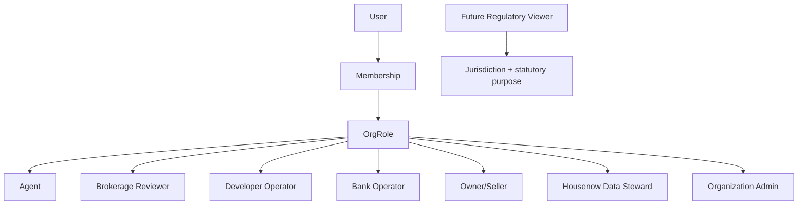
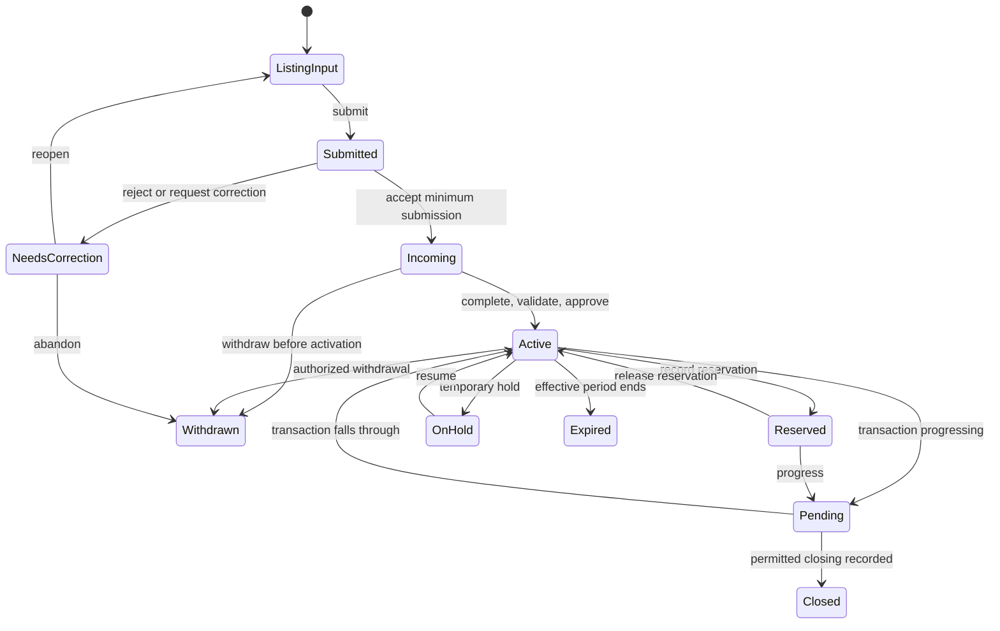
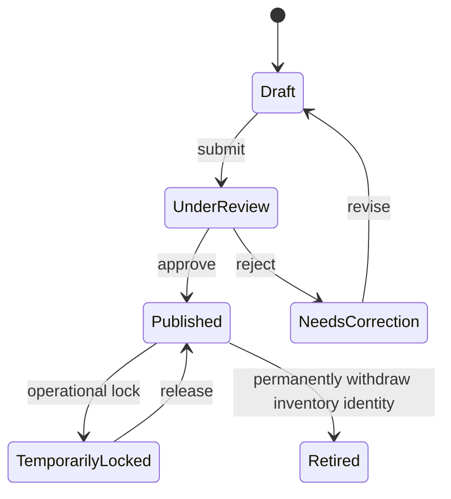

# Phase 2: Product requirements baseline

Status: `DRAFT FOR STAKEHOLDER REVIEW`
Scope: Target six-actor baseline and MVP requirement foundation
Evidence date: 2026-08-12

## Requirement policy

- `FACT` describes reference evidence, not automatically approved Vietnam behavior.
- `PROPOSAL` is the working Housenow design baseline.
- `OPEN QUESTION` blocks policy approval but does not block labeled prototype exploration.
- Every production requirement must trace through `Actor → Use case → Business rule → Screen/API → Acceptance criteria → Test`.

## Actor definitions

| Actor | Goal | Governed scope |
|---|---|---|
| Agent | Discover assets, represent a Party, create and maintain Listings, collaborate with buyers | Own Listings plus explicitly shared organization resources |
| Brokerage Reviewer | Assure representation, quality, compliance, and current state | Listings and members inside one or more authorized offices |
| Developer Operator | Maintain Project/Unit identity, inventory, price, legal-document status, and distribution assignments | Owned/managed Projects and Units |
| Bank Operator | Assess permitted property/project context and manage consented finance leads | Approved products and purpose-bound consent scope |
| Buyer | Discover verified public offerings, shortlist, contact, schedule, and report issues | Public data plus personal consented workspace |
| Owner/Seller | Prove or claim authority over a Property, grant representation and distribution consent, monitor the Listing, and request correction, suspension or revocation | Own verified/claimed Properties, agreements, consent and permitted transaction milestones |
| Housenow Data Steward | Resolve identity, duplicate, provenance, verification, taxonomy, and quality issues | Assigned queues and governed override scope |
| Regulatory Viewer | Future oversight role; inspect aggregates, issues and authorized evidence when HouseNow enables a lawful regulatory workflow | Jurisdiction and statutory purpose; not one of the target six market actors |

## Actor-use case matrix

Legend: `P` primary actor, `S` supporting actor, `V` permitted viewer, blank means no baseline capability.

| Use case | Agent | Brokerage | Developer | Bank | Buyer | Owner/Seller | Steward | Future Regulator |
|---|---:|---:|---:|---:|---:|---:|---:|---:|
| UC-01 Search Property/Listing | P | P | V | V | P | V-own | P | V-authority |
| UC-02 Inspect identity, provenance, verification | P | P | P | V | V-public | V-own | P | V-authority |
| UC-03 Create Listing Input from existing Property | P | S | P-unit |  |  | S-authority | S |  |
| UC-04 Declare representation/distribution basis | P | S | P |  |  | P | V | V-authority |
| UC-05 Validate and submit Listing | P | S | P-unit |  |  | Acknowledge | S |  |
| UC-06 Review and activate Listing |  | P | P-own inventory |  |  | V-own | S | V-authority |
| UC-07 Change Listing status/price | P-own | P-scope | P-own |  |  | Request | S | Override-authority |
| UC-08 Review history and audit projection | V-own | V-scope | V-own | V-limited | V-public | V-own-milestones | P | V-authority |
| UC-09 Resolve duplicate/correction | Report | Review | Report | Report | Report | Dispute | P | Request |
| UC-10 Maintain Project/Unit inventory |  | V-assigned | P | V-permitted | V-public | V-owned-unit | S | V-authority |
| UC-11 Save/share/schedule Listing | P | V | V |  | P | V-own-summary |  |  |
| UC-12 Report a data issue | P | P | P | P | P | P | P | P-authority |
| UC-13 View finance fit and calculator | V | V | V | P | P | V-own-consent |  |  |
| UC-14 View organization/market quality dashboard | V-own | P-scope | P-own | V-product |  | V-own-listing | P | P-authority |
| UC-15 Claim or link an owned Property | S | V |  |  |  | P | P-verify | V-authority |
| UC-16 Grant, renew or revoke representation | S | S |  |  |  | P | V-case | V-authority |
| UC-17 Grant or revoke listing/distribution consent | S | S | P-own-unit |  |  | P | V-case | V-authority |
| UC-18 Monitor owned Listing and transaction milestones | V-assigned | V-scope | V-own-unit | V-consent |  | P | V-case | V-authority |
| UC-19 Request correction, pause or withdrawal | S | P-review | S-own |  | Report | P | S-case | V-authority |

## Role hierarchy proposal

Roles are organization-scoped, not global ranks.

`PROPOSAL`: A User may hold multiple Memberships, but every action evaluates the selected Membership, Organization, purpose, resource scope, and field classification.

## Core workflows

### WF-01 Find Property and create Listing

Happy path:

1. Agent searches by canonical ID, parcel/project-unit reference, or normalized address.
2. System returns candidates with source, confidence, and current/prior Listings.
3. Agent selects an existing Property.
4. System creates a new Listing Input with a new temporary identity and preserves the Property ID.
5. Agent supplies transaction, representation, price, dates, visibility, and required remarks/documents.
6. System validates field, policy, duplicate-active, authority, and effective-period rules.
7. Agent submits to Incoming or brokerage review according to policy.
8. Reviewer approves Active transition when guards pass.
9. System appends audit/status events and updates permitted discovery views.

Exception paths:

- No Property candidate: create a Property Candidate for Steward review, not an automatically canonical Property.
- Multiple candidates: user must compare identifiers and sources before selection.
- Conflicting source values: retain both source records and route a Data Issue.
- Existing conflicting Active Listing: prevent silent duplicate activation and route review.
- Expired/invalid representation: block Active and request renewed evidence.
- Validation failure: preserve Listing Input and show field-level correction guidance.

### WF-02 Review and activate Listing

1. Reviewer opens the organization queue.
2. System shows validation results, representation basis, provenance gaps, duplicate warnings, and restricted evidence.
3. Reviewer approves, rejects with reasons, or requests correction.
4. Approval creates a Listing Status Event and Active visibility according to distribution policy.
5. Rejection returns the Listing to an editable correction state without deleting the submission history.

### WF-03 Correct identity or duplicate

1. Actor submits a Data Issue or automated matching creates a candidate.
2. Steward compares source keys, addresses, Project/Unit links, Parcel links, and history.
3. Steward chooses not-duplicate, link, or merge.
4. Merge creates a Merge Decision, redirects aliases, and preserves all source and audit records.
5. Downstream indexes and reports reconcile to the canonical identity.

### WF-04 Change Listing status

1. Authorized actor selects an allowed transition, never a free-form status value.
2. System requests effective date, reason, and conditional evidence.
3. Policy verifies actor, organization scope, current state, representation period, and concurrency version.
4. System commits transition and Audit Event atomically.
5. Search, notifications, reports, and permitted feeds receive a versioned change event.

### WF-05 Claim or link an owned Property

1. Seller searches by canonical Property ID, normalized address, Project/Unit reference or an invitation from the responsible Agent/Brokerage.
2. Seller submits an `OwnershipClaim` with claimant identity, claimed relationship, effective period and permitted evidence references.
3. The system links the claim to a candidate Property without changing canonical Property fields or marking ownership verified automatically.
4. Data Steward or the accountable verification workflow compares identity, source and conflicting claims.
5. The claim becomes Pending, Verified, Partially Verified, Rejected, Expired or Revoked with reason and audit evidence.
6. Only a verified or policy-approved claim unlocks seller actions that require authority; rejected claims retain a safe dispute route.

Exception paths: no matching Property creates a candidate for review; multiple matches require disambiguation; multiple owners preserve separate Party shares/authority; a disputed claim blocks new representation changes but does not erase an existing lawful Listing.

### WF-06 Grant, renew or revoke representation

1. Seller opens a verified Property and reviews the proposed Agent/Brokerage, transaction type, exclusivity, territory/channel scope and effective dates.
2. Seller accepts, rejects or requests correction to the proposed `Representation`; acceptance records acknowledgement/evidence and the exact policy/document version.
3. The system notifies the Agent and Brokerage and exposes only the authority outcome needed to prepare a Listing.
4. Renewal creates a new effective period or version; it does not overwrite the prior agreement.
5. Revocation records effective time and reason, blocks future actions that rely on the revoked authority, and routes active Listings for Brokerage review.
6. Existing history remains queryable; the system never silently withdraws or deletes a Listing solely from a UI click.

### WF-07 Grant or revoke distribution consent

1. Seller reviews the public field preview, media, intended channels, recipient classes, purpose and consent duration.
2. Seller may grant consent per channel or approved channel group; refusal to one channel does not imply refusal to all processing.
3. Activation checks that representation and required distribution consent are valid at the effective time.
4. A consent change creates a versioned event and triggers reconciliation with every affected downstream channel.
5. Revocation prevents future distribution after the applicable effective time while preserving lawful audit and previously completed transaction history.
6. Failed downstream withdrawal is visible as an operational issue with owner, retry state and SLA.

### WF-08 Seller correction, pause or withdrawal request

1. Seller selects the owned Property/Listing, identifies the disputed field or requested action and supplies a reason/evidence.
2. The system creates a case rather than directly mutating canonical data or Listing status.
3. Responsible Agent/Brokerage receives the request with SLA; Data Steward joins when identity, source or duplicate resolution is required.
4. A safety-critical or authority dispute may place the Listing in policy-defined review/hold state, but only an authorized transition changes lifecycle state.
5. Resolution records accepted/rejected/partially accepted outcome, before/after evidence and notifications.
6. Seller can see the case outcome and permitted milestones without seeing internal remarks, buyer identity or unrestricted audit content.

## Proposed Listing lifecycle

This state model is a prototype baseline, not approved Vietnam policy.

### Transition requirements

| Transition | Proposed actor | Preconditions | Required data | Audit/notification |
|---|---|---|---|---|
| Listing Input → Submitted | Agent/Developer | Editable scope, base identity selected | Transaction type, price, period, responsible party, representation reference | Submission event; notify reviewer if configured |
| Submitted → Incoming | System/Reviewer | Minimum submission rules pass | Listing ID allocation, visibility scope | Status event; notify responsible actor |
| Submitted → Needs Correction | Reviewer | Reasoned quality/authority failure | Reason codes and field comments | Status event; notify submitter |
| Incoming → Active | Reviewer or policy owner | Full Active rules, valid authority, no unresolved blocker | Approval reason, effective time, distribution consent | Status event; search/feed update; notify participants |
| Active → On Hold | Agent/Broker | Transition allowed by agreement/policy | Effective time and reason | Status event; remove from permitted active discovery as defined |
| Active/Reserved → Pending | Agent/Broker | Transaction-progress evidence policy satisfied | Effective time, conditional detail | Status event; notify organization/authorized parties |
| Pending → Closed | Authorized actor | Closing data/source rules satisfied | Closing date, permitted outcome fields, source | Status plus Closing Record; downstream reconciliation |
| Active → Withdrawn | Agent/Broker | Authority and reason validated | Effective time, reason, optional document | Status event; distribution withdrawal |
| Active → Expired | System | Effective period ends without extension | Policy version and effective time | Status event; notify responsible parties |

Rollback is not deletion. Incorrect transitions require a compensating correction event by an authorized actor.

## Project and Unit inventory lifecycle proposal

Unit commercial availability such as Available, Held, Reserved, and Sold must be modeled separately from identity publication status.

## Representation and distribution workflow

- A Listing references a Representation or Distribution Assignment; it does not infer authority from Organization Membership alone.
- Authority has parties, scope, transaction type, effective period, consent/distribution conditions, evidence, and verification state.
- Expiry, revocation, or dispute may block future transitions without erasing prior actions.
- Target scope includes a Seller workspace. Legal/Product must still decide which actions require a direct account, offline evidence, e-signature or a verified Agent-assisted flow.

## Verification workflow

1. Create a verification request for a defined claim.
2. Collect permitted evidence and source references.
3. Evaluate against a versioned rule set.
4. Record outcome: Pending, Verified, Partially Verified, Rejected, Expired, or Revoked.
5. Record verifier, time, scope, evidence references, and expiry/review date.
6. Trigger reevaluation when critical source data or authority changes.

Verification badges must state what was verified and when; a generic permanent “verified property” claim is prohibited.

## Provenance model

Every important record or field may carry:

- source system/type;
- source record key;
- retrieved time;
- effective time or period;
- responsible actor/organization;
- transformation/normalization method;
- confidence;
- editability and override reason;
- superseded-by relation without destructive overwrite.

## Duplicate and merge workflow

- Matching creates candidates, never automatic destructive merge by default.
- Signals include canonical/source IDs, normalized address, geospatial proximity, Project/Building/Unit tuple, Parcel relation, and overlapping characteristics.
- Active Listing conflict is distinct from duplicate Property identity.
- Merge preserves aliases, source records, histories, audit events, and downstream correlation IDs.
- Unmerge/correction requires a new auditable decision.

## Notification events baseline

- Listing submitted, correction requested, approved, rejected, activated, held, expired, withdrawn, pending, or closed.
- Representation nearing expiry, expired, revoked, or disputed.
- Listing stale or required update overdue.
- Data Issue assigned, updated, resolved, or reopened.
- Duplicate candidate created or Merge Decision completed.
- Saved-search match and scheduled viewing updates.
- Import completed, partially failed, or requires reconciliation.

Recipients and channels require purpose, scope, preference, and sensitive-field review.

## Search and filter taxonomy baseline

- Identity: Property ID, Listing ID, Parcel/source ID, Project, building, Unit.
- Location: province/city, district, ward, normalized address, map bounds.
- Offering: sale/lease, Listing Status, effective dates, price range.
- Asset: Property type, area and source, bedrooms, bathrooms, orientation, Project attributes.
- Trust: Verification scope/state, source category, confidence, issue flags.
- Organization: responsible Agent, Brokerage, Developer, distribution assignment.
- Market: days active, price change, new/relisted, closing period where permitted.

Search indexes must be separated by Public, Industry, and Restricted visibility policy.

## Screen/use-case traceability

| Screen | Use cases | Primary rules |
|---|---|---|
| Role switch/login simulation | Cross-actor prototype | BR-PERM-01, BR-PERM-02 |
| Search and results | UC-01, UC-02 | BR-ID-01, BR-DATA-01, BR-PERM-02 |
| Property/Listing detail | UC-02, UC-08 | BR-ID-01, BR-LIST-01, BR-DATA-01 |
| Create/edit Listing | UC-03, UC-04, UC-05 | BR-ID-02, BR-REP-01, BR-LIST-02 |
| Brokerage review | UC-06 | BR-REP-02, BR-LIFE-01, BR-AUDIT-01 |
| Project inventory | UC-10 | BR-UNIT-01, BR-DATA-01 |
| Bank finance context | UC-13 | BR-CONSENT-01, BR-PERM-02 |
| Buyer experience | UC-01, UC-11, UC-12 | BR-PERM-02, BR-CONSENT-01 |
| Seller property and authority workspace | UC-15, UC-16 | BR-ID-01, BR-REP-01, BR-PERM-01, BR-AUDIT-01 |
| Seller consent and listing oversight | UC-17, UC-18 | BR-CONSENT-01, BR-LIST-01, BR-PERM-02 |
| Seller correction/dispute case | UC-09, UC-12, UC-19 | BR-DATA-01, BR-LIFE-01, BR-AUDIT-01 |
| Data quality queue | UC-09, UC-12 | BR-DUP-01, BR-AUDIT-01 |
| Future regulator dashboard | UC-14 | BR-AGG-01, BR-PERM-01 |

## Phase 2 exit assessment

The product behavior baseline, actor matrix, proposed lifecycles, provenance, verification, duplicate handling, audit, notification, and search taxonomy are documented. Approval remains blocked by named open decisions and stakeholder/legal review; the baseline is sufficient to design a labeled clickable prototype and conduct focused workshops.
