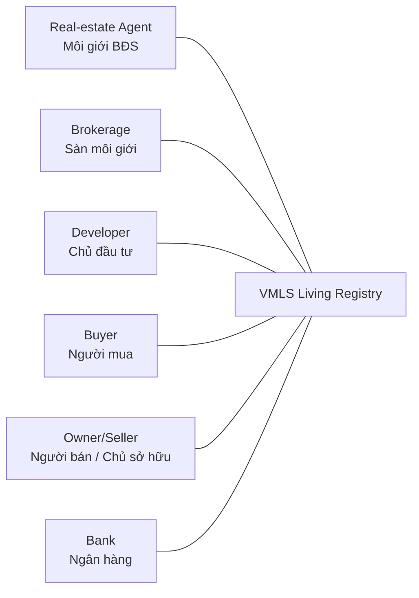

# HouseNow MLS product roadmap

## Vision

HouseNow MLS is a permissioned real-estate data and market-operations platform for Vietnam. It gives every asset a durable identity and makes each Listing, authority claim, source, verification result, permission decision, and material change traceable.

The platform should answer:

- Does this real-estate asset exist under a consistent identity?
- Who may represent, advertise, sell, lease, or distribute it?
- Where did each material field come from and how was it verified?
- What is the Listing's governed lifecycle and history?
- Who may see or change each field, for what purpose, and for how long?
- Is the evidence reliable enough for search, cooperation, finance, closing, and lawful oversight?

## Product principles

1. Trust before growth.
2. Permission by design.
3. History is append-oriented and material events are immutable.
4. Property identity is distinct from each Listing.
5. Provenance and verification are explicit.
6. Build complete workflows, not disconnected feature lists.
7. Validate policy with a prototype before locking production architecture.

## Canonical actors

Organization Admin, System Admin, and Data Steward are scoped operational roles. Regulator (`Cơ quan quản lý`) is deferred oversight scope, not a current market actor.

## Delivery sequence

### Phase 0–2 — Alignment, discovery, and specification

- Lock the actor boundary and core identity distinctions.
- Preserve evidence labels and isolate Texas/U.S. observations from Vietnam policy.
- Define working requirements, permissions, business rules, acceptance criteria, and traceability.
- Resolve remaining product, legal, data-governance, and pilot decisions before production commitment.

### Phase 3–4 — UX exploration and scope lock

- Demonstrate actor-specific search, Property 360, Listing creation/review/lifecycle, source history, CMA, access governance, quality, and organization flows.
- Keep the vertical slice centered on durable Property identity and a governed Listing lifecycle.
- Use product feedback to narrow the first pilot rather than expanding the feature catalog.

### Phase 5–6 — Executable local slice

- Persist the core Listing lifecycle, authorization decisions, access requests, and audit events.
- Enforce actor and organization scope in the backend.
- Complete the six actor perspectives, including Owner/Seller authority and consent.
- Separate the admin control plane from business-data access.
- Harden production identity, persistence, observability, backup, integration, and policy only after approval gates close.

## Near-term priorities

1. Complete product, domain, legal, and data-governance review of the working baseline.
2. Select the first pilot buyer, locality, segment, organizations, and measurable risk to validate.
3. Finish Owner/Seller grant and renewal behavior plus downstream consent enforcement.
4. Build the accepted System Admin and Organization Admin control-plane slice without blanket data access.
5. Define source-of-truth and integration contracts for identity, legal status, distribution, finance, and closing.
6. Replace demo authentication and session-only flows only after the pilot boundary is approved.

## Explicit non-commitments

- Texas or U.S. MLS policy is not adopted automatically.
- The prototype lifecycle is not approved Vietnam operating policy.
- CMA is not an official valuation certificate.
- HouseNow's billing `Transaction` is not a property-sale transaction.
- Regulator, notary, commission, reservation, payment, and full closing workflows remain future or research scope unless explicitly approved.
