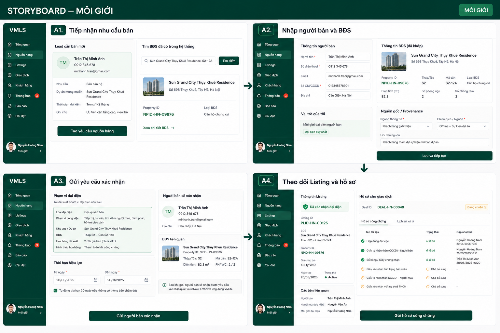
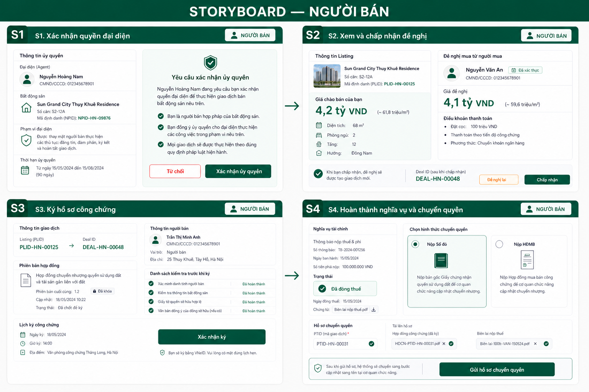
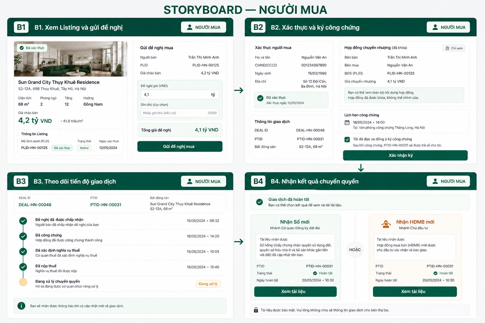
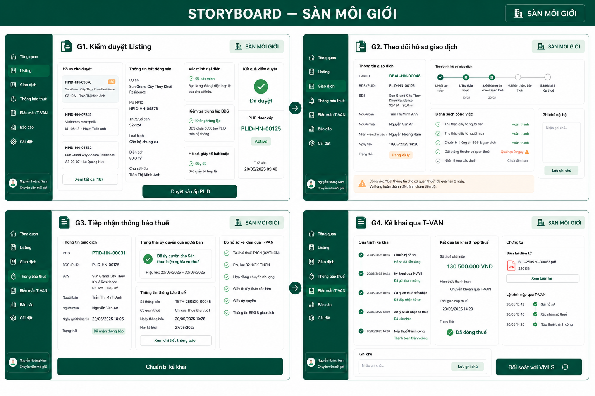
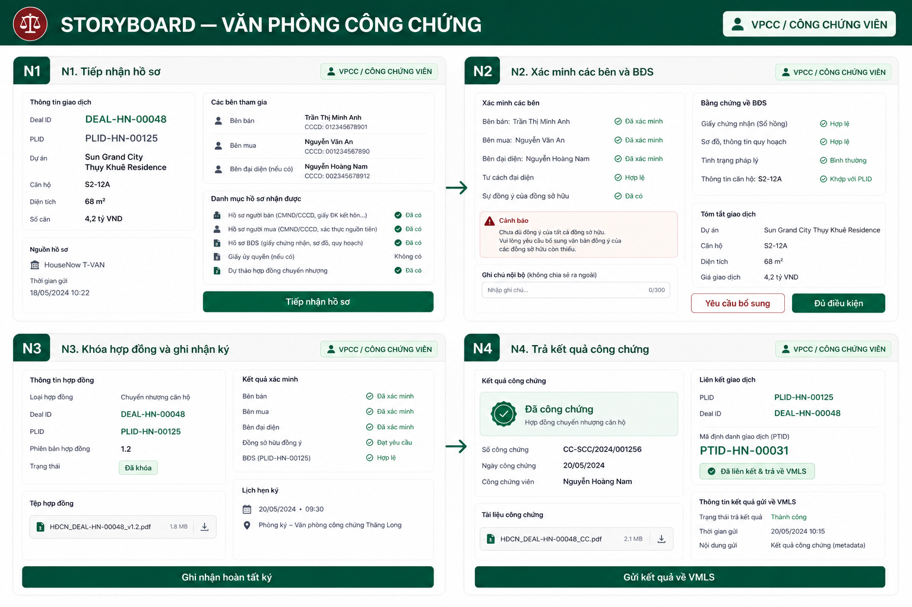
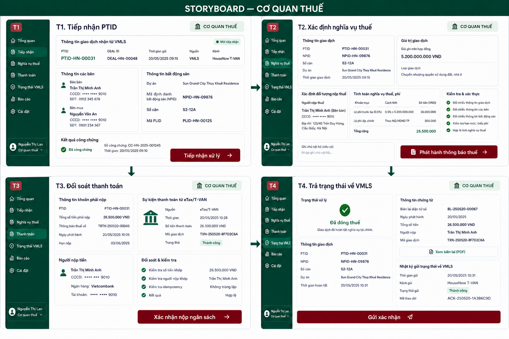
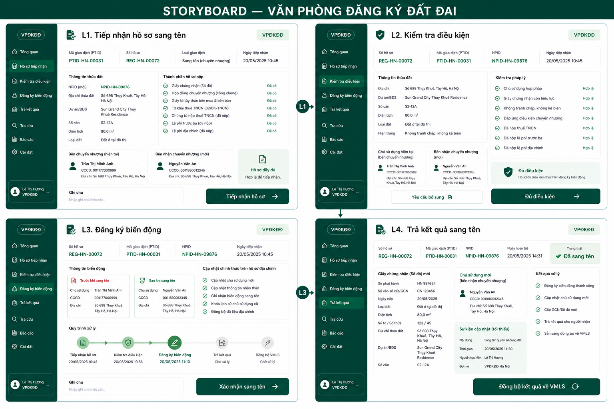
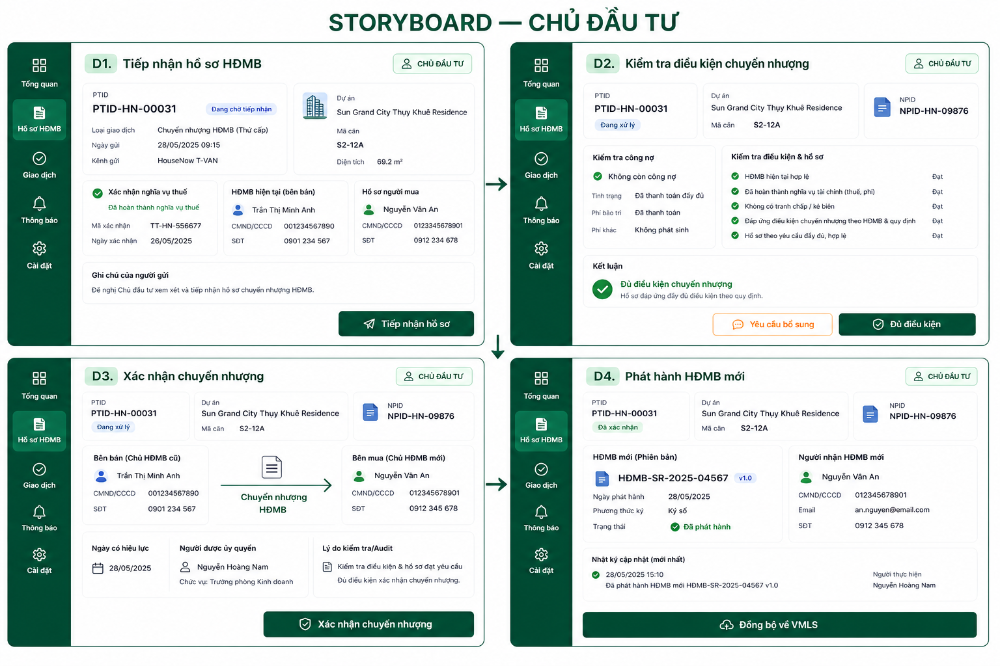
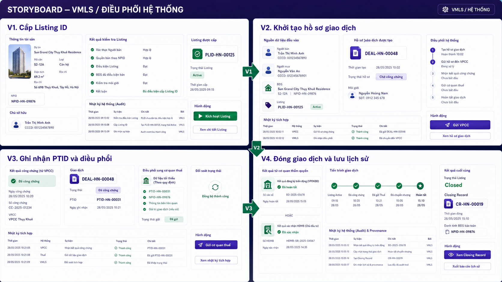

# VMLS actor-specific storyboards

> Status: `PROPOSAL`
>
> Purpose: review the transaction flow as actor-owned screens. These visuals do not approve legal policy, integration contracts, or authority boundaries.

## Shared demo identity

- Property: `NPID-HN-09876`
- Listing: `PLID-HN-00125`
- Deal: `DEAL-HN-00048`
- Official transaction reference: `PTID-HN-00031`
- Closing Record: `CR-HN-00019`

## 1. Môi giới

Screens: tiếp nhận nhu cầu bán; nhập người bán và BĐS; gửi yêu cầu xác nhận; theo dõi Listing và hồ sơ.

## 2. Người bán

Screens: xác nhận quyền đại diện; xem và chấp nhận đề nghị; ký hồ sơ công chứng; hoàn thành nghĩa vụ và gửi hồ sơ chuyển quyền.

## 3. Người mua

Screens: xem Listing và gửi đề nghị; xác thực và ký công chứng; theo dõi tiến độ; nhận Sổ mới hoặc HĐMB mới.

## 4. Sàn môi giới

Screens: kiểm duyệt Listing; theo dõi hồ sơ giao dịch; tiếp nhận thông báo thuế theo ủy quyền; kê khai qua T-VAN.

## 5. Văn phòng công chứng

Screens: tiếp nhận hồ sơ; xác minh các bên và BĐS; khóa hợp đồng và ghi nhận ký; trả kết quả công chứng.

## 6. Cơ quan thuế

Screens: tiếp nhận PTID; xác định nghĩa vụ thuế; đối soát thanh toán; trả trạng thái về VMLS.

## 7. Văn phòng đăng ký đất đai

Screens: tiếp nhận hồ sơ sang tên; kiểm tra điều kiện; đăng ký biến động; trả kết quả sang tên.

## 8. Chủ đầu tư

Screens: tiếp nhận hồ sơ HĐMB; kiểm tra điều kiện; xác nhận chuyển nhượng; phát hành HĐMB mới.

## 9. VMLS / hệ thống

Screens: cấp Listing ID; khởi tạo hồ sơ giao dịch; ghi nhận PTID và điều phối; đóng giao dịch và lưu Closing Record.

## Boundary notes

- `PROPOSAL`: VMLS orchestrates and records statuses; it does not replace the legal authority of the notary office, tax authority, land registry, or developer.
- `PROPOSAL`: Seller-authorized tax filing by the brokerage is separate from tax assessment and payment confirmation by the tax authority.
- `PROPOSAL`: The buyer sees progress and results but cannot execute authority decisions.
- `OPEN QUESTION`: Whether PTID is issued by VMLS or only linked from an official transaction registry must be confirmed.
- `OPEN QUESTION`: Direct VMLS workspaces versus external portal/API integrations remain to be decided for each authority.
