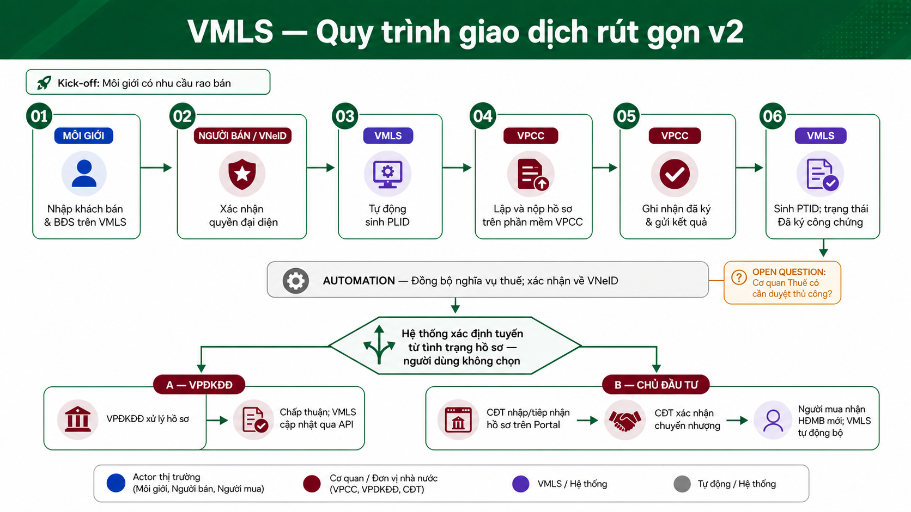
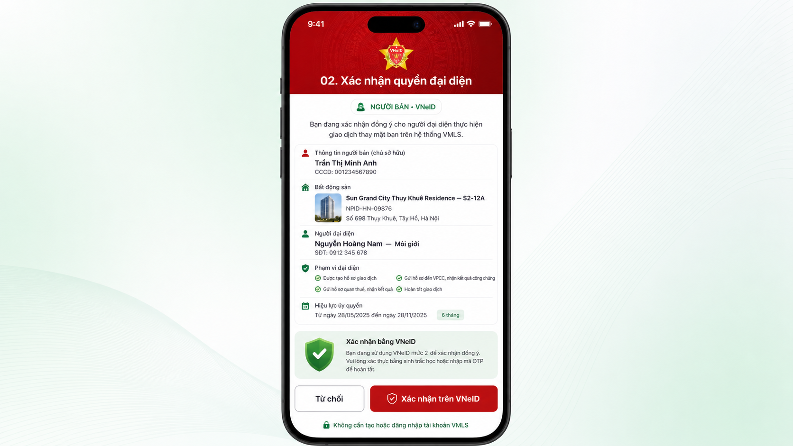
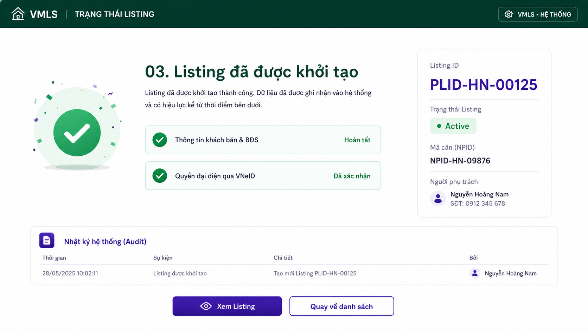
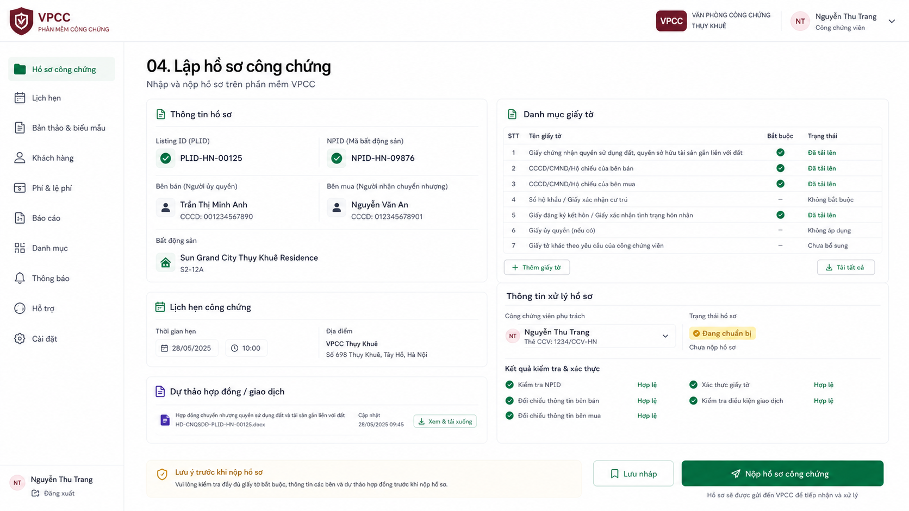
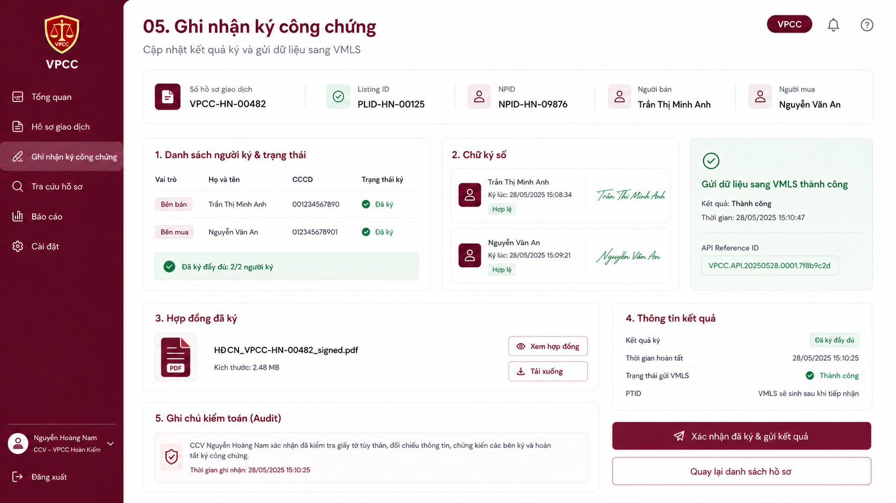
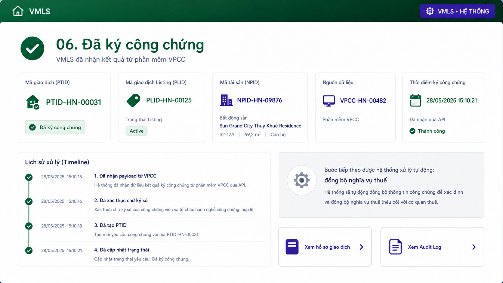
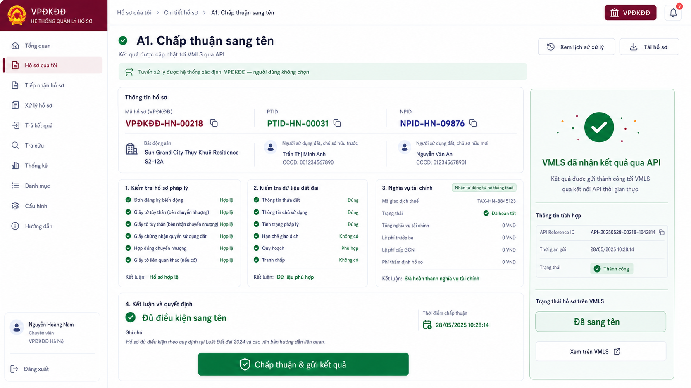
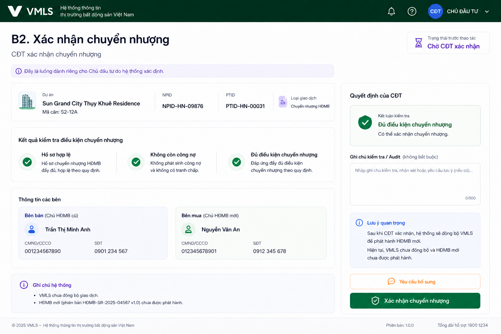
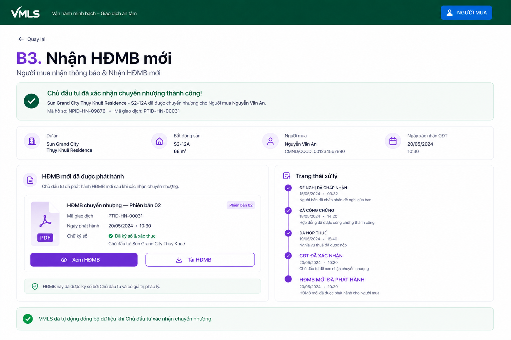

# VMLS transaction flow v2

> **Superseded for UI review:** use [VMLS transaction screens v3](./vmls-process-v3.md) for the standardized header/sidebar shell, list screens, and navigation relationship map. This v2 document is preserved for comparison.

> Evidence status: **PROPOSAL** — revised from stakeholder comments. This is not yet an approved legal, tax, integration, or production workflow.
>
> Naming note: **HNRE in the supplied flow is treated as VMLS**. `NPID` identifies the Property, `PLID` identifies the Listing, and `PTID` identifies the Transaction; they remain separate lifecycle objects.

## Revised flow

## What changed from the 24-step draft

| Old step(s) | v2 decision | Revised behavior |
|---|---|---|
| 01 | Removed as a screen | Agent demand is the kickoff event. |
| 02 | New 01 | Agent enters the existing NPID, representation scope and effective period, then sends the request to the seller. Property candidate matching is upstream of this flow. |
| 03 | New 02 | Seller confirms representation through VNeID; no complex VMLS login. |
| 04 | New 03 | Result-only VMLS status after prerequisites complete; PLID is generated automatically. |
| 05–06 | New 04 | Dossier creation and submission happen in VPCC software. |
| 07 | New 05–06 | VPCC records completed signing and sends the result; VMLS receives it, creates PTID and shows `Đã ký công chứng`. |
| 08 | Removed | No standalone HouseNow T-VAN delivery screen. |
| 09–14 | Collapsed into automation | Tax data exchange and confirmation are system events, not user screens. |
| 15 | Replaced by system routing | The dossier determines the route; the user does not choose VPĐKĐĐ versus Developer. |
| 16–17 | Branch A — A1 | VPĐKĐĐ processes and approves; VMLS is updated through API. |
| 18–19 | Removed as VMLS screens | VNeID/357 updates and buyer notification are external or embedded outcomes. |
| 20–21 | Branch B — B1 | Submission and intake are merged into one Developer Portal screen. This is the old `15.2` route. |
| 22 | Branch B — B2 | Developer confirms transfer. |
| 23 | Branch B — B3 | Buyer receives the new HĐMB. |
| 24 | Removed | VMLS data synchronizes automatically when the Developer confirms; there is no separate manual sync screen. |

## Common screens

### 01 — Môi giới nhập mã định danh BĐS và gửi thông tin đến Người bán

### 02 — Người bán xác nhận qua VNeID

### 03 — VMLS thông báo Listing đã được khởi tạo

### 04 — VPCC lập và nộp hồ sơ

### 05 — VPCC ghi nhận đã ký và gửi kết quả

### 06 — VMLS nhận kết quả, sinh PTID và cập nhật trạng thái

## System events without screens

- VMLS exchanges tax-obligation data through the applicable integration.
- Tax/payment confirmation is delivered to VNeID when the integration supports it.
- The routing service determines the applicable dossier route; the seller does not select it.
- External identity and 357 synchronization do not create separate VMLS UI steps.

> **OPEN QUESTION — tax integration:** Does the Tax Authority require a manual review/approval action, or is the exchange fully automatic? If manual approval is required, an authority screen must be restored before finalizing the storyboard.

## Branch A — VPĐKĐĐ

### A1 — VPĐKĐĐ approves and VMLS receives the result through API

Physical document submission or certificate pickup may still occur outside the software storyboard; it is not represented as a VMLS screen.

## Branch B — Developer

### B1 — Developer Portal input and intake

### B2 — Developer confirms transfer

### B3 — Buyer receives the new HĐMB; VMLS is already synchronized

## Shared fictional demo data

- Project: Sun Grand City Thụy Khuê Residence
- Unit: S2-12A
- Property ID: `NPID-HN-09876`
- Listing ID: `PLID-HN-00125`
- Transaction ID: `PTID-HN-00031`
- Seller: Trần Thị Minh Anh
- Buyer: Nguyễn Văn An
- Agent: Nguyễn Hoàng Nam
