# VMLS transaction screens v3

> **PROPOSAL:** This storyboard standardizes visual structure and screen navigation for review. It does not approve the legal, tax, VNeID, VPCC, VPĐKĐĐ, Developer, or API contracts shown in the mockups.

## Format contract

Every interactive web/software screen in this storyboard uses the same application-shell structure:

- A full-width Registry Green header with product/system, current context, notifications, actor badge, and user identity.
- A persistent Registry Green left sidebar with one clearly highlighted workspace.
- Paper White or Archive Ivory content surfaces with card-based hierarchy.
- Mono-styled identifiers for `NPID`, `PLID`, `PTID`, dossier IDs, API references, and timestamps.
- Mint Trace for lifecycle/provenance, Coral Signal for the primary action, Amber for warnings, and non-color status cues.
- **Exception:** screen `02` remains a VNeID mobile screen and does not use the web shell.

## Relationship between screens

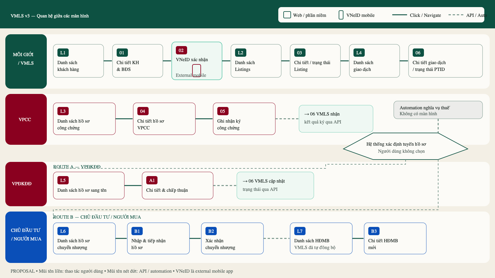

Editable source: [`00-screen-relationship-map.svg`](./assets/vmls-process-v3/00-screen-relationship-map.svg)

### Navigation summary

| Actor/system | Relationship |
|---|---|
| Agent / VMLS | `L1 Customer list → 01 Customer & Property detail → 02 VNeID → L2 Listing list → 03 Listing detail/status → L4 Transaction list → 06 Transaction detail` |
| VPCC | `L3 Notary dossier list → 04 Dossier detail → 05 Signing detail --API→ 06 VMLS transaction detail` |
| VPĐKĐĐ route | `L5 Land-registry dossier list → A1 Approval detail --API→ 06 VMLS transaction updated` |
| Developer / Buyer route | `L6 Transfer list → B1 Intake detail → B2 Confirmation --auto-sync→ L7 Contract list → B3 Contract detail` |
| System only | `06 → tax automation → dossier routing`; these are not interactive screens. |

## Revised process overview

## Agent and VMLS screens

### L1 — Customer list

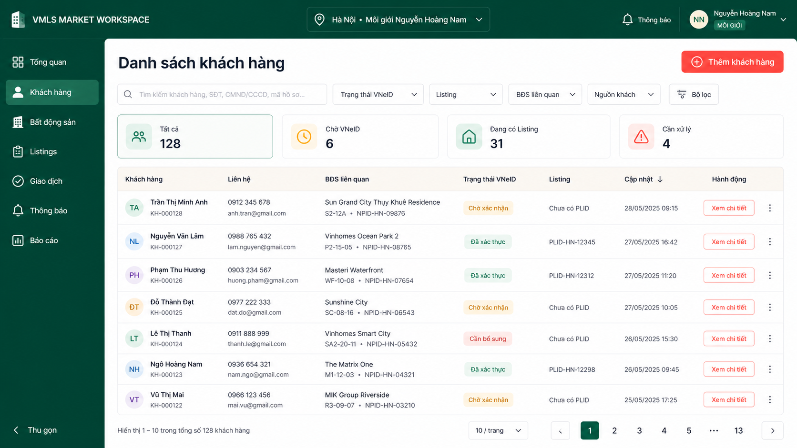

### 01 — Customer and Property detail

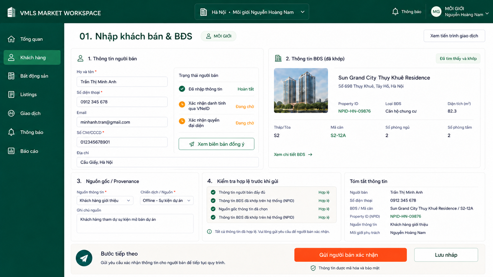

### 02 — Seller confirmation in VNeID

### L2 — Listing list

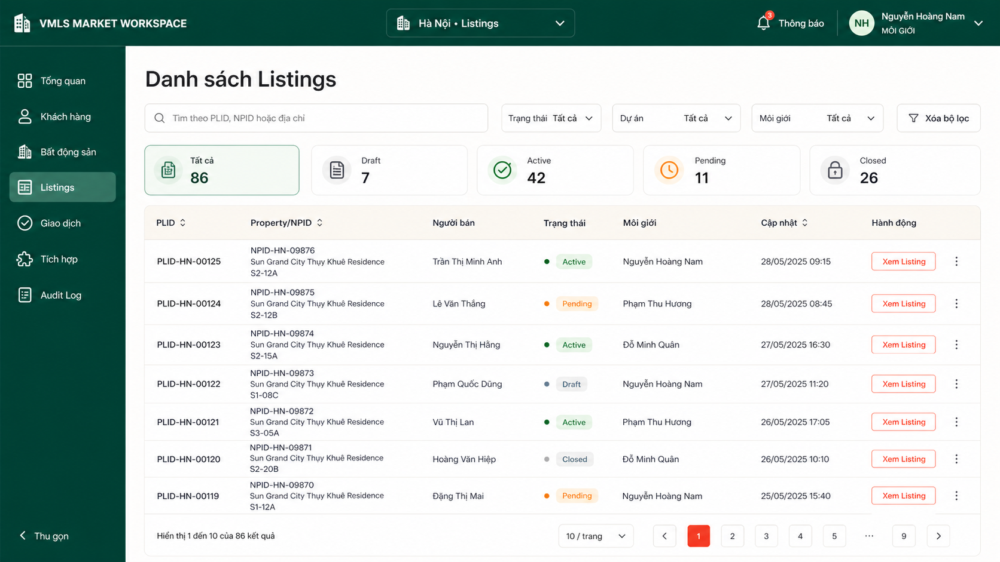

### 03 — Listing detail/status

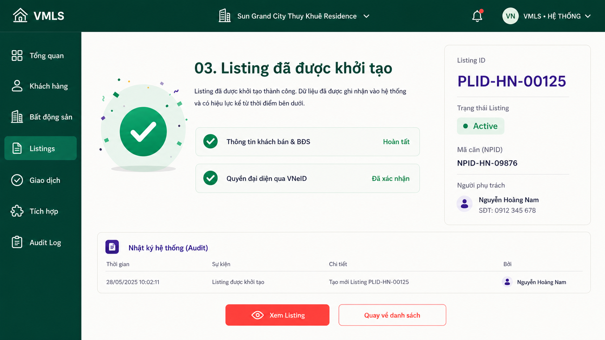

### L4 — Transaction list

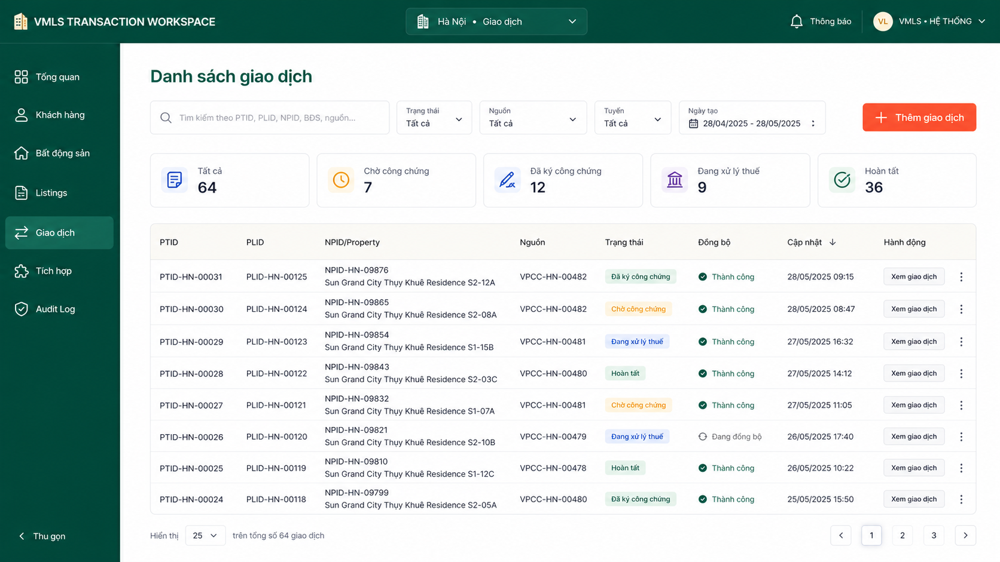

### 06 — Transaction detail/status

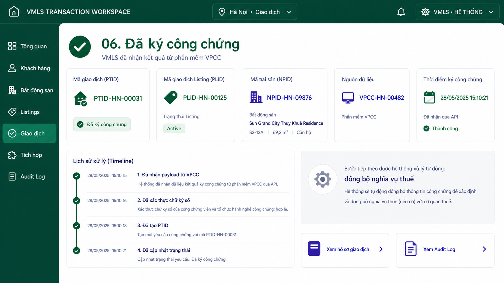

## VPCC screens

### L3 — Notary dossier list

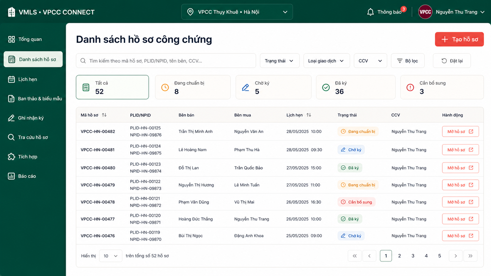

### 04 — Notary dossier detail

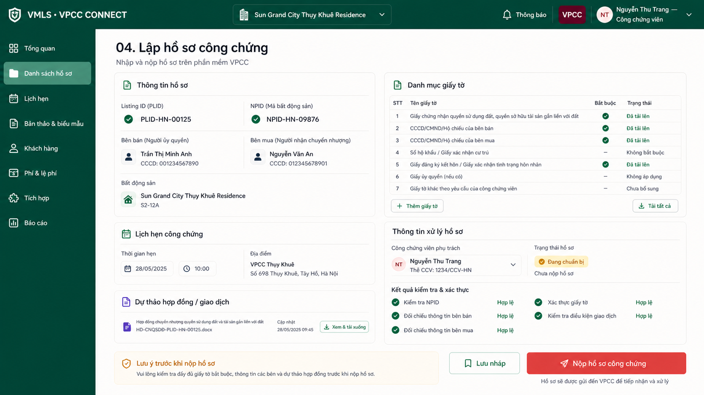

### 05 — Signing detail and API result

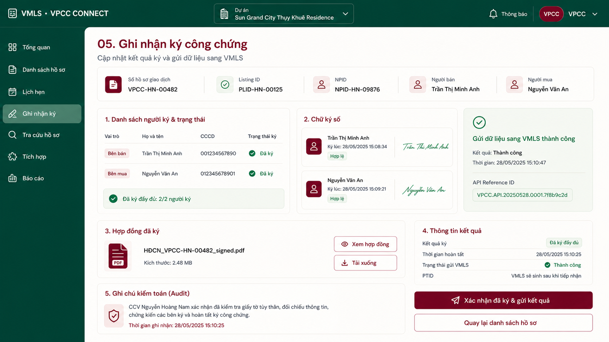

## Branch A — VPĐKĐĐ

### L5 — Land-registry dossier list

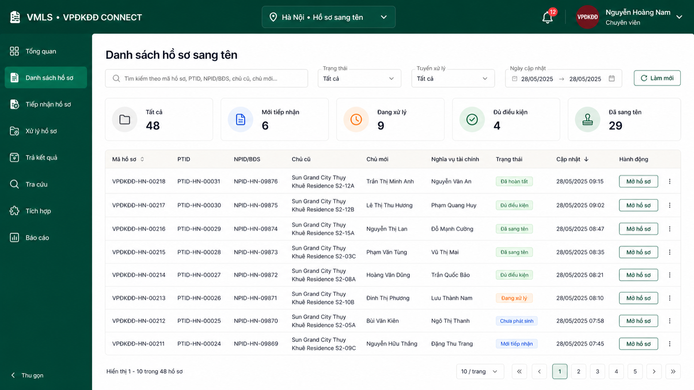

### A1 — Approval detail and API update

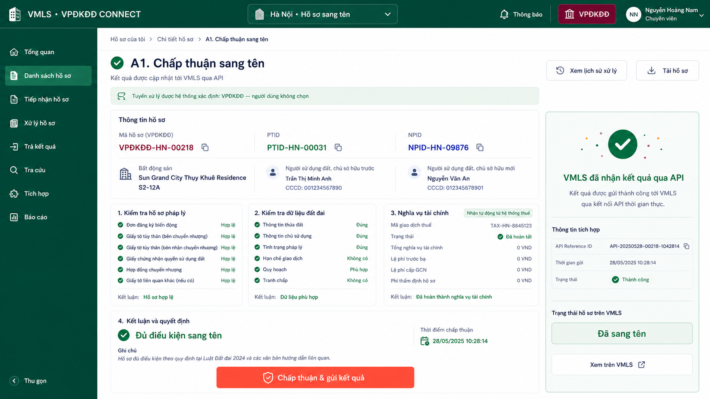

## Branch B — Developer and Buyer

### L6 — Developer transfer list

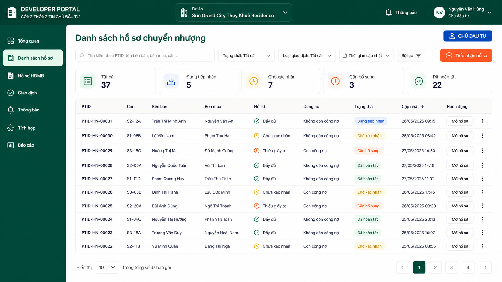

### B1 — Developer intake detail

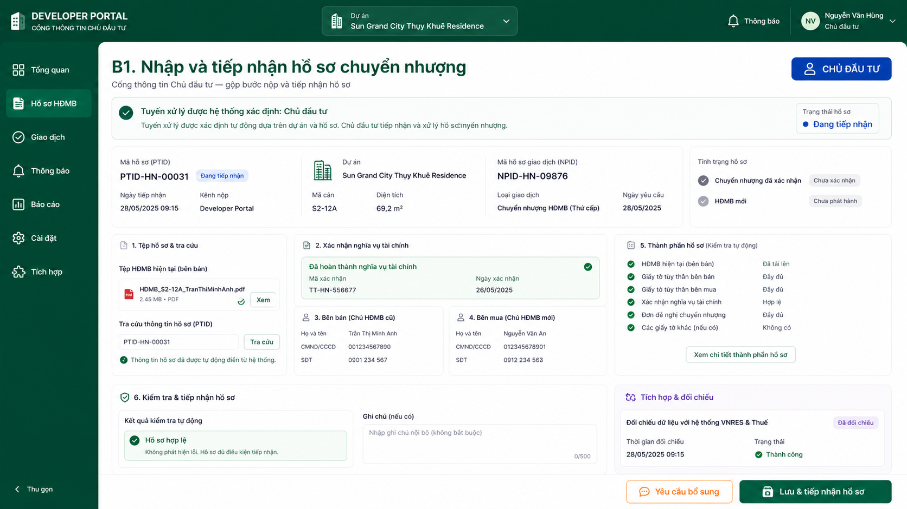

### B2 — Developer confirmation detail

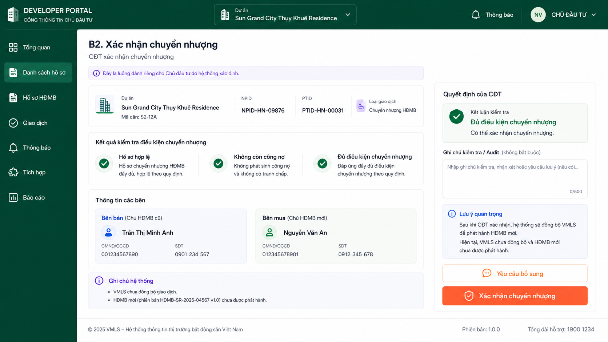

### L7 — Buyer contract list

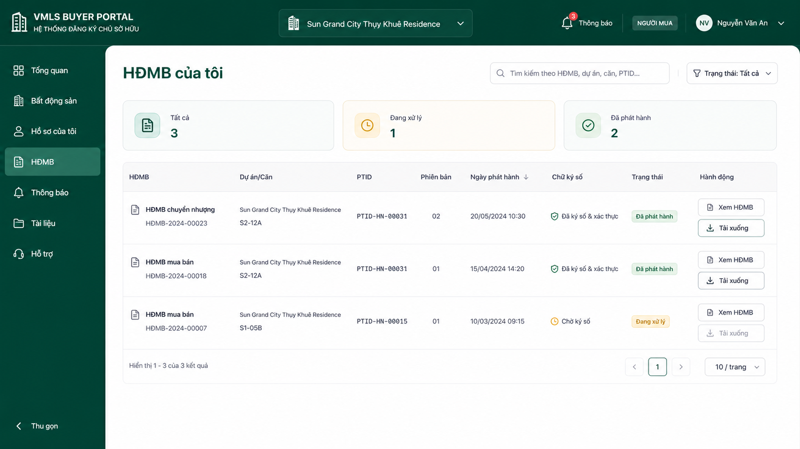

### B3 — Buyer contract detail

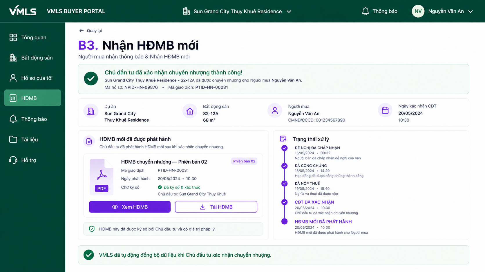

## Review notes

- `NPID`, `PLID`, and `PTID` remain separate objects and are not interchangeable.
- VNeID is modeled as an external mobile confirmation surface, not a second VMLS account flow.
- VPCC, VPĐKĐĐ, and Developer use the same shell grammar while retaining their own actor badge and workspace navigation.
- Solid relationships are user navigation; dashed relationships are API or automation.
- Tax approval remains an **OPEN QUESTION**: a manual authority screen must be added if the integration is not fully automatic.
