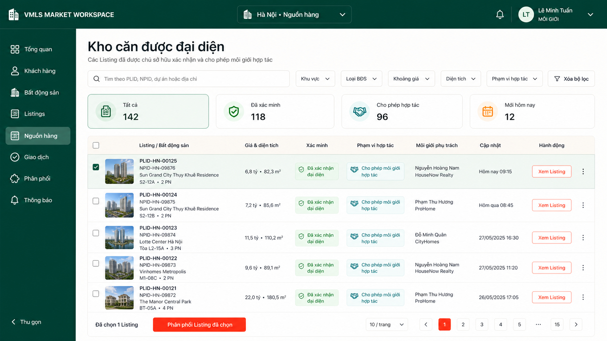
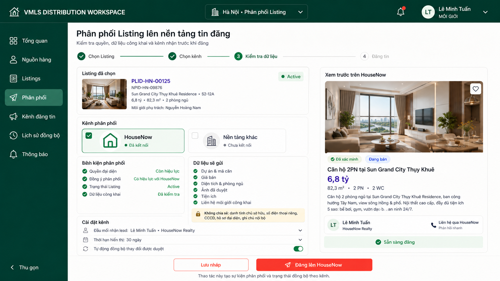

# Demo: nguồn hàng được đại diện và phân phối Listing

## Phạm vi nghiệp vụ

- **PROPOSAL:** Sau khi chủ sở hữu xác nhận quyền đại diện, VMLS kích hoạt Listing để tra cứu trong phạm vi thị trường nội bộ.
- **PROPOSAL:** Môi giới khác chỉ thấy Industry projection phục vụ hợp tác; danh tính, liên hệ và hồ sơ riêng của chủ sở hữu không xuất hiện.
- **PROPOSAL:** Đăng sang một nền tảng tin đăng chỉ được thực hiện khi Listing còn hiệu lực và consent phân phối bao phủ đúng kênh, mục đích và thời hạn.
- **PROPOSAL:** VMLS chỉ gửi public projection đã duyệt, đồng thời ghi Distribution Event và trạng thái đồng bộ theo kênh.
- **PROPOSAL:** HouseNow trong demo là kênh ví dụ, không phải xác nhận một tích hợp đang vận hành.

## Quan hệ giữa hai màn

`Kho căn được đại diện` → chọn Listing đủ điều kiện → `Phân phối Listing` → kiểm tra quyền và public projection → đăng lên HouseNow.

## 01. Kho căn được đại diện

Actor: **Môi giới tra cứu nguồn hàng**.

Mục tiêu: tìm Listing đã được xác nhận đại diện, xem phạm vi hợp tác và chọn Listing cần phân phối. Màn danh sách không hiển thị dữ liệu riêng của chủ sở hữu.

## 02. Phân phối Listing lên HouseNow

Actor: **Môi giới thực hiện phân phối**.

Mục tiêu: chọn kênh, kiểm tra điều kiện phân phối, rà soát dữ liệu công khai, xem trước tin và thực hiện đăng. Hệ thống nêu rõ các trường không được chia sẻ.

## Điểm cần chốt trước khi triển khai

- **OPEN QUESTION:** Môi giới hợp tác có được tự đăng Listing hay phải qua phê duyệt của môi giới phụ trách?
- **OPEN QUESTION:** Lead từ HouseNow thuộc môi giới đăng tin, môi giới phụ trách hay được phân phối theo quy tắc của brokerage?
- **OPEN QUESTION:** Consent được quản lý theo từng kênh cụ thể hay theo nhóm nền tảng tin đăng?
- **OPEN QUESTION:** Khi quyền đại diện hết hạn hoặc bị thu hồi, VMLS có tự động gỡ tin trên mọi kênh hay tạo yêu cầu xử lý?
