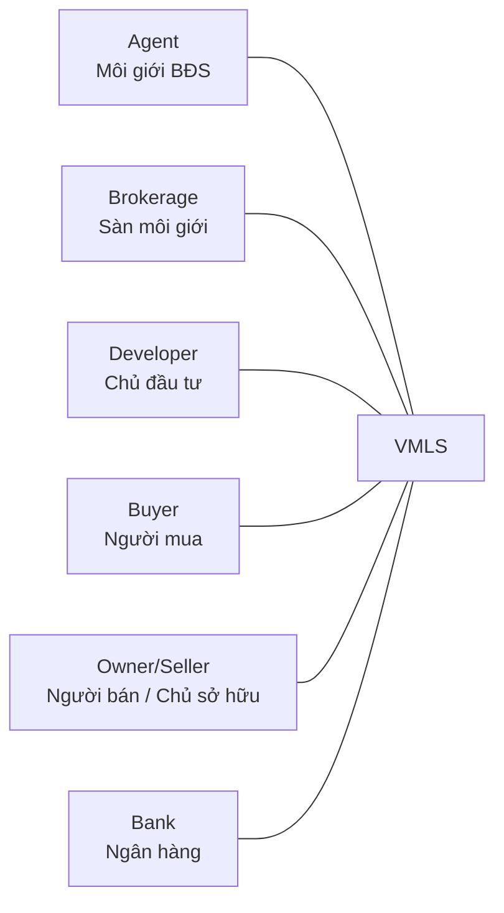

# HouseNow MLS actor model research

Date: 2026-08-13
Status: `RESEARCH RECOMMENDATION` — requires product, legal, data-governance and pilot validation.

## Executive answer — updated scope decision

The target six market actors are now **Agent, Brokerage, Developer, Buyer, Owner/Seller and Bank**. This is a substitution, not a rebuild: five implemented perspectives remain; Owner/Seller is promoted from an already-modeled authority-bearing party; Regulator moves from primary product persona to deferred oversight scope.

For production authorization, HouseNow still needs operating and machine principals beyond the six market actors, but they should not be counted as six new dashboards:

- **Target market release: 6** domain actors, including Owner/Seller.
- **Production operating baseline: +3 roles** — Data Steward, Organization Admin and System Admin.
- **Ecosystem scale: +4 families** — Tenant/Renter, Independent Appraiser, Notary/Legal Conveyancing and Data Exchange Partner.
- **Future oversight: Regulator**, activated only when a concrete jurisdiction, statutory purpose and data-access contract are approved.

The count deliberately mixes different kinds of authorization principals. Only domain actors with distinct jobs need dedicated user journeys. Organization roles and machine principals should normally reuse shared administration/integration surfaces.

| Gate | Addition | Principal type | Why it must remain distinct |
|---|---|---|---|
| Target six | Owner / Seller / Landlord | Domain actor | Owns consent, representation, correction/dispute and authorization of material listing changes; replaces Regulator in the primary market scope. |
| Operating baseline | Data Steward | Platform operating role | Resolves identity, duplicate, provenance, taxonomy and assigned quality cases. |
| Operating baseline | Organization Admin | Organization-scoped role | Manages memberships and approved entitlements only inside its organization. |
| Operating baseline | System Admin | Platform control-plane role | Manages identity, organizations, policy, integrations and service state without blanket business-data access. |
| Deferred oversight | Regulator | Authority-scoped actor | Reuses aggregate/audit research only after jurisdiction, lawful purpose, suppression and drill-down policy are approved. |
| Ecosystem | Tenant / Renter | Domain actor | Has a lease journey, obligations and consent scope that are not equivalent to a buyer journey. |
| Ecosystem | Independent Appraiser / Valuation Firm | Purpose-scoped professional actor | Supplies or consumes comparable/valuation evidence independently of a lender's decision scope. |
| Ecosystem | Notary / Legal Conveyancing | Transaction verification actor | Verifies documents and notarization state; should not receive general MLS browsing rights. |
| Ecosystem | Data Exchange Partner | Machine/organization principal with `provider` or `consumer` mode | Covers authoritative inbound sources and purpose-/field-scoped outbound portal, IDX, vendor and API access. Provider and consumer credentials remain separate even though they are one top-level family for planning. |

Therefore, relative to the running prototype, the immediate persona delta is **+1 Seller and -1 Regulator in the target navigation**. Relative to a production-capable authorization model, add the three operating roles without turning them into market personas. Ecosystem actors remain capability-triggered.

## What the repository establishes

The interface and authentication fixtures expose the six target actors plus a visibly deferred Regulator exploration (`src/data/mockData.js`, `src/App.jsx`, `server/auth.js`). Owner/Seller now has a scoped vertical slice; it is no longer merely a proposed persona.

The [roadmap](../../product/roadmap.md) separates Organization Admin, System Admin, and Data Steward from market actors and denies blanket business-data access. [Requirements](../../product/requirements.md) model Owner/Seller Ownership Claims, Representation, Consent, Listing oversight, and correction/dispute requests. The [System Admin plan](../../product/plans/phase-6-3-system-admin.md) specifies the separate control plane.

Historical imported diagrams used other six-actor combinations, including Notary and Regulator substitutions. They are archived, not current product evidence.

## Primary-source evidence

### Owner / Seller / Landlord

The seller is an authority-bearing party, not a buyer subtype. NAR's current Model MLS Rules require seller signatures before a listing is delivered to the service and separately govern seller choices over listing distribution. That supports an explicit consent/representation principal even when HouseNow captures consent through documents rather than a seller login ([NAR Model Rules and Regulations](https://www.nar.realtor/handbook-on-multiple-listing-policy/c-model-rules-and-regulations-for-an-mls-operated-as-a-committee-of-an-association-of-realtors)).

Vietnam's Law on Real Estate Business defines property management as activity under authorization from an owner or land-use-right holder, and requires material property/project information to be published fully, truthfully, accurately and updated when it changes. These obligations make authority and provenance first-class domain concerns ([Law 29/2023/QH15, Articles 3 and 6](https://datafiles.chinhphu.vn/cpp/files/vbpq/2024/01/luat29.pdf)).

### Tenant / Renter

Vietnam's Law on Real Estate Business distinguishes sale, lease, sublease and lease-purchase throughout the regulated transaction model. Tenant permissions, deposits, handover, renewal/termination and personal consent therefore should not be hidden inside the Buyer role when rental becomes a product line ([Law 29/2023/QH15](https://datafiles.chinhphu.vn/cpp/files/vbpq/2024/01/luat29.pdf)).

### Independent appraiser

Mature MLS governance recognizes licensed/certified appraisers as subscribers and permits factual data submitted by appraisers. This supports a separate purpose-scoped valuation actor rather than granting Bank-equivalent access ([NAR Model MLS Bylaws, Article 4.3](https://www.nar.realtor/handbook-on-multiple-listing-policy/e-model-bylaws-for-a-multiple-listing-service-separately-incorporated-but-wholly-owned-by-an); [NAR Handbook, operational policies](https://www.nar.realtor/handbook-on-multiple-listing-policy)).

### Notary / legal conveyancing

Vietnam law requires notarization or authentication when individuals transact in covered real estate contracts. The housing/market information system is also designed to interconnect with notarial and land databases. This warrants a narrow transaction-verification principal rather than generic Regulator or Broker access ([Law 29/2023/QH15, Articles 44 and 74](https://datafiles.chinhphu.vn/cpp/files/vbpq/2024/01/luat29.pdf)).

### Data exchange partner

Vietnam law requires interconnection and sharing across land, notarial and other sector databases, with access constrained by the receiving party's functions and authority ([Law 29/2023/QH15, Articles 74–75](https://datafiles.chinhphu.vn/cpp/files/vbpq/2024/01/luat29.pdf)). The newer national framework, Decree 357/2025/NĐ-CP, has applied since 1 March 2026 and governs the housing and real-estate-market information/database system ([official decree record](https://vanban.chinhphu.vn/?classid=1&docid=216395&orggroupid=2&pageid=27160)).

RESO's current Data Dictionary separately models organizations, members, offices, media, showings, contacts, events and other resources exchanged across real-estate systems. NAR's IDX policy separately constrains electronic display/delivery, including confidential fields and source attribution. Together these support dedicated machine identities and contracts for data providers and consumers rather than impersonating a human actor ([RESO Data Dictionary 2.0](https://dd.reso.org/DD2.0/); [NAR IDX Policy](https://www.nar.realtor/handbook-on-multiple-listing-policy/advertising-print-and-electronic-section-1-internet-data-exchange-idx-policy-policy-statement-7-58)).

### Operating roles and separation of duties

NAR's model governance distinguishes MLS participants, affiliated subscribers/users and the service's governing/operating structure. It explicitly includes sales associates, appraisers and optionally supervised administrative staff as subscribers rather than treating everyone as one universal member role ([NAR Model MLS Bylaws, Articles 4 and 6](https://www.nar.realtor/handbook-on-multiple-listing-policy/e-model-bylaws-for-a-multiple-listing-service-separately-incorporated-but-wholly-owned-by-an)). This supports HouseNow's existing separation of Data Steward, Organization Admin and System Admin.

## Counting rules

An addition is counted only when it has a distinct combination of:

1. Goal and workflow.
2. Governed data scope or legal authority.
3. Write/approval responsibility.
4. Audit and accountability requirements.

Do **not** create a new top-level actor for every title or organization:

- Listing Agent and Buyer Agent are contextual assignments under Agent.
- Brokerage reviewer and office manager are entitlements within Brokerage/Organization.
- Central and provincial authorities are organizations/scopes under Regulator unless their use cases genuinely diverge.
- A portal, cadastral source and showing vendor get separate credentials and contracts, but can share the `Data Exchange Partner` family with provider/consumer subtypes.
- Photographer, inspector, insurer, property manager, auction provider and training provider remain future subtypes/integrations until HouseNow commits to those workflows.

## Recommended rollout

| Stage | Activate | Product implication |
|---|---|---|
| Target scope alignment | Owner/Seller as primary market actor; Regulator deferred | Add Seller projection/workspace and persist ownership claim, representation, consent, dispute and revocation. Hide Regulator from default target navigation without deleting research/code. |
| Pilot hardening | Data Steward; Organization Admin; System Admin | Keep control planes separate and deny blanket business-data access. |
| Rental expansion | Tenant / Renter | Add lease-specific lifecycle and consent; do not reuse Buyer labels mechanically. |
| Valuation and closing | Appraiser; Notary / Legal | Add purpose-bound cases, evidence exchange and transaction verification; avoid broad search by default. |
| Multi-market data network | Data Exchange Partner | Issue organization-bound machine credentials; separate inbound provenance from outbound display/use rights, rate limits and audit. |

## Assumptions and decision gates

- “Scale” means multi-organization, multi-market production operation with external data exchange, not merely more users or listings.
- The current Bank actor covers lender workflows, not independent appraisal.
- Regulator remains a future authority-scoped actor, not part of the target six release and not a substitute for source systems or notarial execution.
- The recommendation is an authorization/domain model, not a staffing estimate.
- Product should validate task frequency before giving any addition a dedicated home/dashboard.
- Legal must validate the precise representation, privacy, consent, notarization and government-data access rules before real data or production access is enabled.

## Decision summary

Adopt the updated target six market actors now. Implement Seller incrementally on the existing MLS core; defer Regulator UI activation. Add Data Steward, Organization Admin and System Admin as operating roles, then activate the four ecosystem families only when their workflows are committed. Do not use the old “six plus eight” count for product navigation planning.
