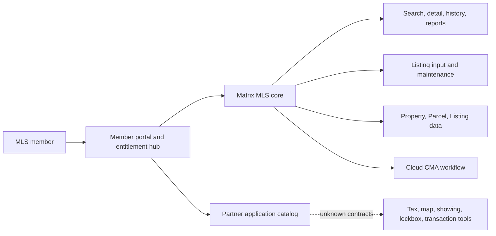
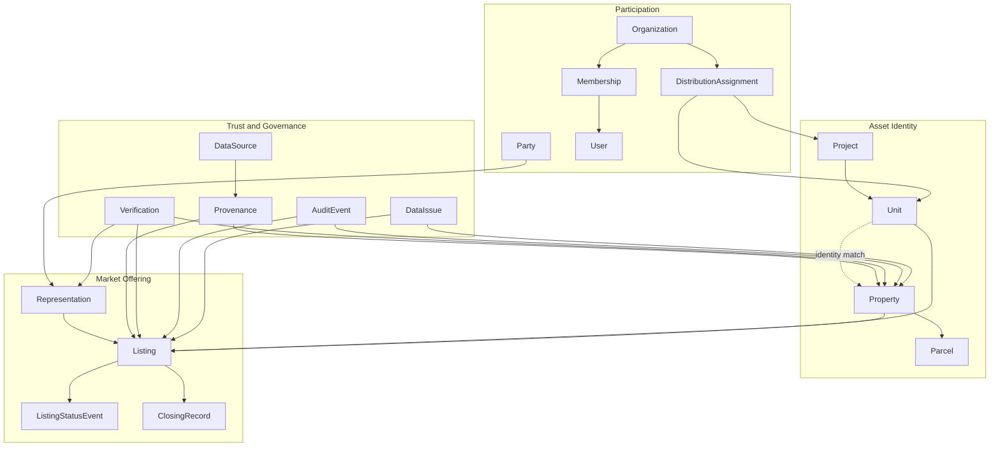

# Texas MLS reference and domain discovery

Status: `COMPLETE FOR AVAILABLE REFERENCE`
Reference snapshot: `TheNowProject/mls`, archive commit marker `4d1921b20bab1a158db2f8d7b5ee438a3aef6aa4`
Date: 2026-08-12

## Scope and limitation

The supplied snapshot is a research repository, not an implementation repository. It contains a canonical reference glossary, a business-analysis report, visual analysis, transcript, selected frames, and agent working rules. It contains no application source, package manifest, database migrations, API definitions, deployment files, or runtime entry points.

Therefore:

- Product and domain discovery can be completed against the available evidence.
- Code architecture, implementation completeness, authentication behavior, database schema, and external contracts cannot be discovered.
- Reuse is limited to research artifacts and terminology. No code reuse decision is possible.

## Evidence sources

| Priority | Source | Use |
|---|---|---|
| Primary | `reference/mls/documents/research/mls-texas/BA-report.md` | Analyzed workflow, domain, rules, risks, and evidence labels |
| Canonical terminology | `reference/mls/CONTEXT.md` | Reference language and distinctions |
| Supporting | `visual-analysis.md`, `as-observed-overview.md` | UI and product-structure corroboration |
| Primary evidence fallback | Transcript, 24 selected frames, 26 contact sheets | Verify claims requiring direct visual/audio evidence |

## Product architecture as observed

`FACT`: The portal, Matrix core, and Cloud CMA are directly observed.
`OPEN QUESTION`: SSO, API boundaries, database ownership, messaging, and deployment topology are not visible.

## Housenow proposed domain map

Relationships shown are `PROPOSAL` unless already identified as a reference `FACT`. Detailed cardinality remains configurable where Vietnam discovery is incomplete.

## Current actor-capability map from reference

| Capability | Member/Agent | Broker/Office | Association | Public user | Confidence |
|---|---:|---:|---:|---:|---|
| Enter and maintain Listing | Yes | Supervisory involvement stated | Policy context stated | No | FACT for Agent; SOURCE CLAIM for supervision |
| Search Listing and Property data | Yes | Yes by membership context | Entitlement context | Limited downstream | FACT / INFERENCE |
| View private remarks/showing data | Entitled member | Entitled office context | Not established | No | FACT for separation; exact rules unknown |
| Change Listing status | Responsible user | Supervisory role stated | Complaint/policy role stated | No | FACT for actions; SOURCE CLAIM for governance |
| Create CMA | Yes | Likely by entitlement | Not established | No | FACT for member workflow |
| Control app access | Through membership | Organization context | Portal membership/dues | No | FACT at product level; mechanism unknown |

This table describes the Texas reference only and is not a Vietnam permission specification.

## Integration inventory

| Integration area | Evidence | Contract status | Housenow treatment |
|---|---|---|---|
| Tax/public record | Search and tax tabs observed | Unknown | Discovery input only |
| Map, parcel, flood | Tabs observed | Unknown | Map/vendor and data policy unresolved |
| Showing and lockbox | Partner tools and actions observed | Unknown | Post-core integration candidate |
| Transaction documents | Partner app observed | Unknown | Outside first MVP slice |
| Public syndication | Participant describes downstream portals | Unknown | Requires explicit consent, mapping, retry, replay, reconciliation |
| Cloud CMA | Full user workflow observed | Unknown | Human-in-the-loop post-core capability |
| Member portal/SSO | Cross-app portal behavior observed | Unknown | IAM architecture unresolved |

No API contract, feed schema, delivery SLA, retry policy, or source credentials are available.

## Reuse / replace / reference matrix

| Asset | Decision | Notes |
|---|---|---|
| Evidence taxonomy | Reuse | Preserve FACT, SOURCE CLAIM, INFERENCE, PROPOSAL, OPEN QUESTION |
| Reference glossary | Reference and adapt | Housenow glossary expands Project, Unit, Data Steward, visibility language |
| Property/Listing distinction | Adopt as domain invariant | Strongest evidence-backed distinction |
| Texas status labels and SLA | Reference only | Must be validated for Vietnam |
| Search/detail/create workflow | Reference | Useful flow evidence; do not copy interface literally |
| CMA workflow | Reference for later phase | Human selection is essential |
| Source code/components | Replace/build new | No code supplied |
| Schema/API/infra | Design after policy baseline | No implementation evidence |

## Security and technical risk register

| ID | Risk | Severity | Evidence | Mitigation before MVP |
|---|---|---:|---|---|
| R-001 | Property and Listing are merged, destroying relist history | Critical | FACT + domain invariant | Separate canonical identifiers and test relist scenarios |
| R-002 | Restricted remarks or owner/showing data leak through search, export, logs, or analytics | Critical | FACT that scopes differ | Field classification plus backend authorization across every consumer |
| R-003 | Status is an editable string without guards or audit | Critical | FACT that actions are governed | Transition policy, optimistic concurrency, append-only event record |
| R-004 | Source conflicts are overwritten without provenance | High | Multiple source categories observed | Record/field provenance and correction workflow |
| R-005 | Copy/prefill creates duplicate Property records | High | Existing/tax/blank input paths observed | Identity matching before create and auditable merge queue |
| R-006 | Texas-specific licensing, association, agreement, status, or SLA is hard-coded | High | Reference is jurisdiction-specific | Policy configuration and Vietnam legal/product approval |
| R-007 | Downstream feeds become stale or inconsistent | High | Syndication is a stated workflow | Idempotency, outbox/event design, retries, reconciliation, replay |
| R-008 | CMA is presented as automated official valuation | High | Human review observed | Human-in-the-loop selection and explicit report purpose/version |
| R-009 | Prototype permissions are mistaken for security controls | Critical | Frontend-only prototype | Label prototype and require backend authorization for MVP |
| R-010 | Real personal or property-sensitive data enters prototype | High | Source frames contain identifiable data | Synthetic data only; avoid copying reference records |

## Questions for Tech Lead and domain owners

1. Is another implementation repository available, and is it reference, fork, or reusable source?
2. Which organization governs canonical Property and Listing identities?
3. What is the initial pilot locality and transaction segment?
4. What authoritative identifiers and data sources are available in that locality?
5. Which actor approves representation and Active visibility?
6. What fields are Public, Industry, Restricted, or consent-based?
7. What is the approved lifecycle per sale, lease, and developer inventory?
8. What duplicate, correction, dispute, and merge authority is required?
9. Which external contracts exist for cadastral, project, bank, regulator, map, and public distribution data?
10. What audit retention, export, privacy, and incident requirements apply?

## Phase 1 exit assessment

| Criterion | Result |
|---|---|
| Explain Listing lifecycle in supplied repo | Completed at product-evidence level; implementation unavailable |
| Identify reusable and replaceable areas | Completed; research reusable, code unavailable |
| Architecture and domain maps | Completed with evidence labels |
| Data model and integrations | Domain proposal and integration inventory completed; technical contracts unavailable |
| Security/technical risks | Completed |
| Tech Lead walkthrough confirmation | Pending external stakeholder action |

Phase 1 is complete for the material supplied. A future implementation repository triggers a new code-level discovery pass rather than invalidating this report.
