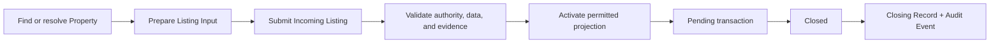

# HouseNow MLS primer

This primer explains the product model and what the local prototype is intended to validate. It is not approved operating policy, legal advice, or a description of a production system.

## What an MLS is

A Multiple Listing Service is shared market infrastructure through which authorized participants contribute, verify, discover, cooperate around, and govern real-estate data. It is not merely a public portal containing advertisements.

A portal usually optimizes consumer discovery and lead generation. An MLS must also answer:

- Which durable asset does this record describe?
- Who has authority to offer or distribute it?
- Which organization and user are accountable for the Listing?
- Which fields are public, industry-only, or restricted?
- Where did the data come from and when was it verified?
- Which lifecycle and audit events led to the current state?

## One running example

Suppose an apartment in Ho Chi Minh City is offered for sale twice over several years.

- The physical/legal asset is one `Property`.
- Each market offering is a separate `Listing` with its own price, representation basis, effective dates, visibility, and lifecycle.
- A later relist does not overwrite the earlier Listing.
- A completed outcome is a `Closing Record`, not the Property and not the Listing itself.
- Owner authority, broker Representation, distribution Consent, sources, verification, and audit events remain separately traceable.

That distinction lets the system preserve price and listing history without pretending every advertisement is a new asset.

## Why the distinction matters in Vietnam

`INFERENCE`: Vietnam's market often distributes the same property through multiple brokers and channels, with inconsistent price, area, status, media, and owner claims. A useful VMLS must therefore prioritize identity resolution, responsibility, provenance, and governed corrections before maximizing listing volume.

`FACT`: Vietnam-specific legal, licensing, representation, privacy, cadastral, transaction, and government-access policy remains subject to authoritative legal/product approval. U.S. and Texas workflows are research inputs only.

## Canonical market actors

| Actor | Vietnamese alias | Primary job in VMLS |
|---|---|---|
| Real-estate Agent | Môi giới BĐS | Find Properties, manage clients, create governed Listings, schedule showings, and prepare CMA reports |
| Brokerage | Sàn môi giới | Review Listings, manage members and inventory, resolve quality work, and govern organization scope |
| Developer | Chủ đầu tư | Manage Project/Unit inventory, legal evidence, availability, price/policy, and distribution assignments |
| Buyer | Người mua | Discover permitted Listings, compare evidence, save candidates, schedule showings, and report data issues |
| Owner/Seller | Người bán / Chủ sở hữu | Establish authority, grant/revoke Representation and Consent, monitor Listings, and request correction or withdrawal |
| Bank | Ngân hàng | Receive purpose- and consent-bound finance context and return only the permitted workflow state |

Data Steward, Organization Admin, and System Admin are operational roles. They do not become market actors or receive blanket business-data access. Regulator (`Cơ quan quản lý`) is deferred until a lawful oversight workflow is approved.

## Core records

- `Property`: durable asset identity.
- `Parcel`: cadastral/legal land unit related to a Property.
- `Project`: governed development and its legal/inventory structure.
- `Unit`: marketable product inside a Project; links to Property only when evidence supports it.
- `Listing`: one time-bounded market offering.
- `Party`: person or organization participating in an authorized capacity.
- `Membership`, `Role`, `Entitlement`, `Purpose`: organization and access authority.
- `Representation`, `Listing Agreement`, `Consent`: authority to act or distribute.
- `Data Source`, `Verification`, `Provenance`: why a field or record should be trusted.
- `Audit Event`: immutable material action or decision.
- `Closing Record`: permitted completed-transaction outcome.
- `CMA Report`: versioned, human-reviewed comparative market analysis; not an official valuation certificate.

Use the complete [domain language](../domain/language.md) and [data dictionary](../domain/data-dictionary.md) for exact definitions.

## Governed Listing flow



Exact statuses, approval authority, deadlines, and legal effects remain working product context unless explicitly marked accepted.

## Data visibility

Visibility is a backend projection decision, not CSS hiding:

```text
effective access = membership × role × organization × resource
                 × action × purpose × consent × time × field policy
```

- Public Fields may be distributed to consumers under current policy.
- Industry Fields require an entitled market participant.
- Restricted Fields require a specific purpose, scope, authority, consent, or exceptional access workflow.

Derived views, search indexes, exports, reports, logs, analytics, and downstream feeds must enforce the same classification.

## What the local prototype demonstrates

The current build uses 26 synthetic Properties across Ho Chi Minh City and Hanoi. It demonstrates:

- Property search and Property 360 by actor.
- Listing creation, brokerage review, lifecycle transitions, Closing Records, and audit history.
- Price/source/listing history and CMA candidate review.
- Contacts, shortlist, showing, quality, organization, access-request, and notification exploration.
- Owner/Seller authority, consent versioning, claims, and correction/pause/withdrawal cases.
- Backend actor projections and sensitive-read audit.

It does not establish production identity, cadastral or partner integrations, approved legal policy, full transaction/commission/booking workflows, or operational readiness.

## Reading path

1. [Current state](../product/current-state.md)
2. [Domain language](../domain/language.md)
3. [Requirements](../product/requirements.md)
4. [Security limitations](../technical/security.md)
5. Relevant [research](./README.md) only when evidence is needed
