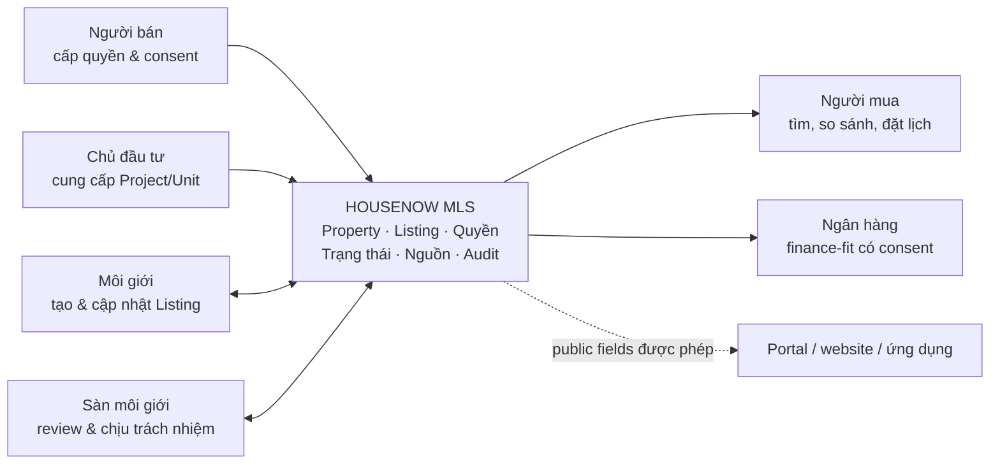
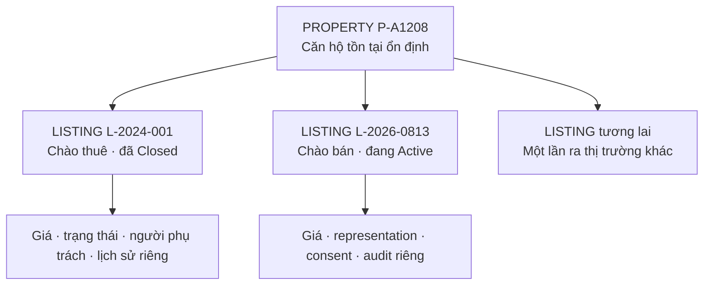
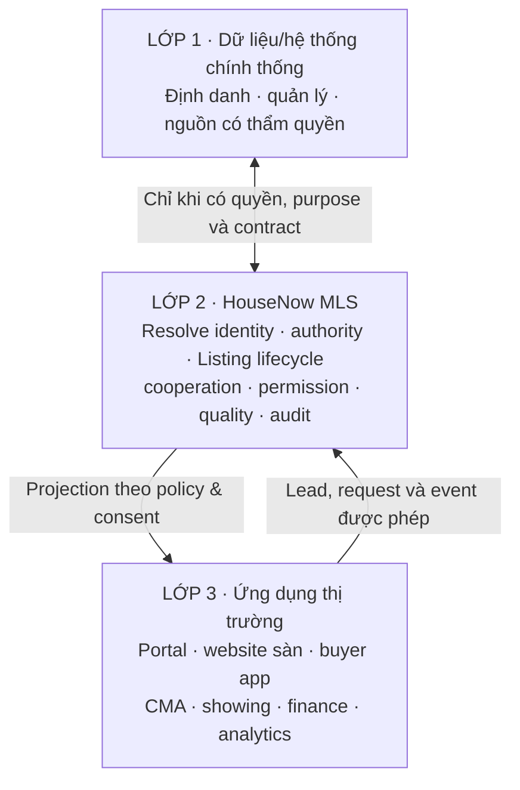
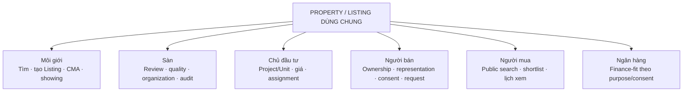
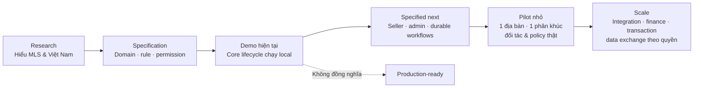

# HouseNow MLS Primer — đọc một lần để hiểu MLS và bản demo hiện tại

> Cập nhật: 2026-08-13  
> Đối tượng đọc: người mới tham gia dự án, founder, product, design, engineering, đối tác sàn/CĐT/ngân hàng và người cần đánh giá hướng đi của HouseNow MLS.  
> Trạng thái: tài liệu nhập môn và định hướng nghiên cứu; không phải cam kết pháp lý, chính sách vận hành đã được phê duyệt hay mô tả một hệ thống production.

## Cách đọc các nhãn trong tài liệu

- **FACT**: điều đã quan sát được trong nguồn tham chiếu, văn bản chính thức hoặc code/tài liệu hiện có. FACT về MLS tại Texas không tự động trở thành yêu cầu cho Việt Nam.
- **PROPOSAL**: phương án HouseNow đang đề xuất để nghiên cứu, thiết kế hoặc thử nghiệm.
- **OPEN QUESTION**: câu hỏi cần Product, Legal/Data Governance, chuyên gia nghiệp vụ hoặc đối tác pilot quyết định trước khi triển khai thật.

Quy tắc phân loại này kế thừa phương pháp evidence của [báo cáo BA nguồn NTREIS/Matrix](../../reference/mls/documents/research/mls-texas/BA-report.md) và [product requirements baseline](../product/product-requirements-baseline.md).

---

## 1. Đọc 5 phút — nếu chỉ nhớ ba ý

1. **MLS không phải một website đăng tin.** MLS là một mạng lưới dữ liệu **và luật chơi hợp tác**: ai được đưa tài sản ra thị trường, dữ liệu nào được chia sẻ, listing đang ở trạng thái nào, ai đã thay đổi điều gì và khi nào.
2. **Tài sản không đồng nghĩa với tin đăng.** Một căn hộ tồn tại bền vững dưới dạng `Property`; mỗi lần căn đó được chào bán hoặc cho thuê là một `Listing` riêng, có giá, người phụ trách, quyền đại diện và vòng đời riêng.
3. **HouseNow hiện đang build một local prototype để kiểm chứng mô hình**, chưa phải MLS production hay pilot dùng dữ liệu thật. Phần lõi Property → Listing → review → trạng thái → audit đã chạy; Seller cũng đã có vertical slice đầu tiên cho own Property, authority, consent và case, nhưng chính sách và command set chưa hoàn tất. Xem trạng thái chính thức tại [Phase Status](../PHASE_STATUS.md).

> **PROPOSAL — câu định nghĩa dễ nhớ:** HouseNow MLS hướng tới việc giúp nhiều bên cùng khai thác một nguồn hàng mà vẫn bảo vệ quyền của người có nguồn, đồng thời tạo ra lịch sử dữ liệu có thể truy nguyên cho thị trường.

### MLS trong một hình



Hình trên thể hiện ý chính: MLS là lớp dữ liệu và workflow dùng chung giữa các bên; portal chỉ là một trong các nơi có thể nhận phần dữ liệu công khai được phép.

---

## 2. Một căn hộ A-1208 để hình dung MLS

Giả sử chị Lan sở hữu căn hộ **A-1208** và muốn bán.

### 2.1 Nếu thị trường chỉ có các kênh đăng tin

Chị Lan gửi thông tin cho vài môi giới. Một người đăng giá 5,2 tỷ, người khác đăng 5,5 tỷ; có người giấu số căn để tránh bị lấy khách; chính chủ cũng đăng thêm một tin. Khi căn đã bán, một số tin vẫn còn. Người mua khó biết:

- các tin đó có cùng nói về một căn không;
- ai thật sự được phép bán hoặc phân phối;
- giá nào còn hiệu lực;
- căn còn bán, đang giữ chỗ hay đã giao dịch;
- dữ liệu nào đã được kiểm tra, dữ liệu nào chỉ do người đăng tự khai.

Portal vẫn làm tốt việc quảng bá và tạo lead, nhưng bản thân một tập hợp tin quảng cáo chưa tạo ra một hồ sơ nghiệp vụ thống nhất cho căn A-1208.

### 2.2 Nếu vận hành theo mô hình MLS

Căn A-1208 có một định danh `Property`, ví dụ `P-A1208`. Khi chị Lan đưa căn ra bán trong tháng 8, hệ thống tạo một `Listing`, ví dụ `L-2026-0813`, thay vì biến căn hộ thành một tài sản mới.

Luồng dự kiến có thể hình dung như sau:

```text
Chị Lan chứng minh/claim quan hệ với P-A1208
→ cấp quyền đại diện có thời hạn cho môi giới hoặc sàn
→ xem và đồng ý phạm vi dữ liệu được phân phối
→ môi giới tạo L-2026-0813
→ hệ thống kiểm tra dữ liệu, quyền và tin đang còn hiệu lực
→ sàn review rồi mới kích hoạt
→ môi giới khác tìm thấy phần dữ liệu họ được phép xem và mang khách tới
→ Listing đi qua Active → Pending → Closed
→ kết quả được ghi thành Closing Record và Audit Event
```

Nếu hai năm sau chị Lan bán lại, `P-A1208` vẫn là tài sản đó nhưng sẽ có một `Listing` khác. Nhờ vậy, hệ thống giữ được lịch sử chào bán, thay đổi giá, trạng thái và kết quả giao dịch mà không ghi đè quá khứ.

### Một Property có thể có nhiều Listing theo thời gian



Điểm quan trọng nhất: đóng hoặc rút một Listing không làm mất Property, và tạo Listing mới không được ghi đè lịch sử Listing cũ.

**FACT:** trong hệ thống Matrix được dùng làm nguồn nghiên cứu, cùng một địa chỉ/property có thể có nhiều MLS record theo các lần ra thị trường; giao diện cũng tách lịch sử và các action đổi trạng thái. Bằng chứng và giới hạn quan sát được ghi tại [BA report, mục Property–Listing và lifecycle](../../reference/mls/documents/research/mls-texas/BA-report.md).

**PROPOSAL:** HouseNow áp dụng nguyên tắc đó vào domain Việt Nam, nhưng trạng thái, điều kiện duyệt, thời hạn cập nhật và thẩm quyền của từng bên vẫn phải được xác nhận riêng cho thị trường Việt Nam. [Scope lock hiện tại](../product/phase-4-scope-lock.md) chỉ đóng băng một vertical slice để chạy demo.

---

## 3. Sáu khái niệm phải hiểu đúng

### Property — tài sản bền vững

`Property` là căn nhà, thửa đất hoặc đơn vị bất động sản có danh tính tồn tại qua nhiều lần đưa ra thị trường. Với dự án, `Project` chứa nhiều `Unit`; một Unit có thể được liên kết với Property khi đủ bằng chứng định danh.

### Listing — một lần chào bán hoặc cho thuê

`Listing` là một market offering có định danh riêng, gắn với Property/Unit, giá, loại giao dịch, thời hạn, bên chịu trách nhiệm, quyền đại diện, phạm vi hiển thị và vòng đời. Listing không phải Property và cũng chưa phải giao dịch đã hoàn tất.

### Representation — quyền đại diện

`Representation` trả lời: **ai được hành động cho ai, trong việc gì, ở phạm vi nào và trong bao lâu?** Môi giới thuộc một sàn không có nghĩa là tự động được đăng mọi tài sản. Quyền đại diện khác với quyền sở hữu và khác với membership trong tổ chức.

### Consent — đồng ý có phạm vi

`Consent` trả lời: **dữ liệu nào được dùng, cho mục đích gì, gửi tới nhóm người/kênh nào và đến khi nào?** Consent có thể hết hạn hoặc bị thu hồi; không nên được hiểu là một checkbox cho phép vĩnh viễn mọi cách sử dụng.

### Provenance và Verification — nguồn không đồng nghĩa với xác minh

- `Provenance` cho biết dữ liệu đến từ đâu, ai cung cấp, lúc nào, đã được biến đổi ra sao.
- `Verification` là kết quả đánh giá một claim cụ thể dựa trên evidence và rule tại một thời điểm.

Ví dụ: diện tích 78 m² có thể có provenance là “chủ sở hữu tự khai”; điều đó chưa có nghĩa diện tích đã được cơ quan hoặc quy trình phù hợp xác minh. Một badge “verified” cũng phải nói rõ **đã xác minh điều gì và khi nào**, không nên ngầm tuyên bố toàn bộ Property đúng vĩnh viễn.

### Lifecycle và Audit — thay đổi bằng sự kiện, không xóa dấu vết

Listing đi qua các trạng thái được cho phép, thay vì người dùng sửa một nhãn tự do. Mỗi thay đổi quan trọng cần có actor, thời gian, lý do, trạng thái trước/sau và evidence khi cần. `Audit Event` không phải activity feed có thể sửa tùy ý.

Định nghĩa canonical đầy đủ nằm trong [HouseNow Domain Language](../../CONTEXT.md) và [data dictionary](../domain/data-dictionary.md).

---

## 4. MLS khác portal đăng tin ở đâu?

Portal và MLS có thể bổ trợ nhau; chúng không giải cùng một bài toán.

| Câu hỏi | Portal đăng tin | MLS |
|---|---|---|
| Tối ưu cho điều gì? | Quảng cáo, tìm kiếm công khai, traffic và lead | Dữ liệu nghiệp vụ, hợp tác, trách nhiệm và lịch sử |
| Đơn vị trung tâm | Tin quảng cáo | Property + Listing + authority + history |
| Ai được đưa hàng vào? | Theo policy tài khoản/moderation của portal | Thành viên/tổ chức và căn cứ đại diện được kiểm tra theo rule |
| Nhiều tin cùng một căn | Có thể cùng tồn tại | Cần resolve về cùng Property và xử lý xung đột Listing |
| Trạng thái | Đăng/sửa/ẩn/gỡ/hết hạn | Lifecycle có transition, guard và audit |
| Giá | Chủ yếu là giá chào | Giá chào, sự kiện thay đổi và có thể có closing data theo quyền |
| Hợp tác môi giới | Thường diễn ra ngoài nền tảng | Là workflow trung tâm, có attribution và trách nhiệm |
| Dữ liệu hiển thị | Chủ yếu hướng tới consumer | Public, industry và restricted projection khác nhau |
| Vai trò trong hệ sinh thái | Điểm đến để consumer khám phá | Có thể là nguồn nghiệp vụ cấp public feed được phép cho nhiều điểm đến |

Với căn A-1208, portal có thể hiển thị ảnh, giá và nút liên hệ. MLS phải trả lời thêm: tin này có gắn đúng Property không, quyền đại diện còn hiệu lực không, ai duyệt Active, môi giới nào mang khách tới, public channel nào được phép nhận dữ liệu và việc rút tin đã được đồng bộ chưa.

### Portal là “mặt tiền”; MLS là “hệ thống vận hành phía sau”

```mermaid
flowchart LR
    subgraph Front["Mặt tiền thị trường"]
      Portal["Portal công khai"]
      Website["Website sàn/CĐT"]
      BuyerApp["Ứng dụng người mua"]
    end

    subgraph Core["MLS Core"]
      Identity["Property identity"]
      Listing["Listing lifecycle"]
      Rights["Representation & consent"]
      Trust["Provenance · verification · audit"]
    end

    subgraph Work["Vận hành chuyên môn"]
      Broker["Brokerage review"]
      CMA["CMA / phân tích"]
      Showing["Showing / hợp tác"]
      Finance["Finance case"]
    end

    Core -->|"public projection"| Front
    Work <--> Core
```



**FACT:** walkthrough Matrix cho thấy public description và một số field có thể phân phối ra ngoài, trong khi private remarks, agent/office detail và showing instructions có phạm vi khác. Đây là bằng chứng cho việc phân loại dữ liệu ở domain/API, không chỉ ẩn menu ở frontend. Xem [BA report, mục 6.2](../../reference/mls/documents/research/mls-texas/BA-report.md).

**PROPOSAL:** Housenow Portal nên được xem là một downstream application của HouseNow MLS: portal nhận public projection; không nhận private remarks, hồ sơ quyền đại diện hay audit đầy đủ nếu không có purpose và entitlement phù hợp.

---

## 5. MLS được ứng dụng vào việc gì?

MLS không chỉ là “tìm thêm nhà”. Nếu data và governance đủ tốt, nó tạo nền cho nhiều ứng dụng:

1. **Tìm đúng nguồn hàng:** tìm theo Property/Listing, bản đồ và tiêu chí; phân biệt căn thật với các lần chào bán.
2. **Kiểm soát nguồn và quyền phân phối:** ghi nhận ai đại diện chủ sở hữu, sàn nào được phân phối dự án, thời hạn và kênh được phép.
3. **Giữ inventory còn hiệu lực:** có lifecycle, SLA, review và notification để giảm tin đã bán nhưng vẫn quảng bá.
4. **Hợp tác giữa môi giới/sàn:** chia sẻ nguồn hàng mà vẫn giữ attribution, assignment, lịch xem và lịch sử đóng góp.
5. **Property 360:** gom identity, listing history, price events, closing/source records và quality issue theo quyền.
6. **CMA và tư vấn giá:** chọn comparable có chủ đích, so sánh giá/m², DOM và khoảng giá; kết quả vẫn cần human review.
7. **Phân phối đa kênh:** một Listing được duyệt có thể cấp public subset cho portal/website, đồng thời theo dõi trạng thái sync và consent.
8. **Dữ liệu cho tài chính:** với purpose và consent phù hợp, ngân hàng có thể nhận context tối thiểu để tư vấn finance-fit hoặc tiếp nhận lead; underwriting chi tiết vẫn thuộc hệ thống ngân hàng.
9. **Chất lượng và tranh chấp:** báo dữ liệu sai, xử lý duplicate, lưu evidence, quyết định correction/merge và audit.
10. **Phân tích thị trường:** lịch sử chuẩn hóa có thể hỗ trợ chỉ số giá, thanh khoản, fraud signal và inventory analytics — nhưng chỉ đáng tin khi nguồn, quyền và độ đầy đủ dữ liệu được kiểm soát.

> **PROPOSAL:** “Trust before growth” là nguyên tắc cốt lõi của HouseNow: giá trị không nằm ở số lượng tin bằng mọi giá, mà ở khả năng biết dữ liệu nào đáng tin đến đâu và ai chịu trách nhiệm. Các nguyên tắc sản phẩm nằm trong [Master Plan](../../MASTER_PLAN.md#11-giá-trị-cốt-lõi).

---

## 6. Bối cảnh Việt Nam: đã có nhiều mảnh ghép, nhưng chưa chắc đã có một MLS liên thông

Thị trường Việt Nam đã có ít nhất ba nhóm hệ thống khác nhau:

- **Portal công khai:** giúp đăng tin, quảng bá, tìm kiếm và tạo lead.
- **Hệ thống nội bộ của sàn/CĐT:** CRM, kho hàng, booking, bảng giá và inventory phục vụ một tổ chức hoặc mạng lưới riêng.
- **Hệ thống/CSDL Nhà nước:** phục vụ định danh, quản lý, báo cáo, liên thông theo chức năng và thẩm quyền.

Các nhóm trên đều có giá trị, nhưng không tự động tạo thành MLS. Một MLS đa tổ chức còn cần chuẩn dữ liệu chung, canonical identity, căn cứ quyền đăng/phân phối, listing lifecycle, member rule, cooperation, complaint/enforcement và lịch sử có thể audit.

**FACT:** Luật Kinh doanh bất động sản 29/2023/QH15 đặt yêu cầu công khai thông tin bất động sản/dự án đầy đủ, trung thực, chính xác và cập nhật khi thay đổi; luật cũng quy định hệ thống thông tin về nhà ở và thị trường bất động sản có kết nối/chia sẻ với các cơ sở dữ liệu liên quan. Xem [bản PDF chính thức trên Cổng Thông tin Chính phủ](https://datafiles.chinhphu.vn/cpp/files/vbpq/2024/01/luat29.pdf), đặc biệt các điều được tổng hợp trong [actor-scaling research](./actor-scaling-recommendation.md#primary-source-evidence).

**FACT:** Nghị định 357/2025/NĐ-CP quy định về xây dựng và quản lý hệ thống thông tin, cơ sở dữ liệu về nhà ở và thị trường bất động sản; hồ sơ chính thức được công bố trên [Cổng Thông tin Chính phủ](https://vanban.chinhphu.vn/?classid=1&docid=216395&orggroupid=2&pageid=27160). Bộ Xây dựng cũng giới thiệu định hướng mã định danh điện tử cho bất động sản tại [moc.gov.vn](https://moc.gov.vn/en/news/91245/gan-ma-dinh-danh-dien-tu-cho-bat-dong-san-tu-0132026.aspx).

**PROPOSAL:** HouseNow MLS nên là **lớp nghiệp vụ hợp tác** tương thích với hạ tầng định danh/dữ liệu chính thống, không tự nhận mình là CSDL Nhà nước. Có thể hình dung ba lớp:

```text
CSDL/hệ thống chính thống theo thẩm quyền
↕ kết nối chỉ khi có căn cứ, purpose và contract phù hợp
HouseNow MLS: identity resolution + representation + listing lifecycle
              + cooperation + permissions + quality + audit
↕ public/partner projection theo consent và policy
Portal, website sàn, app buyer, mortgage, analytics và partner apps
```



**FACT — giới hạn bằng chứng:** dựa trên research công khai đang có trong repo, nhóm chưa xác nhận một hệ thống tại Việt Nam đạt đồng thời độ phủ đa sàn độc lập, canonical Property identity, member rules, trách nhiệm cập nhật, cooperation, lịch sử giao dịch và enforcement như mô hình MLS trưởng thành. Điều này **không phải** kết luận “Việt Nam không có bất kỳ sản phẩm nào gọi là MLS”; nó là khoảng trống cần validation bằng market discovery và pilot partner.

**OPEN QUESTION:** HouseNow được phép đọc, lưu, đối soát hoặc thương mại hóa nhóm dữ liệu Nhà nước nào, cho purpose nào và theo cơ chế cấp quyền nào? Tham gia xây dựng/tích hợp một hệ thống chính thống không tự động tạo quyền sở hữu hoặc quyền dùng dữ liệu cho sản phẩm thương mại.

---

## 7. Sáu actor mục tiêu và giá trị họ nhận được

Target scope hiện tại có sáu actor thị trường. `Data Steward`, `Organization Admin` và `System Admin` là vai trò vận hành, không phải ba persona thị trường bổ sung và không có blanket access vào dữ liệu nghiệp vụ.

| Actor | Họ muốn làm gì với căn A-1208? | HouseNow cần bảo vệ điều gì? |
|---|---|---|
| **Môi giới BĐS** | Tìm đúng Property, quản lý khách/nhu cầu, tạo Listing, đặt lịch xem, hợp tác và theo dõi giao dịch | Attribution, assignment, private/member fields và phạm vi hành động |
| **Sàn môi giới** | Quản lý thành viên, review Listing, kiểm soát inventory, lead, quality, compliance và báo cáo | Organization scope, separation of duties và audit |
| **Chủ đầu tư** | Quản lý Project/Unit, quỹ căn, giá/chính sách và đơn vị phân phối | Own-inventory scope, version giá và xung đột phân phối |
| **Người mua** | Tìm/lọc/so sánh, xem nguồn hàng còn hiệu lực, liên hệ, đặt lịch, nhận tư vấn tài chính | Public projection, consent, privacy và không bị lộ hồ sơ/nhu cầu ngoài mục đích |
| **Người bán / Chủ sở hữu** | Claim/link tài sản, xác nhận quyền đại diện, consent phân phối, theo dõi Listing và yêu cầu sửa/tạm dừng/rút | Ownership claim không được tự động coi là đúng; không lộ buyer identity, CRM hay internal remarks |
| **Ngân hàng** | Nhận finance lead có consent, xem property/project context tối thiểu, sơ tuyển và trả trạng thái cần thiết | Purpose limitation; không đưa underwriting note hoặc hồ sơ tín dụng vào MLS |

### Cùng một Property, mỗi actor nhìn và làm một phần khác nhau



Không có actor nào mặc định nhìn thấy “tất cả”. Cùng một record phải được chiếu thành public, industry, own-scope hoặc restricted projection phù hợp.

Danh sách use case và quan hệ primary/supporting/viewer đầy đủ được trace tại [Actor-use case matrix](../product/product-requirements-baseline.md#actor-use-case-matrix).

### Seller là thay đổi scope, không phải viết lại toàn bộ

**FACT — current repo:** prototype đã có đủ sáu Primary Market Actor là Agent, Brokerage, Developer, Buyer, Owner/Seller và Bank; Regulator được giữ dưới deferred exploration, còn Data Steward là operational role. Seller vertical slice đã dùng lại core Property, Listing, lifecycle, projection và audit hiện có. Xem [Phase 6.1 actor perspectives](../product/phase-6-1-actor-perspectives.md#actor-model) và [Phase 6.4 build plan](../product/phase-6-4-owner-seller-build-plan.md).

**PROPOSAL:** Seller không “tự duyệt tin” thay sàn. Seller xác nhận ownership/authority, representation và distribution consent; nếu muốn sửa, pause hoặc rút Listing thì tạo request/case. Actor có thẩm quyền mới thực hiện lifecycle transition, nhờ vậy không làm mất audit history.

---

## 8. HouseNow đã research như thế nào?

### Nguồn nghiên cứu ban đầu

**FACT:** repo chứa một research snapshot về hệ sinh thái MLS Bắc Texas, gồm BA report, transcript, selected frames và visual analysis. Walkthrough cho thấy member portal, Matrix core, search, listing detail/history, listing input, status actions, CMA và các ứng dụng chuyên biệt. [Reference discovery](./reference-discovery.md) mô tả inventory nguồn; [BA report](../../reference/mls/documents/research/mls-texas/BA-report.md) ghi claim cùng timestamp/frame và giới hạn bằng chứng.

### Cách HouseNow chuyển research thành prototype

```text
Quan sát evidence từ hệ thống tham chiếu
→ tách FACT / SOURCE CLAIM / INFERENCE / PROPOSAL / OPEN QUESTION
→ chuẩn hóa domain language
→ viết requirement, permission, business rule, acceptance criteria
→ khóa một vertical slice nhỏ
→ build React + HTTP API + SQLite
→ test luồng, projection và audit trên mock data
→ dùng prototype để hỏi lại thị trường Việt Nam
```

**PROPOSAL:** HouseNow chỉ lấy các nguyên tắc có khả năng tái sử dụng — tách Property/Listing, lifecycle, public/private fields, provenance, audit, cooperation — rồi thiết kế lại actor, policy và integration cho Việt Nam. Chính sách Texas không được copy nguyên sang Việt Nam.

---

## 9. Hiện tại HouseNow đang build gì?

Repo đang ở **Phase 6 — exploration-ready local prototype**. Cách hiểu đúng nhất là: đủ để team/founder đi qua các luồng, nhìn thấy quyết định sản phẩm và tìm lỗ hổng; chưa đủ để đưa dữ liệu khách hàng hoặc dữ liệu restricted vào vận hành thật.

### Bảng trạng thái đọc nhanh

| Mức | Có nghĩa là gì? | Phạm vi hiện tại | Không nên hiểu thành |
|---|---|---|---|
| **Current implementation** | Luồng có backend/API và persistence phù hợp với local vertical slice | Property/Listing core, validation, review, lifecycle, closing/audit, actor projection, Access Request và sensitive-read audit | Production-ready hoặc policy Việt Nam đã được duyệt |
| **Exploration UI** | Màn hình có thể bấm và review trải nghiệm, nhưng một phần dữ liệu chỉ sống trong browser session | Search/map, Property 360, Contacts, showing, CMA, Quality, Organization, Project, Finance, Oversight, Shortlist, Notification và App Hub | Durable workflow, integration thật hoặc SLA vận hành |
| **Specified next** | Domain/use case đã được viết để build tiếp | Seller workspace; ownership claim, representation, consent/revocation, correction/dispute; admin control plane | Chức năng đã có trong application hiện tại |
| **Future / external integration** | Chỉ triển khai khi có policy, đối tác, authority và production hardening phù hợp | Live government/portal/bank/CĐT integration, payment/commission, e-signature, underwriting, appraisal, notary, regulator record access | Cam kết delivery của demo hiện tại |

### Bản đồ từ demo hiện tại đến hệ thống có thể pilot



HouseNow hiện đứng ở đoạn **demo local có core chạy được**. Bước kế tiếp là chốt policy và Seller workflow, không phải nhảy thẳng tới một MLS toàn quốc.

Nguồn đối chiếu trạng thái: [Phase Status](../PHASE_STATUS.md), [Phase 6.1 actor perspectives](../product/phase-6-1-actor-perspectives.md) và [security/limitations](../technical/security-and-limitations.md).

### 9.1 Phần đã chạy end-to-end và có persistence

**FACT — CURRENT BUILD:** vertical slice sau đã chạy qua React frontend, HTTP API và SQLite:

```text
Find Property
→ Create Listing
→ Validate
→ Brokerage review
→ Active
→ Pending
→ Closed
→ Closing Record + Audit
```

Các capability lõi gồm:

- demo session và authorization ở backend;
- organization-scoped role cho slice hiện tại;
- canonical Property và nhiều Listing history;
- duplicate-current-Listing guard;
- public/member/restricted projection;
- lifecycle transition có rule và reason;
- Listing creation, status event và audit được ghi trong SQLite;
- Property Intelligence gồm price events, listing episodes, closing/source history, DOM/CDOM/relist và CMA candidate snapshot;
- Access Request, quyết định quyền và sensitive-read audit có persistence.

Nguồn kiểm chứng: [README](../../README.md#hiện-tại-đang-ở-giai-đoạn-nào), [local API contract](../technical/api.md), [security and limitations](../technical/security-and-limitations.md) và [Phase Status](../PHASE_STATUS.md).

### 9.2 Phần exploration có tương tác nhưng chưa phải workflow production

**FACT — EXPLORATION:** UI đã cho người review khám phá Search/list-map, Property 360, Contacts, showing, CMA, Quality Queue, Organization, Project, Finance, Oversight, Shortlist, Notification Center và App Hub. Tuy nhiên một số thao tác như contact note, showing request, CMA draft, invitation và actor next step chỉ giữ trong phiên trình duyệt, chưa là durable business record.

Hai data space TP. Hồ Chí Minh và Hà Nội dùng **26 Property mô phỏng**; vị trí bản đồ là tọa độ hiển thị synthetic, không phải dữ liệu địa chính hay vị trí chính xác.

### 9.3 Phần target đã đặc tả nhưng chưa build

**PROPOSAL — NEXT:**

- Seller projection/workspace;
- durable `Party`, `OwnershipClaim`, `Representation`, consent version/revocation và seller correction/dispute case;
- replacement của Regulator trong default target navigation;
- System Admin control plane và break-glass flow theo build plan;
- hardening cho identity, membership/entitlement và policy engine.

### 9.4 Phần future hoặc tích hợp ngoài scope demo

- authentication production, MFA/SSO và account recovery;
- kết nối live với địa chính, định danh, chứng chỉ, portal, CĐT, ngân hàng hoặc cơ sở dữ liệu Nhà nước;
- booking/payment/settlement/commission production;
- chữ ký điện tử và bộ hợp đồng pháp lý hoàn chỉnh;
- underwriting, appraisal chính thức và hồ sơ tín dụng;
- lockbox/hardware access;
- production monitoring, high availability và disaster recovery;
- workflow công chứng hoặc regulator record-level đã được pháp lý phê duyệt.

> **FACT — safety boundary:** tài liệu kỹ thuật hiện tại yêu cầu không đưa dữ liệu khách hàng thật hoặc restricted data vào build này trước khi thay demo authentication, hoàn tất threat/privacy review, duyệt policy và test integration. Xem [Pilot gate](../technical/security-and-limitations.md#pilot-gate).

---

## 10. Mục tiêu của research, development và demo

### Mục tiêu research

- Xác định “bản chất MLS” nào có thể áp dụng tại Việt Nam, thay vì chỉ sao chép màn hình Matrix.
- Chuẩn hóa domain language để Product, Legal, Design và Engineering nói cùng một thứ.
- Làm rõ incentive, governance, authority, privacy, content rights và data-source boundary trước khi scale.
- Chuyển các giả định mơ hồ thành câu hỏi hoặc experiment có thể kiểm chứng với đối tác pilot.

### Mục tiêu development

- Chứng minh domain core có thể chạy: Property khác Listing; lifecycle có guard; projection theo quyền; thay đổi có provenance/audit.
- Tạo foundation đủ sâu để thêm Seller mà không viết lại core.
- Giữ production concern rõ ràng: authorization ở backend, history append-oriented, default deny cho dữ liệu nhạy cảm.
- Tránh build sớm các integration hoặc giao dịch tiền khi policy và quyền dữ liệu chưa chốt.

### Mục tiêu demo

- Cho stakeholder **trải nghiệm một luồng**, không chỉ xem slide.
- So sánh điều mỗi actor nhìn thấy trên cùng một Property.
- Chỉ ra đâu là dữ liệu public, industry và restricted.
- Kiểm tra xem workflow có phản ánh thực tế Việt Nam hay không.
- Thu thập quyết định và câu hỏi để thiết kế pilot, không dùng demo làm bằng chứng rằng sản phẩm đã production-ready.

### Dấu hiệu HouseNow đang trở thành MLS, không chỉ là portal

**PROPOSAL — success measures:**

- tỷ lệ Property được resolve/định danh;
- tỷ lệ Listing có representation hợp lệ;
- duplicate rate và required-field completeness;
- thời gian trung vị để cập nhật status;
- tỷ lệ transaction có cooperation giữa hai bên;
- complaint rate và time to resolution;
- thời gian tìm/xác minh nguồn hàng;
- distribution success/reconciliation rate;
- số tổ chức độc lập tham gia và member retention.

Số page view hoặc số tin đăng vẫn hữu ích, nhưng không đủ để chứng minh một MLS có trust và network cooperation.

---

## 11. Scope hiện tại và những gì cố ý không hứa

### In scope của prototype/research hiện tại

- canonical Property và Listing history;
- Listing input, validation, review và lifecycle;
- Search, Property 360 và actor projection;
- provenance/source/verification concept;
- permissions, consent/access exploration và audit;
- Contacts/showing/CMA/quality/organization exploration;
- Project, finance và buyer workspace exploration;
- target design cho Seller authority, representation, consent và request/case.

### Không phải scope/cam kết hiện tại

- một MLS toàn quốc đang vận hành;
- nguồn sự thật pháp lý duy nhất cho mọi Property;
- xác nhận quyền sở hữu tự động chỉ vì người dùng upload giấy tờ;
- portal thay thế mọi portal đang có;
- hệ thống giao dịch tiền, công chứng hoặc cấp tín dụng;
- chứng thư định giá; CMA chỉ là phân tích so sánh có human review;
- quyền khai thác mặc định đối với dữ liệu Nhà nước;
- AI tự quyết định giá, quyền sở hữu, compliance hoặc sanction;
- regulator/system admin có quyền xem toàn bộ dữ liệu mặc định.

**PROPOSAL:** pilot nên bắt đầu nhỏ với một địa bàn, một phân khúc và một nhóm tổ chức độc lập đủ tạo cooperation. Quỹ căn dự án sơ cấp là một giả thuyết pilot đáng kiểm tra vì Project/Unit, CĐT, inventory và assignment thường dễ khoanh hơn thị trường thứ cấp — nhưng đây chưa phải quyết định đã duyệt.

---

## 12. Cách demo để người mới hiểu trong 15–20 phút

### Chuẩn bị

Yêu cầu Node.js 22+. Chạy:

```bash
npm install
npm run dev:full
```

- Web: `http://127.0.0.1:5180`
- API: `http://127.0.0.1:5181`

### Kịch bản kể chuyện

1. **Buyer view:** tìm một căn Active, xem public details, price history và shortlist. Hỏi: “Người mua có cần biết gì, và không nên thấy gì?”
2. **Agent view:** mở cùng Property, xem history/source trong phạm vi được phép và bắt đầu Listing/CMA/showing. Hỏi: “Đây là Property hay một Listing?”
3. **Brokerage view:** review Listing, nhìn validation/quality và thực hiện transition có reason. Hỏi: “Ai chịu trách nhiệm cho Active?”
4. **Lifecycle:** đưa Listing qua Pending và Closed, sau đó xem closing/audit history. Hỏi: “Nếu sửa sai thì tạo event bù hay xóa quá khứ?”
5. **Permission:** so sánh projection của Buyer, Agent, Brokerage, Developer và Bank. Hỏi: “Field nào public, industry, restricted; purpose và consent nào cho phép?”
6. **Seller workspace:** khám phá luồng đã chạy claim → own-property projection → Representation/consent revocation → correction/pause/withdraw request; dùng [WF-05 đến WF-08](../product/product-requirements-baseline.md#wf-05-claim-or-link-an-owned-property) để phân biệt phần đã implement với grant/renew và policy còn mở.
7. **Kết thúc đúng kỳ vọng:** nhắc lại data là mock, một số thao tác session-local và chưa có production integration.

Sau demo, chạy các kiểm tra kỹ thuật hiện có:

```bash
npm run lint
npm test
npm run build
```

---

## 13. Các câu hỏi còn mở trước pilot/production

### Sản phẩm và thị trường

- **OPEN QUESTION:** ai là buyer đầu tiên của sản phẩm: sàn, CĐT, hiệp hội/network, hay một mô hình operator khác?
- **OPEN QUESTION:** địa bàn, loại tài sản và 3–5 tổ chức pilot nào đủ tạo cooperation thật?
- **OPEN QUESTION:** incentive nào khiến môi giới/sàn nhập nguồn hàng thật và cập nhật đúng hạn?
- **OPEN QUESTION:** mô hình phí và governance nào không làm HouseNow vừa viết rule, vừa phán quyết, vừa hưởng lợi thiếu kiểm soát?

### Nghiệp vụ và pháp lý

- **OPEN QUESTION:** căn cứ nào đủ để xác minh ownership claim và representation tại Việt Nam?
- **OPEN QUESTION:** trường hợp đồng sở hữu cần ngưỡng đồng ý nào; ai được revoke và khi nào?
- **OPEN QUESTION:** lifecycle Việt Nam chính thức gồm trạng thái nào, ai được transition và SLA bao lâu?
- **OPEN QUESTION:** ai sở hữu/quyền cấp phép ảnh, video, floor plan và description?
- **OPEN QUESTION:** complaint, correction, sanction và appeal do ai xử lý, theo evidence standard nào?

### Dữ liệu và quyền truy cập

- **OPEN QUESTION:** source-of-truth cho identity, địa chỉ, diện tích, pháp lý, giá và closing là bên nào?
- **OPEN QUESTION:** merge/split Property, Parcel, Project và Unit ra sao khi nguồn xung đột?
- **OPEN QUESTION:** field nào public, industry, restricted; retention và lawful basis là gì?
- **OPEN QUESTION:** HouseNow được kết nối dữ liệu chính thống nào, qua API/contract nào, cho purpose nào?
- **OPEN QUESTION:** thông tin tối thiểu nào được trao đổi với ngân hàng mà không biến MLS thành nơi lưu hồ sơ tín dụng?

Danh sách gate chính thức và review sequence nằm tại [Phase Status](../PHASE_STATUS.md#approval-gates-still-open) và [open questions](../product/open-questions.md).

---

## 14. Bản đồ tài liệu để đọc sâu hơn

| Muốn hiểu | Đọc tiếp |
|---|---|
| Repo đang làm gì và chạy ra sao | [README](../../README.md) |
| Vision, actor, roadmap tổng thể | [MASTER_PLAN](../../MASTER_PLAN.md) |
| Từ vựng Property/Listing/Consent/Audit | [CONTEXT](../../CONTEXT.md) |
| Evidence từ MLS tham chiếu | [Phase 1 discovery](./phase-1-discovery.md), [BA report](../../reference/mls/documents/research/mls-texas/BA-report.md) |
| Actor và use case chi tiết | [Product requirements baseline](../product/product-requirements-baseline.md) |
| Rule và permission | [Business rules](../domain/business-rules.md), [Permission model](../domain/permission-model.md) |
| Vertical slice đang chạy | [Phase 4 scope lock](../product/phase-4-scope-lock.md) |
| Current build vs exploration vs future | [Phase Status](../PHASE_STATUS.md), [Security and limitations](../technical/security-and-limitations.md) |
| Target Seller và actor mở rộng | [Actor scaling recommendation](./actor-scaling-recommendation.md) |
| API local | [API contract](../technical/api.md) |

### Nguồn primary bên ngoài đã được dùng trong research

- [Luật Kinh doanh bất động sản 29/2023/QH15 — bản chính thức](https://datafiles.chinhphu.vn/cpp/files/vbpq/2024/01/luat29.pdf).
- [Nghị định 357/2025/NĐ-CP — hồ sơ trên Cổng Thông tin Chính phủ](https://vanban.chinhphu.vn/?classid=1&docid=216395&orggroupid=2&pageid=27160).
- [Bộ Xây dựng — thông tin về mã định danh điện tử cho bất động sản](https://moc.gov.vn/en/news/91245/gan-ma-dinh-danh-dien-tu-cho-bat-dong-san-tu-0132026.aspx).
- [NAR Model MLS Rules and Regulations](https://www.nar.realtor/handbook-on-multiple-listing-policy/f-model-rules-and-regulations-for-an-mls-separately-incorporated-but-wholly-owned-by-an-association).
- [RESO Data Dictionary 2.0](https://dd.reso.org/DD2.0/).

---

## Kết luận

HouseNow MLS đang nghiên cứu một lớp hạ tầng nghiệp vụ nằm **giữa dữ liệu chính thống và các ứng dụng thị trường**. Nó không chỉ lưu “tin đăng”, mà cố gắng giữ quan hệ giữa tài sản thật, lần chào bán, quyền đại diện, consent, nguồn dữ liệu, trạng thái và trách nhiệm thay đổi.

Với căn A-1208, thành công không chỉ là có một trang đẹp để người mua bấm gọi. Thành công là khi các bên có thể trả lời nhất quán:

- đây có đúng là cùng một tài sản không;
- ai được phép chào bán và phân phối;
- thông tin nào đã được kiểm tra, từ nguồn nào;
- listing còn hiệu lực không;
- mỗi actor được nhìn thấy và làm gì;
- thay đổi nào đã xảy ra, ai thực hiện và vì sao.

Prototype hiện tại là công cụ để kiểm chứng các câu trả lời đó trên mock data. Bước tiếp theo không phải “build mọi thứ”, mà là hoàn thiện Seller scope, chốt các gate về governance/pháp lý/dữ liệu và thiết kế một pilot đủ nhỏ để đo được chất lượng, cooperation và niềm tin.
