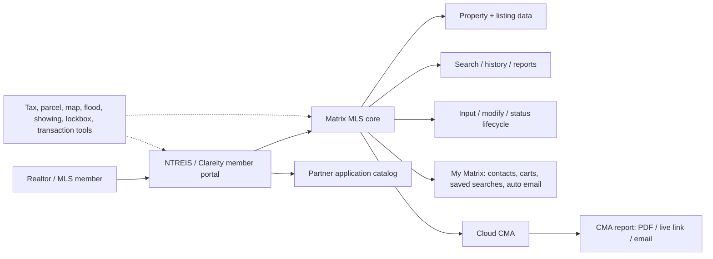
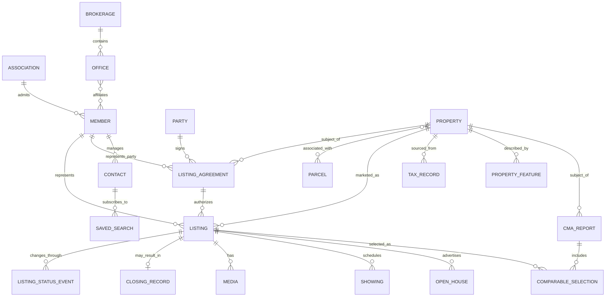
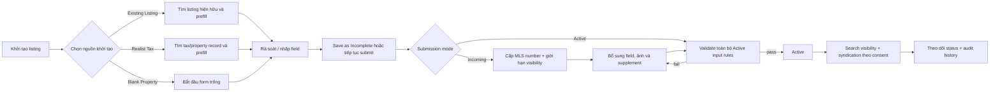
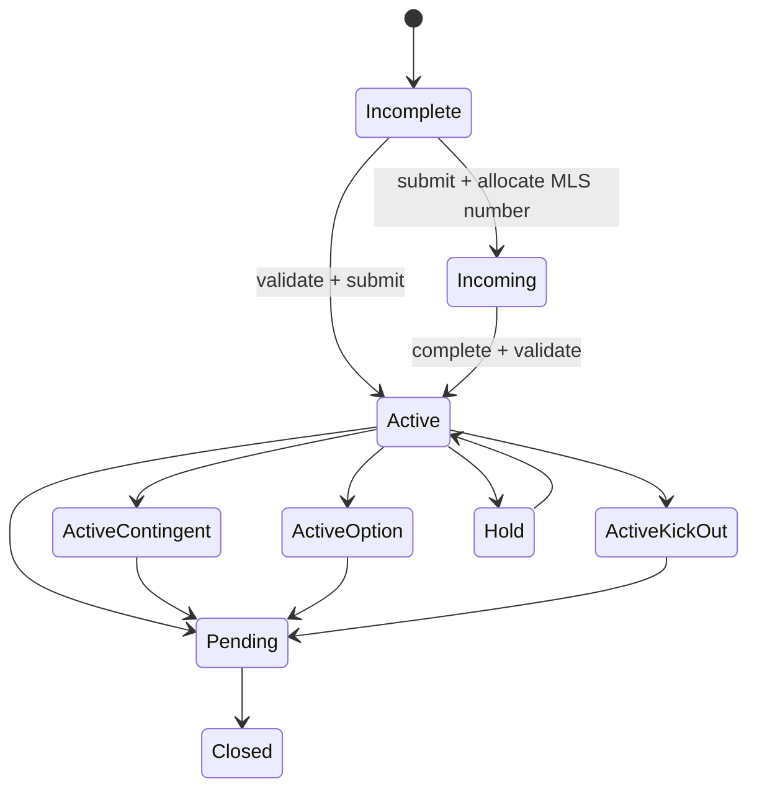
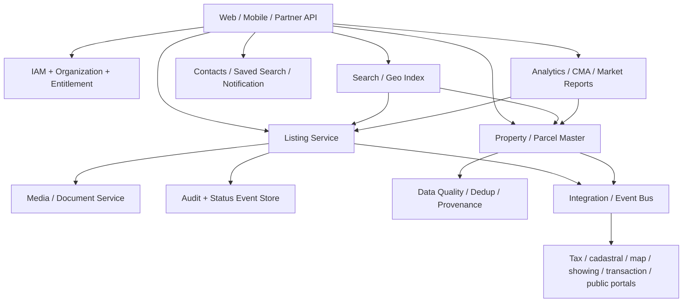

# Phân tích BA video “Lịch xem MLS Texas”

## 1. Kết luận điều hành

Video là một buổi walkthrough dài khoảng 68 phút nhằm tham chiếu cách một hệ sinh thái MLS tại Bắc Texas vận hành cho bài toán số hóa dữ liệu thị trường bất động sản tại Việt Nam.

Ba lớp sản phẩm được nhìn thấy trực tiếp trên màn hình:

1. **Cổng thành viên NTREIS/Clareity**: đăng nhập, trạng thái hội viên/phí và danh mục ứng dụng tích hợp.
2. **NTREIS Matrix (Cotality)**: lõi MLS để tìm kiếm, xem lịch sử, nhập/sửa listing, quản lý listing cá nhân và tạo báo cáo.
3. **Cloud CMA**: chọn bất động sản so sánh, điều chỉnh nội dung và xuất báo cáo phân tích giá.

Điểm quan trọng nhất cho domain model là phải tách **Property**, **Parcel** và **Listing** thành ba khái niệm liên quan nhưng không đồng nghĩa:

- `Property` là tài sản vật lý hoặc đơn vị bất động sản có danh tính bền vững qua nhiều lần đưa ra thị trường.
- `Parcel` là đơn vị thửa đất pháp lý/địa chính liên hệ với property; quan hệ này không mặc định là một-một.
- `Listing` là một lần đưa tài sản ra thị trường, có hợp đồng, agent/office, giá, thời hạn và vòng đời trạng thái riêng.
- Một property có thể có nhiều listing qua thời gian; lịch sử listing/sale không được ghi đè vào hồ sơ tài sản.

Video không mở IDE, repository, file tree, API hoặc sơ đồ triển khai. Vì vậy báo cáo này phân tích **cấu trúc sản phẩm, module, domain và nghiệp vụ**; mọi kiến trúc code/service ở phần đề xuất đều được đánh dấu là **PROPOSAL**, không phải cấu trúc codebase quan sát được.

## 2. Cách đọc mức độ chắc chắn

- **FACT**: thấy trực tiếp trên video hoặc nghe rõ trong audio.
- **SOURCE CLAIM**: người tham gia nói rõ trong video, nhưng phát biểu chưa được kiểm chứng bằng luật, tài liệu chính thức hoặc hệ thống bên ngoài.
- **INFERENCE**: suy luận hợp lý từ hành vi UI/tích hợp, nhưng video không chứng minh cơ chế bên trong.
- **PROPOSAL**: đề xuất cho project Việt Nam, không phải chức năng được xác nhận trong hệ thống Mỹ.
- **OPEN QUESTION**: cần Product Owner/BA/pháp chế xác nhận trước khi thiết kế chi tiết.

## 3. Mục tiêu buổi trao đổi

**FACT — audio 00:00–01:50:** phần mở đầu nêu nhu cầu tham khảo cách MLS Mỹ vận hành để phục vụ một hệ thống dữ liệu thông tin cho Bộ Xây dựng và định hướng chuyển đổi số, đồng bộ dữ liệu thị trường bất động sản Việt Nam. Bảo được giới thiệu là CTO, Bình là Dev Lead; người trình bày demo theo kinh nghiệm sử dụng nghiệp vụ tại Mỹ.

**SOURCE CLAIM — audio 01:02:16–01:04:23:** nhóm nói rõ họ đang triển khai một hệ thống thông tin dữ liệu; lớp MLS được hình dung nằm phía trên nền dữ liệu đất đai đang được làm sạch trên toàn quốc. Vấn đề hiện tại được nêu là dữ liệu đăng bán ở Việt Nam phân mảnh, khó kiểm chứng, đôi khi bị cố ý làm sai lệch; outcome mong muốn là chuẩn hóa và tăng tính minh bạch. Đây là mô tả của người tham gia về project và hiện trạng thị trường, chưa được đối chiếu với hồ sơ của Bộ Xây dựng hoặc nguồn độc lập.

**INFERENCE:** do đó, mục tiêu hợp lý của project không phải chỉ là một website đăng tin. Nó gần với một **hạ tầng dữ liệu và workflow B2B cho thị trường bất động sản**, kết nối hội viên, tổ chức môi giới, dữ liệu tài sản, listing, tìm kiếm, phân tích và các dịch vụ đối tác.

## 4. Bản đồ nội dung theo thời gian

| Khoảng thời gian | Nội dung quan sát được | Giá trị BA |
|---|---|---|
| 00:00–01:50 | Giới thiệu vai trò, bối cảnh Bộ Xây dựng và mục tiêu tham khảo MLS Mỹ | Problem statement và stakeholder kỹ thuật |
| 01:50–07:40 | Cổng NTREIS/Clareity, hội viên và danh mục ứng dụng | Lớp member portal, entitlement và integration hub |
| 07:40–19:00 | Matrix: search, result, listing detail, tax, ảnh và history | Property–listing separation, dữ liệu public/private, lịch sử |
| 19:00–24:00 | My Listings, modify, agreement và các action trạng thái | Ownership, contract context và listing lifecycle |
| 24:00–29:00 | Tạo/copy listing, Tax Search, form nhập, Incoming/Active | Prefill, chống trùng, validation và publish |
| 29:00–32:00 | Stats, search categories và on-demand reports | Reporting, inventory và production analytics |
| 32:00–46:35 | Q&A về association, broker, license, syndication và closing trong khi Matrix vẫn hiển thị | Governance, compliance và trách nhiệm cập nhật |
| 46:35–55:40 | Cloud CMA: subject, comparable, customize, publish | Human-in-the-loop valuation workflow |
| 55:40–58:05 | Báo cáo CMA đã sinh: cover, map, listing và thống kê giá | Kiểm chứng output, metric và kênh chia sẻ |
| 58:05–59:48 | Trở lại cổng ứng dụng; Q&A về app và phạm vi dữ liệu theo bang | Củng cố cấu trúc hệ sinh thái tích hợp |
| 59:48–62:10 | Q&A về giấy phép, luật và biểu mẫu theo bang | Yêu cầu cấu hình theo jurisdiction |
| 62:10–67:10 | Bài toán dữ liệu Việt Nam và kỳ vọng hệ thống cho Bộ Xây dựng | Outcome, phạm vi và rủi ro dữ liệu nguồn |
| 67:10–68:05 | Tổng kết và thống nhất trao đổi tiếp | Next step/discovery |

## 5. Cấu trúc sản phẩm “as observed”

### 5.1. Cổng thành viên và integration hub

**FACT:** màn hình portal hiển thị tổ chức Greater Fort Worth Association of REALTORS, trạng thái membership dues và các app như Matrix, Paragon Connect, Tax, Trends, Learning Lab, Cloud MLX, Cloud CMA, Cloud Streams, Transaction Desk và các partner app khác. Xem [frame 02:40](./frames/selected/02m40s_ntreis-home.jpg).

Năng lực nghiệp vụ suy ra:

- Quản lý member profile và quyền truy cập theo hội viên.
- Cổng vào chung cho nhiều ứng dụng chuyên môn.
- Theo dõi trạng thái phí/hội viên.
- Khả năng truyền context đăng nhập sang app khác là **INFERENCE**; video cho thấy mở app thuận tiện nhưng không chứng minh giao thức SSO/token.

### 5.2. Matrix MLS core

**FACT:** thanh điều hướng Matrix có `My Matrix`, `Search`, `Stats`, `Roster`, `Tax`, `Finance`, `Links`, `Market Reports`, `More`. Chi tiết listing có các tab `Listing`, `Tax`, `Photos`, `History`, `Parcel Map`, `Flood Map`, `Foreclosure`, `Supplements`. Xem [frame 10:40](./frames/selected/10m40s_listing-detail.jpg).

Các capability chính:

- Tìm theo MLS number, địa chỉ hoặc bộ tiêu chí.
- Hiển thị nhiều representation của cùng listing: list, full detail, ảnh, bản đồ, history.
- Phân tách dữ liệu tài sản, dữ liệu rao bán, thuế/public record, agent/office và showing.
- Quản lý listing do agent/office phụ trách.
- Lưu search, cart, contact và gửi auto email.
- Báo cáo market share, production và inventory.
- Kích hoạt các dịch vụ ngoài như CMA, showing, tài liệu giao dịch.

### 5.3. Cloud CMA

**FACT:** wizard tạo báo cáo gồm `Criteria → Listings → Customize → Publish`. Comparable có thể nhập chính xác bằng MLS number hoặc tìm tự động theo khoảng cách/thời gian và tiêu chí bổ sung. Xem [frame 49:00](./frames/selected/49m00s_comparable-selection-method.jpg).

Output quan sát được:

- Bản đồ subject property và comparable listings.
- Phân nhóm Active/Sold.
- Low/Median/Average/High price.
- Giá trung bình trên diện tích và Days on Market.
- Chi tiết từng comparable, ảnh và remarks.
- Các chương báo cáo có thể bật/tắt/sắp xếp.
- Publish và chia sẻ bằng email, PDF link hoặc live link.

### 5.4. Dữ liệu công khai, dữ liệu riêng và hệ thống downstream

**FACT — audio + visual 02:40–07:40:** portal tập hợp cả MLS core lẫn ứng dụng chuyên biệt. Người trình bày đặt Supra và ShowingTime trong luồng đặt lịch, truy cập và theo dõi lượt xem nhà, nhưng lời nói không tách rạch ròi trách nhiệm của từng app. Một ứng dụng tenant-screening đang được phase out cũng được nhắc đến; ở phần cuối tên ứng dụng được nghe là RentSpree nhưng vẫn nên đối chiếu frame. Màn hình còn cho thấy Cloud CMA, Transaction Desk và các công cụ đối tác. Video chứng minh sự hiện diện và luồng mở ứng dụng, nhưng không chứng minh contract API hay cơ chế tích hợp bên trong.

**SOURCE CLAIM — audio 04:47–07:24 và 27:31–29:31:** Matrix/MLS được mô tả là nguồn nghiệp vụ; Zillow/Realtor là kênh downstream độc lập nhận listing tự động, thường chỉ sau vài phút. Người bán có thể chọn không quảng bá ra ngoài trong listing agreement. Đây là mô tả của người tham gia, chưa được kiểm tra với feed contract hoặc chính sách NTREIS.

**FACT — audio + visual 09:59–11:20:** public description và một tập field có thể đi tới kênh công khai, còn `Private Remarks`, thông tin agent/office chi tiết và hướng dẫn showing chỉ dành cho người dùng MLS phù hợp. Vì vậy public/private classification là một phần của domain, không nên xử lý chỉ ở UI.

## 6. Domain model đề xuất từ bằng chứng video

Glossary canonical dùng cho báo cáo nằm tại [CONTEXT.md](./CONTEXT.md); trọng tâm là không dùng `Property`, `Parcel`, `Listing` và `Transaction` như các từ đồng nghĩa.

### 6.1. Aggregate và entity chính

| Khái niệm | Trách nhiệm | Bằng chứng |
|---|---|---|
| Association | Tư cách hội viên, phí và quyền vào hệ sinh thái | Portal và membership dues |
| Brokerage | Tổ chức hành nghề mà agent/broker liên kết | Office affiliation trên listing + `SOURCE CLAIM` trong audio |
| Office | Phạm vi vận hành listing, roster và báo cáo trong một brokerage | Khối Agent/Office, roster, office reports |
| Member | Danh tính có entitlement truy cập hệ sinh thái | Portal account và app catalog |
| Agent | Vai trò nghiệp vụ đại diện một party và phụ trách listing | Agent fields, `My Listings`, prepared-by |
| Broker | Vai trò giám sát ở cấp brokerage/office | `SOURCE CLAIM` trong audio; quyền chi tiết chưa thấy trên UI |
| Party/Client | Người bán, người mua, bên cho thuê hoặc bên thuê được agent đại diện | Audio về seller/buyer representation |
| Property | Tài sản vật lý, địa chỉ, đặc trưng bền vững | Form Property/Location/Rooms/Features |
| Parcel | Thửa đất/định danh cadastral, có thể multi-parcel | Parcel ID, Multi Parcel ID |
| ListingAgreement | Cơ sở đại diện và phạm vi tiếp thị một property | Agreement type trên form + audio về representation agreement |
| Listing | Một lần rao bán/cho thuê có hợp đồng và giá | MLS number, list/expire date, agreement type |
| ListingStatusEvent | Lịch sử chuyển trạng thái theo thời gian | History + các action đổi status |
| ClosingRecord | Kết quả chốt giao dịch như sold price/date và các bên tham gia | Audio 43:22–46:17; schema chi tiết chưa thấy trên UI |
| Tax/PublicRecord | Nguồn dữ liệu nền, có source/provenance | Tax tab, `Public Records`, parcel search |
| Media/Document | Ảnh, virtual tour, supplement, hồ sơ giao dịch | Photos, Supplements, Manage Documents |
| Showing/OpenHouse | Lịch xem, hướng dẫn và quyền truy cập | Showing section, BrokerBay/ShowingTime |
| Contact/SavedSearch | CRM nhẹ và subscription tìm kiếm | My Matrix menu |
| CMAReport/Comparable | Subject, tập so sánh, adjustment và output | Cloud CMA workflow |

**OPEN QUESTION:** ER phía trên rút gọn `Member` và vai trò nghề nghiệp để tập trung vào lõi property/listing. Project Việt Nam cần workshop riêng để quyết định cách tách Person, Membership, License, Brokerage Affiliation và role Agent/Broker; không nên coi chúng là một entity chỉ vì video dùng cùng một tài khoản.

### 6.2. Tách dữ liệu public và private

**FACT:** listing detail phân biệt remarks công khai, private remarks, thông tin agent/office, showing instructions và owner-related fields.

**PROPOSAL:** project Việt Nam cần field-level authorization, ít nhất:

- Public/consumer-facing.
- Chỉ member đã xác thực.
- Chỉ listing agent/office/broker.
- Chỉ cơ quan quản lý/audit.
- Dữ liệu nhạy cảm cần mask trên log, export và report.

## 7. Các quy trình nghiệp vụ chính

### 7.1. Onboarding và truy cập hệ sinh thái

1. Tạo/xác minh member thuộc association hoặc brokerage.
2. Kiểm tra trạng thái hội viên, license và nghĩa vụ phí.
3. Cấp entitlement tới từng app/module.
4. Member mở Matrix, tax, CMA, showing hoặc transaction tool từ portal.
5. Ghi nhận audit cho đăng nhập và thao tác quan trọng.

Bước 3–5 là **PROPOSAL/INFERENCE** ở mức cơ chế; UI chỉ chứng minh portal và app catalog.

**SOURCE CLAIM — audio 36:32–41:59 và 59:48–61:49:** người trình bày phân biệt real-estate agent với REALTOR/member; agent hoạt động dưới broker, giấy phép và biểu mẫu phụ thuộc từng bang, một người có thể có license ở nhiều bang. Các chi tiết này chỉ là input discovery, không được mang nguyên sang mô hình Việt Nam nếu chưa có pháp chế xác nhận.

### 7.2. Tìm và thẩm tra listing

1. Nhập MLS number/địa chỉ hoặc tiêu chí nâng cao.
2. Xem danh sách kết quả và chọn display phù hợp.
3. Mở hồ sơ để đối chiếu Listing, Tax, Photos, History, Parcel/Flood map.
4. Kiểm tra price/status/DOM, property facts, agent/office, showing và remarks.
5. Lưu vào cart/search, gửi link/email, export hoặc chuyển sang CMA.

**FACT — audio + visual 08:30–14:20:** cùng một địa chỉ/property có thể xuất hiện qua nhiều MLS record vì mỗi lần đưa ra thị trường có MLS number riêng. Tab History và public-record history củng cố yêu cầu giữ chuỗi sự kiện qua thời gian thay vì cập nhật đè một “tin đăng duy nhất”.

**SOURCE CLAIM — audio 15:06–17:52:** hệ thống được mô tả là có cảnh báo/ngăn trường hợp cùng một property đang có listing đại diện trùng lặp. Rule chính xác, ngoại lệ sale/lease và phạm vi đối chiếu không xuất hiện trên UI nên vẫn cần workshop.

### 7.3. Tạo listing

**FACT — visual 24:00–26:40:** luồng tạo listing cung cấp ba cách khởi tạo: `Fill from Existing Listing`, `Fill From Realist Tax`, hoặc `Start with a blank Property`. Tax Search yêu cầu `County` và một trong ba bộ tiêu chí: exact `Tax ID`; hoặc `Street Number + Street Name`; hoặc `Owner Last Name`. Xem [Tax Search 26:00](./frames/selected/26m00s_add-property-tax-search.jpg).

**FACT:** form nhập listing chia thành các tab `Property Info`, `Location/Schools`, `Rooms`, `Features`, `Lot Info`, `Utilities`, `Environment`, `Financial`, `HOA`, `Agent/Office`, `Showing`, `Remarks`, `Condo Info`, `Farm & Ranch`, `Status`; có các action `Save as Incomplete`, `Validate`, `Cancel Input`, `Submit Property`. Một số field được highlight màu vàng, nhưng video không cho thấy legend đủ rõ để khẳng định mọi field màu vàng đều bắt buộc. Xem [form 26:40](./frames/selected/26m40s_add-property-form.jpg).

**FACT — visual 28:40:** hướng dẫn trên UI phân biệt `Incoming` và `Active`: Incoming được cấp MLS number nhưng chưa hiển thị cho mọi người, vẫn có thể thêm ảnh/supplement và chạy report; khi dữ liệu hoàn chỉnh và đổi sang Active thì listing mới khả dụng rộng hơn, và Active phải vượt qua toàn bộ input rules. Xem [frame 28:40](./frames/selected/28m40s_listing-status-rules.jpg).

**SOURCE CLAIM — audio 24:30–27:10:** người trình bày ước tính dữ liệu có sẵn từ listing cũ/tax record có thể prefill khoảng 60–70%, sau đó agent vẫn phải rà soát và cập nhật thông tin mới. Đây là ước lượng kinh nghiệm, không phải metric đo từ hệ thống.

### 7.4. Vòng đời listing

Các action nhìn thấy trực tiếp gồm:

- Change to Active Contingent.
- Change to Active Option Contract.
- Change to Pending.
- Change to Active Kick Out.
- Change to Closed.
- Change to Hold.
- Price Change.
- Open Houses.
- Virtual Tours/URLs.
- Manage Photos/Documents/ShowingTime/BrokerBay.

**SOURCE CLAIM — audio 16:19–23:24:** listing dựa trên listing representation agreement; agent chịu trách nhiệm cập nhật và broker có vai trò quản lý/gỡ listing. Người trình bày nói thay đổi trạng thái cần được cập nhật trong vòng 72 giờ và có thể phát sinh khiếu nại/phạt qua association nếu vi phạm. Đây không phải kết luận pháp lý đã kiểm chứng.

**SOURCE CLAIM — audio 43:22–46:17:** khi closing, listing agent được mô tả là phải cập nhật sold price/date, buyer-side agent, hình thức mortgage/cash và các chỉ số liên quan. Project Việt Nam cần xác định bộ dữ liệu closing, nguồn xác nhận và SLA riêng.

State machine tối thiểu để thảo luận:

Đây là **PROPOSAL tối thiểu** dựa trên nhãn action. Video không xác nhận đầy đủ transition guard, quyền thực hiện, SLA hay khả năng huỷ/withdraw/expire; các rule này phải được workshop riêng.

### 7.5. CMA/định giá so sánh

1. Chọn subject property.
2. Chọn exact listings hoặc tìm comparable theo proximity/time/criteria.
3. Review và include/exclude Active/Sold listings.
4. Thêm note/adjustment khi cần.
5. Tính price statistics, price per area và DOM.
6. Chọn chapter/template/branding.
7. Publish report và chia sẻ PDF/live link/email.

**SOURCE CLAIM — audio 46:35–54:10:** thuật toán chỉ đưa ra candidate gần đây/gần vị trí; agent vẫn xem xét năm xây dựng, số tầng, phòng ngủ/phòng tắm, diện tích và mở rộng phạm vi nếu thiếu mẫu phù hợp. Vì vậy CMA trong video là workflow **human-in-the-loop**, không phải định giá tự động hoàn toàn.

Xem [comparable list 51:00](./frames/selected/51m00s_comparable-list.jpg) và [price analysis 58:00](./frames/selected/58m00s_cma-average-price.jpg).

## 8. Business rules nhìn thấy hoặc suy ra mạnh

| Rule | Mức chắc chắn | Ghi chú |
|---|---|---|
| Listing có MLS number riêng | FACT | Hiển thị xuyên suốt search/detail/report |
| Một property có thể có nhiều listing qua thời gian | FACT | Audio và History cho thấy MLS record không đồng nhất với property |
| Form property/listing hỗ trợ Parcel ID và Multi Parcel ID | FACT | Các field xuất hiện trên form; cardinality Property–Parcel cần discovery riêng |
| Form có Listing Agreement Type và Transaction Type | FACT | Hai field xuất hiện và có giá trị; video không đủ bằng chứng riêng để kết luận required chỉ từ màu nền |
| Tax Search phải có County và một bộ khóa tìm hợp lệ | FACT | Exact Tax ID; hoặc Street Number + Street Name; hoặc Owner Last Name |
| Incoming có MLS number nhưng chưa hiển thị rộng | FACT | Hướng dẫn trực tiếp trên UI ở 28:40 |
| Active phải vượt qua toàn bộ input rules | FACT | Hướng dẫn trực tiếp trên UI ở 28:40 |
| Một số field màu vàng biểu thị field cần chú ý/nhập | INFERENCE | UI có highlight và Validate nhưng không thấy legend đủ rõ để đồng nhất với “required” |
| Form ghi nhận list price, list/expire date và nguồn diện tích | FACT | Có field riêng; `SqFt Source` là source dropdown nhìn thấy trực tiếp |
| Agent/office gắn với listing | FACT | Khối Agent/Office và My Listings |
| Status change là action nghiệp vụ, không chỉ sửa text | FACT | Menu action riêng theo trạng thái |
| Listing public và field nội bộ có phạm vi phân phối khác nhau | FACT | Public/Private Remarks và showing/agent sections tách biệt |
| Agent phải cập nhật thay đổi trong 72 giờ | SOURCE CLAIM | Người trình bày nêu; chưa kiểm chứng theo policy/jurisdiction |
| Seller có thể opt out syndication | SOURCE CLAIM | Người trình bày nêu; cần kiểm tra agreement và feed policy |
| Hệ thống cảnh báo/ngăn active duplicate representation | SOURCE CLAIM | Chưa thấy rule engine hoặc exception matrix trên UI |
| Mọi status change cần actor/time/reason | PROPOSAL | Bắt buộc để audit và giải quyết tranh chấp |
| Không tạo property trùng khi đã có parcel/address | INFERENCE + PROPOSAL | Luồng tìm hồ sơ hiện hữu và dữ liệu thuế hỗ trợ kết luận |
| Private remarks/showing data phải bị giới hạn quyền | PROPOSAL mạnh | Nội dung nhạy cảm được tách khỏi public remarks |
| CMA phải lưu snapshot/version của tập comparable | PROPOSAL | Tránh report thay đổi khi listing nguồn cập nhật |

## 9. Module map cho project Việt Nam

### 9.1. MVP bắt buộc

1. **IAM, organization và role**
   - Cơ quan quản lý, association, brokerage, office, broker, agent.
   - License/member status, entitlement, RBAC/ABAC.
2. **Property & Parcel Master**
   - Địa chỉ chuẩn hóa, tọa độ, định danh thửa/tài sản.
   - Merge/deduplicate và provenance từng field.
3. **Listing Lifecycle**
   - Draft, validate, publish, price change, status transition, expire/close.
   - Public/private fields, photos/documents, full audit.
4. **Search & Discovery**
   - MLS/listing ID, địa chỉ, bản đồ, bộ lọc nghiệp vụ.
   - Saved search, result views và listing detail.
5. **Data Quality & Audit**
   - Required/conditional rules, data checker, history, actor/time/reason.
6. **Admin & Taxonomy**
   - Property type, listing agreement, status, feature catalog, địa giới.

### 9.2. Sau MVP

- Contacts, carts, saved searches, auto email/notification.
- Showing/open house và lockbox integration.
- Transaction documents/e-signature.
- Market reports, agent/office production và inventory.
- CMA với comparable/adjustment/template/publish.
- Partner marketplace và public syndication/API.

### 9.3. Kiến trúc logic đề xuất

Đây là **PROPOSAL**. Video không cung cấp bằng chứng để kết luận monolith/microservices, database, cloud, API standard hay source-code layout.

## 10. Epics và acceptance criteria mẫu

### Epic A — Tạo listing từ property hiện hữu

**User story:** Là listing agent, tôi muốn tìm property theo parcel/address và khởi tạo listing từ dữ liệu đã có để giảm nhập lại và tránh bản ghi trùng.

Acceptance criteria tối thiểu:

- Search hỗ trợ exact parcel ID và normalized address.
- Nếu có nhiều candidate, user phải chọn và thấy source/confidence.
- Dữ liệu copy sang listing vẫn giữ `source`, `retrieved_at`, `editable`.
- Không cho submit/chuyển sang **Active** nếu thiếu field hoặc vi phạm Active input rules; nhánh Incoming có bộ điều kiện tối thiểu riêng cần discovery.
- Save as Incomplete không cấp cùng mức visibility như Active.
- Submit theo nhánh Incoming tạo MLS/listing ID mới mà không thay đổi property ID.
- Chỉ cho chuyển Incoming sang Active khi toàn bộ Active input rules đều pass.
- Audit ghi actor, office, timestamp và snapshot trước/sau.

### Epic B — Chuyển trạng thái listing

**User story:** Là agent/broker có quyền, tôi muốn chuyển trạng thái listing theo tiến trình giao dịch để dữ liệu thị trường luôn chính xác.

Acceptance criteria tối thiểu:

- Chỉ hiện transition hợp lệ từ trạng thái hiện tại.
- Một số transition yêu cầu effective date, reason và tài liệu.
- Transition dùng optimistic locking/idempotency để tránh cập nhật kép.
- Lịch sử không được sửa/xoá bởi agent thông thường.
- Search/index và feed đối tác nhận event cập nhật.

### Epic C — Tạo CMA

**User story:** Là agent, tôi muốn chọn subject và comparable để tạo báo cáo giá có thể giải thích cho khách hàng.

Acceptance criteria tối thiểu:

- Có exact selection và rule-based selection.
- Lưu tiêu chí, danh sách include/exclude và adjustment.
- Metric ghi rõ công thức, đơn vị và thời điểm dữ liệu.
- Publish tạo version bất biến; chỉnh sửa sau đó tạo version mới.
- Phân quyền riêng cho draft, client link và public link.

## 11. Non-functional requirements không nên bỏ qua

- **Auditability:** mọi thay đổi giá/status/owner-facing data phải truy vết được.
- **Data provenance:** biết field đến từ cadastral/tax, broker, agent hay hệ thống ngoài.
- **Consistency:** status và price update phải đồng bộ search/report/feed theo SLA đo được.
- **Security:** field-level access, encryption, export control, session/device policy.
- **Privacy:** mask owner/private remarks/showing/lockbox data.
- **Availability:** search và listing input là nghiệp vụ hằng ngày; cần DR/RPO/RTO rõ.
- **Performance:** search địa lý/đa tiêu chí và tải ảnh phải có SLO riêng.
- **Versioning:** taxonomy, validation rule và report formula có hiệu lực theo thời gian.
- **Interoperability:** API/event/schema versioning; cân nhắc chuẩn ngành sau khi khảo sát pháp lý và đối tác.
- **Observability:** metrics cho stale data, failed feed, duplicate property, invalid transition và notification failure.

## 12. Rủi ro nếu “copy UI MLS” mà không làm domain discovery

1. Gộp Property và Listing, làm mất lịch sử tài sản.
2. Xem status như chuỗi text thay vì state machine có guard/audit.
3. Không lưu provenance, dẫn đến tranh chấp dữ liệu giữa nguồn địa chính, thuế và agent.
4. Lộ private remarks, owner/showing/lockbox data qua search/export.
5. Đưa CMA thành phép lấy trung bình đơn giản, thiếu comparable rules và versioning.
6. Tích hợp point-to-point quá nhiều, khó retry/reconcile khi partner lỗi.
7. Hard-code taxonomy Texas vào Việt Nam mà không workshop pháp lý, địa giới và loại giao dịch.

## 13. Open questions cần workshop

### Pháp lý và governance

- Ai là data owner và source of truth cho property, parcel, owner, tax và listing?
- Mô hình vận hành là cơ quan trung ương, liên minh association hay nhiều sàn/broker liên kết?
- Điều kiện cấp MLS/listing ID là gì? Có bước duyệt trước publish không?
- Data retention, quyền sửa sai và quy trình dispute ra sao?

### Listing lifecycle

- Bộ trạng thái Việt Nam chính thức và transition matrix là gì?
- `Save as Incomplete`, `Incoming`, `Coming Soon` và `Active` là persistence stage, market status hay hai khái niệm tách biệt; SLA/visibility của từng loại là gì?
- Phân biệt sale, lease, auction, project/new development thế nào?
- Expire, withdraw, cancel, relist và duplicate listing được xử lý ra sao?
- Những transition nào cần broker approval/tài liệu pháp lý?

### Dữ liệu và tích hợp

- Định danh property/parcel nào dùng xuyên tỉnh/thành?
- Cách reconcile địa chỉ, tách/thửa/gộp thửa, căn hộ trong cùng tòa nhà?
- Đối tác nào cung cấp bản đồ, quy hoạch, thuế, pháp lý, ảnh, chữ ký và thanh toán?
- Public portal được nhận field nào, delay bao lâu và có quyền opt-out không?

### CMA và analytics

- Công thức comparable/adjustment do ai phê duyệt?
- Dùng diện tích nào, đơn vị nào, xử lý outlier và dữ liệu thiếu ra sao?
- Report là tư vấn tham khảo hay chứng thư định giá có giá trị pháp lý?

## 14. Đề xuất lộ trình discovery

1. Workshop ubiquitous language: Property, Parcel, Unit, Project, Listing, Transaction, Agent, Broker.
2. Chốt actor/permission matrix và public/private data classification.
3. Vẽ state machine listing theo loại giao dịch Việt Nam.
4. Chốt canonical IDs, provenance và data reconciliation.
5. Prototype luồng `find property → create listing → validate → publish → change status`.
6. Test với 20–30 hồ sơ thực tế có duplicate, sai địa chỉ, multi-parcel và relist.
7. Sau khi lõi dữ liệu ổn định mới triển khai CMA, marketplace và feed công khai.

## 15. Chỉ mục frame bằng chứng

- [01:00 — Microsoft Teams và thành phần buổi họp](./frames/selected/01m00s_teams-meeting.jpg)
- [02:40 — NTREIS member portal và application catalog](./frames/selected/02m40s_ntreis-home.jpg)
- [08:50 — Matrix search results](./frames/selected/08m50s_search-results.jpg)
- [10:40 — Listing detail và các nhóm dữ liệu](./frames/selected/10m40s_listing-detail.jpg)
- [12:20 — Sale/public-record history](./frames/selected/12m20s_sale-history.jpg)
- [20:40 — My Listings](./frames/selected/20m40s_my-listings.jpg)
- [24:00 — Form modify property/listing](./frames/selected/24m00s_property-edit-form.jpg)
- [26:00 — Tax Search và rule tìm property](./frames/selected/26m00s_add-property-tax-search.jpg)
- [26:40 — Form nhập listing](./frames/selected/26m40s_add-property-form.jpg)
- [28:40 — Quy tắc Incoming và Active](./frames/selected/28m40s_listing-status-rules.jpg)
- [32:00 — On-demand market/production reports](./frames/selected/32m00s_on-demand-reports.jpg)
- [47:30 — Cloud CMA subject/criteria](./frames/selected/47m30s_create-cma-subject.jpg)
- [49:00 — Exact MLS vs automatic comparable search](./frames/selected/49m00s_comparable-selection-method.jpg)
- [51:00 — Agent review comparable list](./frames/selected/51m00s_comparable-list.jpg)
- [55:00 — Customize report chapters](./frames/selected/55m00s_customize-cma-chapters.jpg)
- [55:40 — Publish và sharing options](./frames/selected/55m40s_publish-cma.jpg)
- [58:00 — Comparable price statistics](./frames/selected/58m00s_cma-average-price.jpg)

Toàn bộ 24 keyframe đã crop/chọn lọc nằm trong [frames/selected](./frames/selected/); 26 contact sheet toàn video nằm trong [contact-sheets](./contact-sheets/).

## 16. Giới hạn phân tích

- Transcript được tạo bằng nhận dạng tiếng Việt có timestamp, sau đó đối chiếu thuật ngữ với UI và chạy kiểm tra bổ sung ở các đoạn khó; đoạn nghe không rõ vẫn có thể sai tên riêng.
- Visual pass đã duyệt 409 frame cách nhau 10 giây trên toàn bộ 68:05, sau đó kiểm tra lại các frame nghiệp vụ ở độ phân giải cao. Việc lấy mẫu vẫn có thể bỏ qua popup/trạng thái UI xuất hiện dưới 10 giây.
- Video có một packet audio Opus lỗi sát cuối; hình ảnh vẫn đầy đủ.
- Không có source code/API/database/schema/deployment diagram trong video.
- Các địa chỉ, số điện thoại và thông tin listing mẫu xuất hiện trên frame chỉ được dùng làm bằng chứng UI; báo cáo không tái xuất bản chúng dưới dạng dữ liệu nghiệp vụ.

## 17. Artifacts đi kèm

- [Transcript đã làm sạch, có timestamp và cờ cần review](./transcript/transcript.md)
- [Phụ đề SRT](./transcript/transcript.srt) và [WebVTT](./transcript/transcript.vtt)
- [JSON đã hợp nhất/kiểm chứng](./transcript/transcript.cleaned.json)
- [Word timestamps kèm xác suất](./transcript/transcript.words.tsv)

Transcript chính dùng Whisper large-v3-turbo cho toàn bộ audio và được chạy lại bằng large-v3 tại các đoạn khó. Các tên riêng được suy ra từ ngữ cảnh như NTREIS/RentSpree vẫn được gắn cờ trong transcript để ưu tiên đối chiếu frame.
